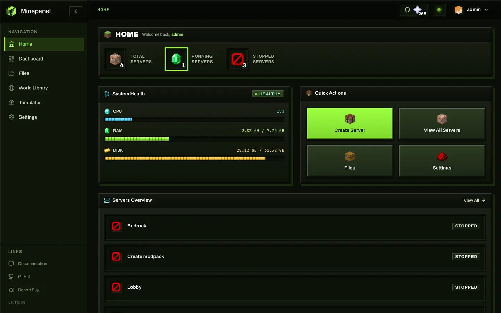

<div align="center">

# Minepanel

**Minecraft Server Manager for Java & Bedrock Edition**

Web panel to manage Minecraft servers with Docker — Create, configure, and monitor Java and Bedrock servers from a modern UI.

[](LICENSE)
[](https://hub.docker.com/r/ketbom/minepanel)
[](https://hub.docker.com/r/ketbom/minepanel)
[](https://deepwiki.com/Ketbome/minepanel)

[Documentation](https://minepanel.ketbome.com) · [Report Bug](https://github.com/Ketbome/minepanel/issues/new?labels=bug) · [Request Feature](https://github.com/Ketbome/minepanel/issues/new?labels=enhancement)

</div>

---

<div align="center">
  
</div>
<div align="center" style="margin-top: 8px;">
  <a href="https://buymeacoffee.com/pims2711y" target="_blank">
    
  </a>
  <br>
  <span style="font-size: 0.95em; color: #888;">If Minepanel or my other projects (like Hytalepanel) help you, a coffee would mean a lot. Thank you for supporting independent devs!</span>
</div>

---

## Quick Start

```bash
git clone https://github.com/Ketbome/minepanel.git
cd minepanel
export JWT_SECRET=$(openssl rand -base64 32)
docker compose up -d
```

Open http://localhost:3000 and complete the initial admin account setup in the UI.

If you access Minepanel over plain HTTP by local IP and login gets stuck on "Verifying authentication...", see the [Configuration](https://minepanel.ketbome.com/configuration) docs for `ALLOW_INSECURE_AUTH_COOKIES`.

---

## Features

- **Java & Bedrock** — Both Minecraft editions, as many servers as your hardware allows, each in its own container
- **All server types** — Vanilla, Paper, Forge, NeoForge, Fabric, Purpur, GTNH and CurseForge, Modrinth or FTB modpacks, with templates and server cloning · [Server types](https://minepanel.ketbome.com/server-types)
- **Mods & plugins** — Integrated Modrinth and CurseForge search, mod list editor, datapacks and Bedrock addons · [Mods & plugins](https://minepanel.ketbome.com/mods-plugins)
- **Worlds** — Per-server world picker, a shared world library, imports from CurseForge or a URL and experimental feature packs for new Java worlds · [Worlds](https://minepanel.ketbome.com/worlds)
- **Real-time monitoring** — CPU, RAM, players, live logs and history graphs, plus TPS/MSPT for NeoForge modpacks (including ATM10) and compatible spark servers · [Monitoring](https://minepanel.ketbome.com/features#real-time-monitoring)
- **Player insights** — Playtime, last seen and join/leave sessions for Java and Bedrock; Java profiles add saved-world stats, advancements and inventory, and an opt-in activity log with chat search and inventory history · [Player profiles](https://minepanel.ketbome.com/features#player-profiles-and-session-history) · [Activity log](https://minepanel.ketbome.com/features#activity-log)
- **Console & tasks** — RCON console, gamerule editor, quick actions, scheduled restarts and commands (interval or cron) and rotating announcements · [Server control](https://minepanel.ketbome.com/features#server-control)
- **Backups** — Scheduled backups with retention, locally or to S3-compatible storage · [Backups](https://minepanel.ketbome.com/features#backups)
- **File manager** — Browse, edit, upload and download server files, with streamed uploads and ZIP downloads · [Files](https://minepanel.ketbome.com/features#file-management)
- **Proxy** — mc-router for single-port multi-server (Java), managed by the panel, with auto-scaling (sleep when idle, wake on join) · [mc-router](https://minepanel.ketbome.com/networking#mc-proxy-router-java-only)
- **Networking** — Port mappings, per-server network settings and admin-only custom compose snippets · [Networking](https://minepanel.ketbome.com/networking)
- **Users & access** — Admin and user roles, per-server permissions, invitations and an audit log · [Access control](https://minepanel.ketbome.com/features#roles-and-access-control)
- **Single Sign-On** — OIDC login (Authentik, Google, …), with an SSO-only mode · [SSO](https://minepanel.ketbome.com/sso)
- **Alerts** — Discord webhooks for server events and alerts (down, crash loop, high CPU/RAM)
- **Updates** — Release notes in the panel for every version between yours and the newest, and a one-click update for admins
- **Multi-language** — English, Spanish, Dutch, German, French, Polish, Russian, Portuguese and Turkish
- **Multi-arch** — x86_64 and ARM64 (Raspberry Pi, Apple Silicon)

---

## Documentation

Full docs at **[minepanel.ketbome.com](https://minepanel.ketbome.com)**

- [Getting Started](https://minepanel.ketbome.com/getting-started) — What Minepanel is and how it works
- [Installation](https://minepanel.ketbome.com/installation) — Docker setup guide
- [Configuration](https://minepanel.ketbome.com/configuration) — Environment variables & settings
- [Networking](https://minepanel.ketbome.com/networking) — Ports, DNS, SSL and proxy setup
- [Features](https://minepanel.ketbome.com/features) — Full feature documentation
- [Administration](https://minepanel.ketbome.com/administration) — Passwords, roles, audit log and database
- [Upgrading to 1.13](https://minepanel.ketbome.com/upgrading-to-1-13) — What changes when you update
- [Troubleshooting](https://minepanel.ketbome.com/troubleshooting) — Common problems and fixes
- [API](https://minepanel.ketbome.com/api) — Authentication model and backend endpoints
- [FAQ](https://minepanel.ketbome.com/faq) — Common questions

Docker guides: [Server with Docker Compose](https://minepanel.ketbome.com/guides/minecraft-server-docker-compose) · [Modded server](https://minepanel.ketbome.com/guides/modded-minecraft-server-docker) · [Bedrock server](https://minepanel.ketbome.com/guides/bedrock-server-docker) · [mc-router setup](https://minepanel.ketbome.com/guides/mc-router-setup) · [Backups with mc-backup](https://minepanel.ketbome.com/guides/minecraft-server-backup-docker)

### 🔍 AI-Powered Documentation

Need quick answers? You can use **[DeepWiki](https://deepwiki.com/Ketbome/minepanel)** to search our documentation using natural language and get contextual answers to your questions.

---

## Powered By

Minepanel is built on top of amazing open source projects by [itzg](https://github.com/itzg):

| Project                                                                                         | Description                              |
| ----------------------------------------------------------------------------------------------- | ---------------------------------------- |
| [itzg/docker-minecraft-server](https://github.com/itzg/docker-minecraft-server)                 | Docker image for Java Edition servers    |
| [itzg/docker-minecraft-bedrock-server](https://github.com/itzg/docker-minecraft-bedrock-server) | Docker image for Bedrock Edition servers |
| [itzg/docker-mc-backup](https://github.com/itzg/docker-mc-backup)                               | Automatic backup sidecar container       |
| [itzg/mc-router](https://github.com/itzg/mc-router)                                             | Minecraft proxy for routing by hostname  |

Thank you itzg for making Minecraft server hosting accessible to everyone!

---

## Related Projects

Part of the same self-hosted game-server ecosystem:

- **[Hytalepanel](https://github.com/Ketbome/hytalepanel)** — Docker-based web panel for Hytale dedicated servers, docs at **[hytalepanel.ketbome.com](https://hytalepanel.ketbome.com)**. Same philosophy as Minepanel, built for Hytale.

---

## Contributors

<a href="https://github.com/Ketbome/minepanel/graphs/contributors">
  
</a>

---

<div align="center">

**[⭐ Star this repo](https://github.com/Ketbome/minepanel)** if you find it useful!

Made with ❤️ by [@Ketbome](https://github.com/Ketbome) · [Community License](LICENSE)

</div>
<div align="center" style="margin-top: 8px;">
  <a href="https://buymeacoffee.com/pims2711y" target="_blank">
    
  </a>
  <br>
  <span style="font-size: 0.95em; color: #888;">If Minepanel or my other projects (like Hytalepanel) help you, a coffee would mean a lot. Thank you for supporting independent devs!</span>
</div>
