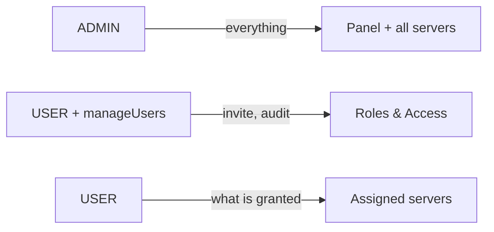
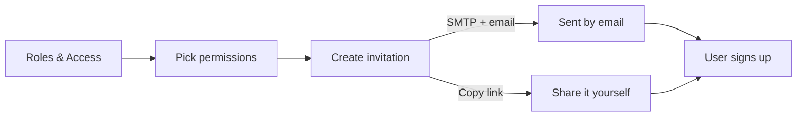
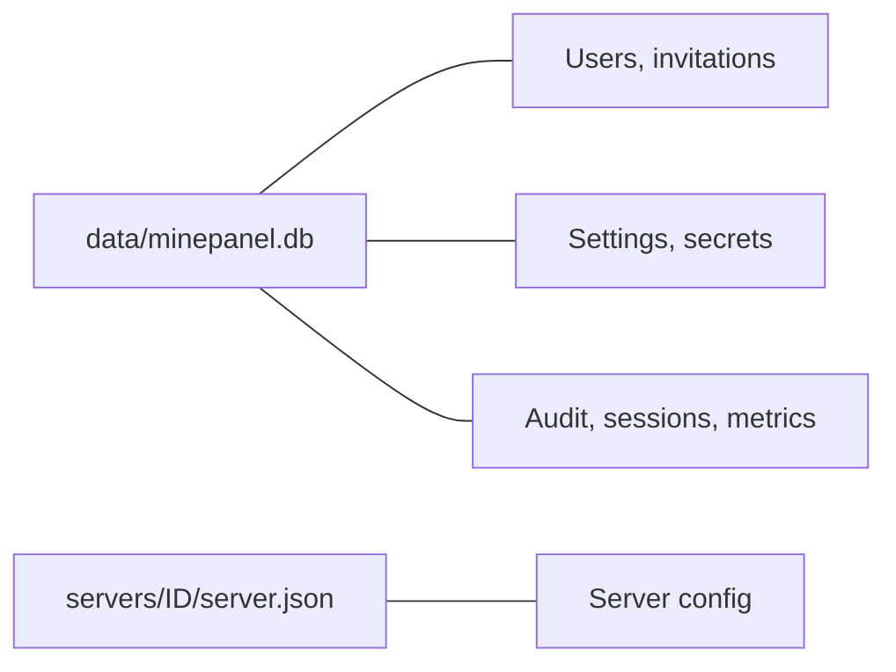
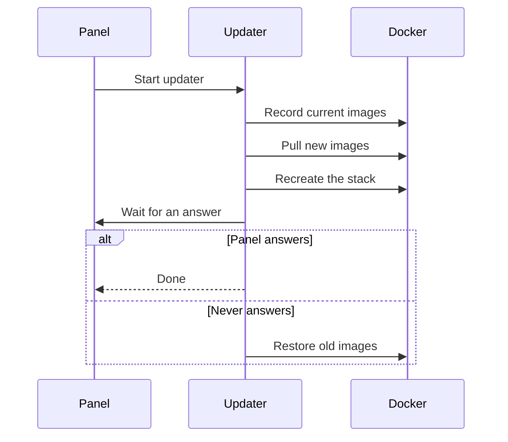

# Administration

Manage passwords, users, the database, backups and updates.

| Task | Where |
| --- | --- |
| Change your password or email | **Settings → Account** |
| Invite users, set permissions | **Settings → Roles & Access** |
| Review who did what | **Settings → Audit** |
| SMTP, OIDC, CurseForge key, Discord | **Settings → Integrations** (admin only) |
| Audit retention | **Settings → Preferences** (admin only) |
| Update Minepanel | Version badge at the bottom of the sidebar |

## Password Management

### Change Admin Password

#### From UI

**Settings → Account → Security**: enter the current password, the new one twice, and press
**Update Password**. Passwords are hashed with bcrypt. Changing it signs out every other
session of the account.

#### First admin

There is no default password and no environment variable for it: on a fresh install the panel
shows a registration form, and the first account created there is the admin.

To also get password recovery, configure SMTP (see
[SMTP for Invitations and Password Recovery](#smtp-for-invitations-and-password-recovery)).

### Forgot Your Password?

| Option | Keeps servers and users | When |
| --- | --- | --- |
| 1. **Forgot your password?** on the login screen | Yes | SMTP is configured and the account has an email |
| 2. Set a new hash with SQL | Yes | You have shell access |
| 3. Delete the database | Servers yes, users and settings no | Nothing else works |

**Option 2: Manual database update**

```bash
# Generate a bcrypt hash with the backend's own bcrypt (while it is running)
docker compose exec backend node -e "console.log(require('bcrypt').hashSync('your_new_password', 12))"

docker compose stop backend
# Use your admin's username; it is whatever was chosen at first setup.
# The second statement signs out every session of that account, like a reset from the UI.
sqlite3 data/minepanel.db "
  UPDATE users SET password = 'your_bcrypt_hash_here' WHERE username = 'your_admin';
  UPDATE refresh_tokens SET revoked = 1 WHERE user_id = (SELECT id FROM users WHERE username = 'your_admin');
"
docker compose start backend
```

`SELECT id, username, role FROM users;` lists the accounts if you do not remember the name.

`data/minepanel.db` is the bind-mount layout; with a named volume use the throwaway container
shown in [Locked Out With SSO Only](#locked-out-with-sso-only).

**Option 3: Reset the database**

::: danger WARNING
This deletes every user, setting, API key and the audit log. Server folders under `servers/`
stay and reappear in the dashboard; every other user has to be invited again.
:::

```bash
docker compose down
rm -f data/minepanel.db
docker compose up -d
```

Minepanel then shows the initial setup screen so you can register a new admin.

### Locked Out With SSO Only

If password login is disabled and no admin account can sign in through your identity
provider, the panel cannot be recovered from the UI. Minepanel now refuses to enable SSO-only
mode in that state, but a panel that already ended up there can be freed with SQL:

If `/app/data` is a **bind mount**, the database is at `data/minepanel.db` under the directory
Compose runs from:

```bash
docker compose stop backend
sqlite3 data/minepanel.db "UPDATE instance_settings SET oidc_disable_password_login = 0;"
docker compose start backend
```

If it is a **named volume** there is no `data/` folder next to your compose file. Run the update
inside a throwaway container mounted on the same volume:

```bash
docker compose stop backend
docker run --rm -v minepanel_data:/data alpine \
  sh -c "apk add --no-cache sqlite >/dev/null && \
         sqlite3 /data/minepanel.db 'UPDATE instance_settings SET oidc_disable_password_login = 0;'"
docker compose start backend
```

Replace `minepanel_data` with your volume name (`docker volume ls`). To find where the panel
resolved its own data mount either way, check the startup logs.

Setting `OIDC_DISABLE_PASSWORD_LOGIN=false` in `.env` does not help here: values saved from
**Settings -> Integrations** are stored in the database and take precedence over the
environment.

## Roles and User Access




### Roles

| Role | Access |
| --- | --- |
| `ADMIN` | Full access to the panel; not restricted by user permissions |
| `USER` | Only the features and servers explicitly assigned |

### Promoting an account to admin

An `ADMIN` can turn any account into an admin (and back) from **Settings → Roles & Access**, with the
**Administrator** switch on each user. This is the supported way to hand admin rights to an
account created through SSO.

- Only an `ADMIN` can change roles. The `manageUsers` permission is not enough, otherwise a
  delegated operator could promote itself.
- Promoting grants full access. Demoting resets the account to no permissions, so grant what
  it needs afterwards.
- The panel always keeps at least one active admin, and refuses to demote the last admin able
  to sign in when password login is disabled.

### Delegated user management

The `manageUsers` permission makes a `USER` a delegated operator, not an administrator.

| Can | Cannot |
| --- | --- |
| Open **Roles & Access** | Edit `ADMIN` accounts (username, email or any field): changing an admin's email and then requesting a password reset would hand over the account |
| Create and manage invitation links | Copy the link of an invitation that grants an admin-only permission |
| Open the audit page | Change audit retention or other high-risk settings |

### User Access Controls

Each switch in **Settings → Roles & Access** maps to one permission:

| Switch | Permission | Allows | Granted by |
| --- | --- | --- | --- |
| Manage users | `manageUsers` | Delegated user management (above) | Admin or `manageUsers` |
| Access all servers | `accessAllServers` | Every server; otherwise only those ticked under **Server access** | Admin or `manageUsers` |
| View logs | `viewLogs` | Read server logs | Admin or `manageUsers` |
| Use console | `useConsole` | Run commands, including command-type scheduled tasks | Admin or `manageUsers` |
| View global files | `viewGlobalFiles` | Browse the global file manager | Admin or `manageUsers` |
| Manage global files | `useGlobalFiles` | Write through the global file manager, import worlds into the library | **Admin only** |
| View server files | `viewServerFiles` | Browse a server's files | Admin or `manageUsers` |
| Manage server files | `useServerFiles` | Edit a server's files | Admin or `manageUsers` |
| Change server version | `changeServerVersion` | Change the Minecraft version and official image tag | **Admin only** |

If a user can access a server, they can view and operate that server. Logs and console are separate permissions, so a user can read logs without being allowed to run commands. Scheduled tasks of type **command** count as console usage: creating, editing, enabling or running one requires the console permission.

### Admin-only container settings

Operating an assigned server does not include changing how its container is built. Only `ADMIN` can modify:

- Docker volumes and the custom backup host directory
- Docker image and Docker labels
- [Custom compose snippets](/networking#custom-compose-snippets)
- UID and GID
- Custom environment variables
- Custom server binary download URLs (Paper, Bukkit, Spigot, Purpur, Folia, Fabric)
- JVM options (`jvmOpts`, `-XX` and `-D` options) and running Java directly (`execDirectly`)
- Extra published ports
- A generic pack loaded from a URL outside the trusted hosts (a zip from the server's modpacks folder is fine)

`USER` accounts can still save the rest of the server form normally; the request is only rejected when one of these fields actually changes. When creating a server, non-admins can only declare volumes for folders inside the server's own directory (`./mc-data:/data`), never host paths, Compose variables, the directory itself or its `server.json` and `docker-compose.yml`; any source other than `mc-data` has to be mounted read-only (`:ro`). Ports can only be published straight through (`19132:19132/udp`, as the Geyser template does).

Every value the panel writes into a generated compose file has its `$` escaped, so a field such as the MOTD can never read the panel's environment through Compose interpolation. Custom compose snippets are the exception: they are admin-only and keep `${VAR}` interpolation.

Proxy hostnames are unique: creating, cloning or saving a server whose hostname another server already routes is rejected with `409`. This covers the default `<id>.<base domain>` when the hostname is blank, and turning the proxy back on for a server.

### Changing the server version

Being assigned to a server does not include changing which Minecraft build it runs.
The `changeServerVersion` permission covers both halves of that change:

- The Minecraft version (Java and Bedrock use the same field)
- The Docker image when it is one of the official itzg java tags (`latest`, `stable`, `javaNN`),
  because the panel derives that tag from the Minecraft version and sends both together

Any other Docker image value stays admin-only. Without the permission the backend answers
`403` and the version controls are disabled in the **Server type** tab.

Global file management does not reach around it. For non-admins, the global file browser only
writes inside a server's `mc-data` folder and the world libraries (`.world/worlds` and each
server's `worlds`), never the folders themselves. `server.json` and the generated compose files
are hidden: they hold the CurseForge key and the RCON and restic passwords, so non-admins can
neither read nor download them, and they are left out of folder downloads. Admins keep full
access to the whole servers directory.
Global file management is still broad (it writes into every server's data), so it is also
**granted by `ADMIN` only**, and it is required to import worlds into the global library.

(Editing a server's generated `docker-compose.yml` is not a way around it either, since that
file is rebuilt from `server.json` on the next start.)

This permission is **granted by `ADMIN` only**. An operator with `manageUsers` cannot turn it
on for another account, for a new invitation, or for themselves: the backend keeps the stored
value for that key when the actor is not an admin, so "Grant all permissions" does not hand it
out either. Creating a server is unaffected — that already requires access to every server,
and the version is chosen as part of the creation form.

### Backend enforcement

Minepanel does not trust permissions edited in the browser.

- Authentication is stored in `httpOnly` cookies
- The frontend may cache the current user briefly **in memory only** to reduce repeated session lookups
- The backend still loads the current user and enforces permission checks again before returning protected data or executing actions

Changing local browser state does not grant real access if the backend denies the request.

Files inside `mc-data` are written by the game container, so plugins or mods can plant symbolic
links there. The file browser, Bedrock add-on sync, player lists, the Players tab, the activity log and the legacy world migration
follow a link only when it resolves inside the same `mc-data`; anything pointing elsewhere is
rejected. Deleting or renaming a link acts on the link itself.

Changing your password signs out every other session: all refresh tokens of the account are
revoked except the one of the session that made the change.

Without SMTP there is no way to confirm a new email address, so only admins can change their
own email in that case; other accounts ask an admin (or a `manageUsers` operator) to set it.
Otherwise an unconfirmed address could be linked to whoever signs in through SSO with it first. Deleting a server also removes its scheduled tasks and every per-server access grant
for it, so a new server created later with the same ID starts with no inherited access.

### Invitations

New users are created through invitation links, by an `ADMIN` or a `manageUsers` operator.



- With SMTP configured and an email address entered, Minepanel sends the invitation itself.
- The raw URL is not shown. **Copy link** on a pending invitation reissues a fresh token
  server-side and returns a new URL.
- Used, expired or already-resolved invitations leave the pending list.
- With [SSO-only mode](/sso#sso-only-mode) on, invitations cannot be accepted (accepting one
  creates a password account).

### SMTP for Invitations and Password Recovery

One SMTP setup serves password recovery, invitations and email-change confirmation.

- **From the panel (recommended):** **Settings → Integrations → Email (SMTP)**, admin only.
  Stored encrypted, applied without a restart, and overrides `.env`.
- **From `.env`:**

```bash
SMTP_HOST=smtp.example.com
SMTP_PORT=587
SMTP_SECURE=false        # true for SMTPS/465
SMTP_USER=your_smtp_user
SMTP_PASS=your_smtp_password
SMTP_FROM=Minepanel <no-reply@example.com>
```

`.env` is read when the container is created, so apply it with `docker compose up -d`
(`docker compose restart` keeps the old values).

### Email change confirmation

| SMTP | Who can change their email | How |
| --- | --- | --- |
| Configured | Everyone | **Settings → Account**: enter the new address, then the code sent to it (valid 15 minutes) |
| Not configured | Admins only, applied immediately | Other accounts ask an admin or a `manageUsers` operator |

## Audit Log

**Settings → Audit** records important account and server actions, filterable by user, action,
result, server and date.


### What is tracked

| Area | Actions |
| --- | --- |
| Accounts | Login, password changes, email change request and confirmation |
| Users | Invitation creation, copy and acceptance; access updates; deletion |
| Servers | Configuration saves; start, stop, restart; console commands |
| Panel | Settings saves; proxy start and stop |

### Access

`ADMIN` and `USER` accounts with `manageUsers`.

### Retention

15 days by default; admins change it in **Settings → Preferences**. Older records are deleted
automatically.

## Database Management

### Database Location

Minepanel uses SQLite at `./data/minepanel.db` (inside the container: `/app/data/minepanel.db`).



| In the database | Not in the database |
| --- | --- |
| Users, invitations, permissions | Server configuration: `servers/<id>/server.json` |
| Panel and instance settings, encrypted secrets (SMTP, OIDC, CurseForge) | Worlds and server files: `servers/<id>/mc-data` |
| Audit log, player sessions, activity, metrics history, scheduled tasks | Proxy files: `data/proxy`, `data/velocity` |

### Backup Database

**Manual backup:**

```bash
cp data/minepanel.db data/minepanel.db.backup
```

**Automated backup script:**

```bash
#!/bin/bash
# backup-minepanel.sh

DATE=$(date +%Y%m%d_%H%M%S)
BACKUP_DIR="./backups/minepanel"
mkdir -p $BACKUP_DIR

# Backup database
cp data/minepanel.db "$BACKUP_DIR/minepanel_$DATE.db"

# Keep only last 7 days
find $BACKUP_DIR -name "minepanel_*.db" -mtime +7 -delete

echo "Backup completed: minepanel_$DATE.db"
```

Make it executable and add to cron:

```bash
chmod +x backup-minepanel.sh

# Add to crontab (daily at 2 AM)
crontab -e
0 2 * * * /path/to/backup-minepanel.sh
```

### Restore Database

```bash
# Stop minepanel
docker compose down

# Restore from backup
cp data/minepanel.db.backup data/minepanel.db

# Start minepanel
docker compose up -d
```

### Database Inspection

To view database contents:

```bash
sqlite3 data/minepanel.db

# List tables
.tables

# View users
SELECT id, username, role, isActive FROM users;

# Exit
.exit
```

### Reset Database

::: danger WARNING
This deletes every user, setting, API key and the audit log. Server folders under `servers/`
are kept and reappear in the dashboard.
:::

```bash
docker compose down
rm -f data/minepanel.db
docker compose up -d
```

After reset, Minepanel will show the initial setup screen again.

## Server Commands

### Auto-Stop + Restart Policy Compatibility

When **Auto-Stop** is enabled, restart policy must be **`no`**.

- Frontend behavior: enabling Auto-Stop immediately switches restart policy to **No restart**
- Backend behavior: incompatible saves are normalized automatically to `restartPolicy: no`
- Existing servers with incompatible values are fixed on next save

This prevents Docker from automatically restarting a server after Auto-Stop intentionally shuts it down.

### Crash loops (retry limit)

With restart policy **Restart on failure**, the Lifecycle tab offers **Maximum retries**
(1-10). The generated compose uses `restart: on-failure:<n>`, so Docker restarts a crashing
server up to `n` times in a row and then leaves it stopped. Empty keeps the old behaviour
(retry forever).

If the server's **down alert** is on (Metrics tab), running out of retries sends one Discord
"crash loop" message with the exit code and the last 20 log lines instead of the generic
down alert. Stops requested from the panel never trigger it.

| | Java | Bedrock |
| --- | --- | --- |
| Transport | RCON | `send-command` inside the container |
| Response in the console | Yes | No: read the **Logs** tab |

### Java Edition (RCON)

Java servers use RCON for command execution. Commands are sent and responses are returned directly:

```bash
# From Minepanel UI: Commands tab
/say Hello World
/gamemode creative player1
/time set day
```

Command payloads are validated and normalized before execution:

- Leading/trailing whitespace is trimmed
- Control characters are removed
- Empty commands after normalization are rejected with a validation error
- Console output is sanitized to remove ANSI escape sequences

### Bedrock Edition (send-command)

Bedrock servers use the `send-command` script. Command output appears in server logs:

```bash
# Manual execution
docker exec CONTAINER_NAME send-command gamerule dofiretick false
docker exec CONTAINER_NAME send-command say Hello World
```

::: warning Bedrock Command Output
Unlike RCON, Bedrock commands don't return output directly. Check the Logs tab to see command results.
:::

### Common Commands

| Command | Java | Bedrock | Description |
| ------- | ---- | ------- | ----------- |
| `/list` | ✅ | ✅ | Show online players |
| `/say` | ✅ | ✅ | Broadcast message |
| `/gamemode` | ✅ | ✅ | Change player gamemode |
| `/time` | ✅ | ✅ | Set world time |
| `/weather` | ✅ | ✅ | Set weather |
| `/gamerule` | ✅ | ✅ | Modify game rules |
| `/op` | ✅ | ✅* | Make player operator |
| `/whitelist` | ✅ | ✅ | Manage whitelist |

*Bedrock uses XUIDs instead of player names for permissions.

### Quick Actions Notes

- `gamerule` quick actions are compatible with both naming styles (`keepInventory` for older versions and `keep_inventory` for 1.21+)
- PvP toggle uses the server command `pvp true|false` (not `gamerule pvp`)
- **All gamerules** (Java only, World section) lists every rule the running server reports via `help gamerule`, including modded ones, with its current value. From 1.21.11 game rules are a registry and `help` no longer lists them; those servers show the vanilla rules only, with a note that modded rules may be missing. Boolean rules are switches, numeric rules are number fields; changes are sent with `gamerule <rule> <value>`. Backed by `GET /servers/:id/gamerules` (requires console permission).

---

## Server Backups

### Automatic Backups

Turn on **Enable Backups** in a server's **Backups** tab. Minepanel adds an `itzg/mc-backup`
sidecar to that server's compose project.


| Method | Use |
| --- | --- |
| `tar` (default) | Compressed archives |
| `rsync` | Incremental copies |
| `restic` | Encrypted, deduplicated repository |
| `rclone` | Cloud storage |

The generated sidecar looks like this:

```yaml
services:
  mc:
    # ... server config ...

  backup:
    image: itzg/mc-backup
    container_name: my-server-backup
    depends_on:
      - mc
    environment:
      BACKUP_METHOD: tar
      BACKUP_INTERVAL: 24h
      INITIAL_DELAY: 2m
      BACKUP_NAME: world
      DEST_DIR: /backups
      PRUNE_BACKUPS_DAYS: 7
      RCON_HOST: mc
      RCON_PORT: 25575
      RCON_PASSWORD: your_rcon_password
    volumes:
      - ./mc-data:/data:ro
      - ./backups:/backups
```

When the server runs behind the proxy, Minepanel sets `RCON_HOST` to the server ID instead of `mc`. All proxied stacks share `minepanel-network`, where every server also answers to the generic `mc` alias, so the backup would otherwise reach another server.

### Manual Backup

There is no "back up now" button: the sidecar runs on **Backup Interval** (and at start with
**Backup on Startup**). Archives land in `servers/<id>/backups` (or the **Host Backup
Directory**), which the global **Files** page can browse and download. For a one-off copy:

```bash
# Backup a specific server
cd servers/my-server
tar -czf ../my-server-backup-$(date +%Y%m%d).tar.gz mc-data/
```

### Restore from Backup

1. Stop the server
2. Extract backup to `mc-data` folder
3. Start the server

```bash
docker compose stop mc
tar -xzf backup.tar.gz -C servers/my-server/
docker compose start mc
```

## Updates

### Update Minepanel

The sidebar shows the running version at the bottom. When a newer release exists
it turns amber; clicking it opens the changes between your version and the newest
one, grouped by category and linked to the pull request each came from.

Anything you have to do by hand — a compose service to add, a variable to set — is
lifted out of those notes into a **Before you update** panel at the top of the
dialog, above the update button. It collects the "Breaking Changes" and
"Manual Steps" categories of every release you are behind, so the steps are read
before the update rather than after it.

**From the panel:** admins get an **Update now** button at the bottom of that
dialog, under the update instructions. Minepanel does not recreate itself — that
would kill the command halfway through — it hands the job to a throwaway container:



The panel is unreachable for a moment and returns on its own: the dialog keeps
asking `GET /version/update-status` while that happens, ignores the requests that
fail in between, and reloads the page once the new version answers. If the updater
stops before finishing, or takes more than eight minutes, the panel says so instead
of spinning forever.

**From the shell**, or when the panel was not started by Docker Compose:

```bash
docker compose pull
docker compose up -d
```

::: warning Read the notes on a major update
Automatic rollback covers a version that fails to start. It cannot undo a version
that starts fine but behaves differently, so read the breaking-change notes before
updating across a major version.
:::

The version is baked into the image at build time, so a locally built image shows
nothing. The panel asks the GitHub releases API at most once per hour and never
fails a request over it: if GitHub is unreachable, the badge simply keeps showing
the current version, and that miss is only held for five minutes rather than the
full hour.

That hour is also why a release published minutes ago may not show up yet. The
dialog has a **Check for updates** button that skips the cache — no more than
once a minute, since the 60 unauthenticated calls per hour are shared by every
panel behind the same address — and prints when GitHub was last asked.

`GET /version` returns the same data, including the parsed changelog. Add
`?refresh=true` for the forced check the button performs. Each release
carries its changes grouped in `sections`, and a section is `important` when it is
one the panel lifts into **Before you update**:

```json
{
  "current": "1.11.35",
  "latest": "1.12.0",
  "updateAvailable": true,
  "hasBreakingChanges": true,
  "canSelfUpdate": true,
  "changelog": [
    {
      "version": "1.12.0",
      "sections": [
        {
          "title": "⚠️ Breaking Changes",
          "important": true,
          "changes": [{ "text": "mc-router moved out of the root compose file", "author": "Ketbome", "pr": 190, "prUrl": "..." }]
        }
      ],
      "compareUrl": "https://github.com/Ketbome/minepanel/compare/v1.11.35...v1.12.0"
    }
  ]
}
```

`GET /version/update-status` is the smaller endpoint the dialog polls while an
update runs: it returns only `current` and `lastUpdate`, and never calls GitHub.

**Unattended updates:** use [Watchtower](https://containrrr.dev/watchtower/) if you
want them without a human in the loop. It updates blindly, so nobody reads the
changelog first:

```yaml
  watchtower:
    image: containrrr/watchtower
    volumes:
      - /var/run/docker.sock:/var/run/docker.sock
    command: --interval 86400 --cleanup minepanel-backend minepanel-frontend
    restart: unless-stopped
```

Pin the panel to a specific tag instead of `latest` if you would rather approve
each update yourself.

### Update Minecraft Server

A server set to `LATEST` picks up the newest release when it restarts. A pinned version
changes only when you change it: stop the server, pick the version in the **Server Type** tab
(needs the `changeServerVersion` permission), save and start it.

### Rollback

Images are tagged with the release number (`1.13.23`, no `v`). Pin both images to the previous
release in `docker-compose.yml`:

```yaml
services:
  backend:
    image: ketbom/minepanel-backend:1.13.23
  frontend:
    image: ketbom/minepanel-frontend:1.13.23
```

```bash
docker compose up -d
```

The all-in-one image (`ketbom/minepanel`) uses the same tags.

## Resource Management

### Check Resource Usage

```bash
# View container stats
docker stats

# Only this stack
docker stats $(docker compose ps -q)

# Check disk usage
docker system df
```

### Clean Up

```bash
# Remove unused images
docker image prune -a

# Remove unused volumes
docker volume prune

# Complete cleanup
docker system prune -a --volumes
```

### Logs Management

**View logs:**

```bash
# All services
docker compose logs

# Specific service
docker compose logs backend

# Follow logs
docker compose logs -f

# Last 100 lines
docker compose logs --tail 100
```

**Limit log size:**

Add to `docker-compose.yml`:

```yaml
services:
  backend:
    logging:
      driver: "json-file"
      options:
        max-size: "10m"
        max-file: "3"
```

## System Defaults

### Reset to Defaults

To reset Minepanel to default settings (keeps servers):

```bash
# Stop containers
docker compose down

# Remove only configuration
rm -f data/minepanel.db

# Restart
docker compose up -d
```

### Complete Reset

::: danger
This removes EVERYTHING including all servers!
:::

```bash
docker compose down
rm -rf data/
rm -rf servers/
docker compose up -d
```

## Maintenance Mode

To perform maintenance:

```bash
# Stop all services
docker compose stop

# Perform maintenance (backups, updates, etc.)
# ...

# Start services
docker compose start
```

Or stop specific services:

```bash
# Stop only the panel (keeps servers running)
docker compose stop backend frontend

# Restart
docker compose start backend frontend
```

## Health Checks

### Container Health

```bash
# Check container status
docker compose ps

# Inspect the backend container
docker inspect $(docker compose ps -q backend)

# Check logs for errors
docker compose logs backend | grep -i error
```

### Service Health

```bash
# Test API endpoint
curl http://localhost:8091/health

# Test frontend
curl http://localhost:3000
```

## Best Practices

1. **Regular Backups** - Backup database and server data regularly
2. **Update Regularly** - Keep Minepanel and servers up to date
3. **Monitor Resources** - Watch disk space and memory usage
4. **Secure Passwords** - Change default passwords immediately
5. **Use HTTPS** - In production, always use SSL/TLS
6. **Document Changes** - Keep notes of custom configurations
7. **Test Restores** - Periodically test backup restoration

## Next Steps

- Configure [Networking & Remote Access](/networking)
- Set up [Server Types](/server-types)
- Review [Troubleshooting Guide](/troubleshooting)
