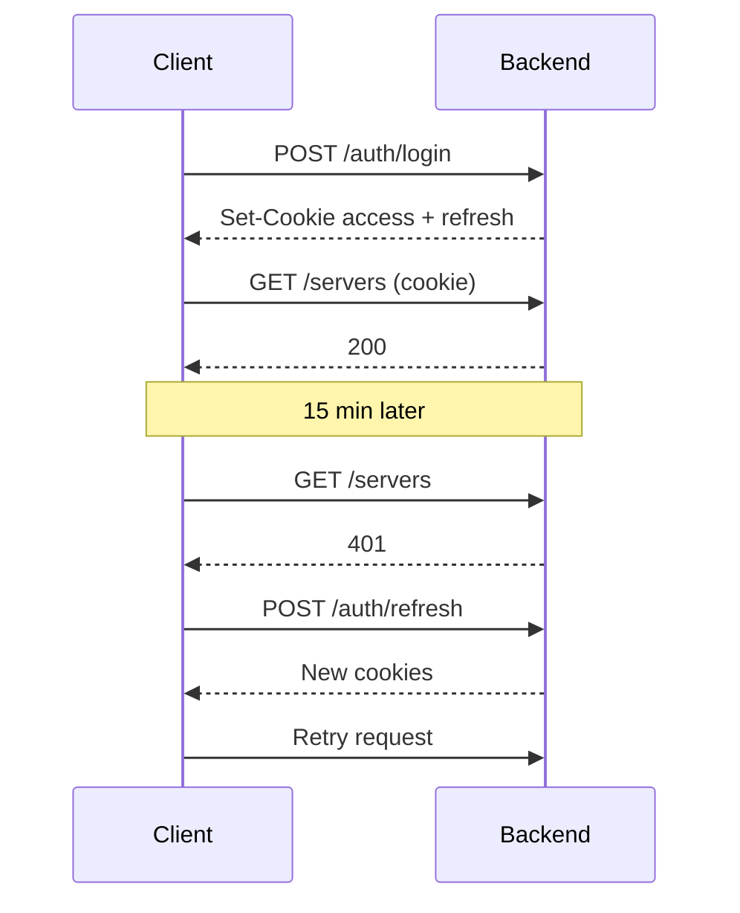
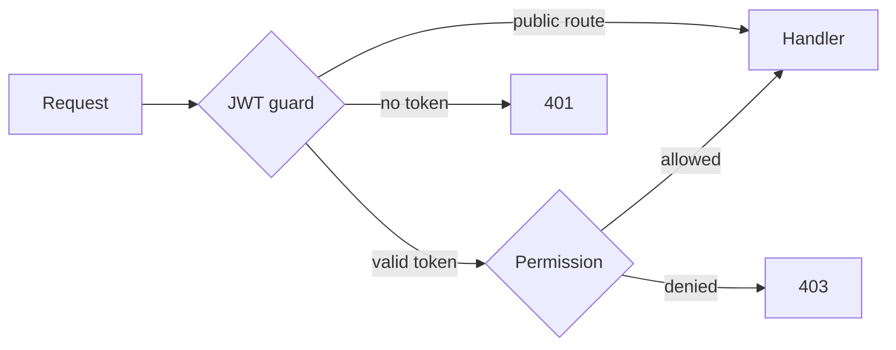

# API Reference

Minepanel exposes a REST API used by the web dashboard.

## Base URL

The backend runs behind the URL configured in `NEXT_PUBLIC_BACKEND_URL` on the frontend.

Examples:

- `https://panel.example.com/api`
- `http://localhost:8091`

If `BASE_PATH` is configured in the backend, that prefix is part of the API URL.

If the frontend is also served under a subpath, that is controlled separately by `NEXT_PUBLIC_BASE_PATH`.

## Authentication

Minepanel uses JWT sessions stored in `httpOnly` cookies set by `POST /auth/login`:

| Cookie | Lifetime | Used for |
| --- | --- | --- |
| `access_token` | 15 minutes by default (JWT; the deprecated `JWT_EXPIRES_IN` overrides it) | Every authenticated request |
| `refresh_token` | 7 days | `POST /auth/refresh` only; rotated on every refresh |



The dashboard does this retry automatically. A rotated refresh token stays valid for 60 seconds
so two tabs refreshing at once don't sign each other out.

- The access token is read from the cookie first, then from `Authorization: Bearer <token>`.
  The login flow never returns raw JWTs in the response body.
- JWT tokens are not accepted in query strings.

## Public Endpoints

These routes do not require an authenticated session:

| Method | Path | Purpose |
| --- | --- | --- |
| `GET` | `/health` | Liveness check |
| `POST` | `/auth/login` | Start a session |
| `POST` | `/auth/refresh` | Renew access token using `refresh_token` cookie |
| `POST` | `/auth/logout` | Clear session cookies and revoke refresh token when present |
| `GET` | `/auth/setup-status` | Whether first-run setup is pending, whether password recovery is available, and the SSO login options |
| `POST` | `/auth/setup-admin` | Create the first admin account; `409` once any user exists |
| `POST` | `/auth/forgot-password` | Email a password reset link (rate limited) |
| `POST` | `/auth/reset-password` | Set a new password with a reset token (rate limited) |
| `GET` | `/auth/invitations/:token` | Read an invitation before accepting it |
| `POST` | `/auth/invitations/accept` | Create an account from an invitation (rate limited) |
| `GET` | `/auth/oidc/login` | Begin SSO login, redirects to the OIDC provider (when SSO is configured) |
| `GET` | `/auth/oidc/callback` | OIDC provider callback; sets session cookies and redirects to the dashboard |
| `POST` | `/servers/autoscale` | mc-router auto-scaling webhook; disabled unless auto-scaling is enabled in Settings |
| `GET` | `/item-textures/:version/:item` | Cached vanilla item PNG, so `` tags load without credentials; never starts a download |

All other endpoints require JWT authentication. See [Single Sign-On](/sso) for SSO setup.



The JWT guard is global; per-server routes then check the user's server access and
permissions (for example **use console** or **view logs**).

## Login Flow

### Login

```bash
curl -i \
  -c cookies.txt \
  -H 'Content-Type: application/json' \
  -X POST https://panel.example.com/api/auth/login \
  -d '{"username":"admin-or-email@example.com","password":"changeme"}'
```

Successful login returns the username and token lifetime, and writes auth cookies.

### Initial Setup

```bash
curl -i \
  -c cookies.txt \
  -H 'Content-Type: application/json' \
  -X POST https://panel.example.com/api/auth/setup-admin \
  -d '{"username":"admin","email":"admin@example.com","password":"changeme123"}'
```

### Current Session

```bash
curl -b cookies.txt https://panel.example.com/api/auth/me
```

### Refresh Session

```bash
curl -i -b cookies.txt -c cookies.txt -X POST https://panel.example.com/api/auth/refresh
```

### Logout

```bash
curl -i -b cookies.txt -X POST https://panel.example.com/api/auth/logout
```

## Main Resource Groups

### Auth

- `POST /auth/login`
- `GET /auth/me`
- `POST /auth/refresh`
- `POST /auth/logout`

First-run setup and password recovery (public):

- `GET /auth/setup-status` — `{ requiresSetup, passwordRecoveryEnabled, sso: { enabled,
  providerName, passwordLoginDisabled, loginUrl } }`. `requiresSetup` is `true` until the first
  user exists
- `POST /auth/setup-admin` — body `{ username, email, password }`. Creates the first admin and
  signs it in (session cookies, like login). Answers `409` once setup is complete
- `POST /auth/forgot-password` — body `{ email }`. Always answers the same message whether or
  not the address belongs to an account; `503` when SMTP is not configured. The link expires
  after `PASSWORD_RESET_TOKEN_EXPIRES_IN_MINUTES` (default 60)
- `POST /auth/reset-password` — body `{ token, password }`. Single use; signs the user out of
  every existing session

`setup-admin` and `invitations/accept` create password accounts, so both are refused while SSO
has password login turned off.

Invitations (the **manage users** permission):

- `GET /auth/invitations` — open invitations with their role, access and `expiresAt`
- `POST /auth/invitations` — body `{ email?, permissions?, serverAccess? }`. Invited accounts
  are always `USER`. Admin-only permissions are ignored unless an admin sends them. Returns the `inviteUrl`
  and `emailSent` (the invitation is emailed when an address is given and SMTP is configured).
  Invitations expire after 7 days
- `GET /auth/invitations/:id/link` — `{ inviteUrl }` of an open invitation again (audited);
  `403` for a non-admin when the invitation carries admin-only permissions
- `GET /auth/invitations/:token` (public) — role, access, email and expiry of a valid
  invitation; `400` when it is used or expired
- `POST /auth/invitations/accept` (public) — body `{ token, username, password, email? }`.
  Creates the account and signs it in. `email` is only used when the invitation has none

### Servers

Main control plane for server creation, configuration, lifecycle, logs, commands, worlds, and related runtime actions.

Typical examples:

- `GET /servers`
- `GET /servers/:id`
- `POST /servers`
- `PUT /servers/:id`
- `POST /servers/:id/start`
- `POST /servers/:id/stop`
- `POST /servers/:id/stop/force` — skips the shutdown announcement (see below)
- `POST /servers/:id/restart`
- `GET /servers/:id/logs`
- `GET /servers/:id/logs/stream?lines=&since=` — `{ logs, hasErrors, lastUpdate, status,
  lastTimestamp, metadata }`; `lines` defaults to 500 (max 5000)
- `GET /servers/:id/logs/since/:timestamp` — only the lines after `timestamp`

Log endpoints need the **view logs** permission. `since`/`timestamp` accept an ISO 8601
timestamp, a Unix timestamp, or a duration such as `10m` or `1h30m`; anything else is `400`.

- `GET /servers/:id/gamerules` — `{ supported, complete, rules: [{ name, value }] }`, read over
  RCON; needs the **console** permission. Bedrock answers `supported: false`. `complete: false`
  means the list is the vanilla one and modded rules may be missing (1.21.11+ no longer lists
  rules in `help gamerule`)
- `GET /servers/:id/backups/snapshots` — restic snapshots of the server's backups; `400` unless
  the backup method is `restic`. Failures come back as `{ success: false, error }`
- `GET /servers/:id/players/whitelist`, `GET /servers/:id/players/ops`,
  `GET /servers/:id/players/banned` — the lists from the server's JSON files
- `POST /servers/:id/players/online` — body `{ rconPort, rconPassword? }`. `{ online, max,
  players, supportsRcon }` from the `list` command; Bedrock reads the answer from the log
- `GET /servers/:id/runtime-stats` — live status, CPU, memory, player totals, uptime and
  game version for one server
- `GET /servers/all-runtime-stats` — the same data keyed by server ID, filtered to the servers
  visible to the current user
- `GET /servers/:id/status` — `{ status }`: `running`, `stopped`, `starting` or `not_found`
- `GET /servers/all-status` — the same keyed by server ID, filtered to visible servers
- `GET /servers/:id/resources` — Docker CPU, memory, memory limit and disk usage as display
  strings plus `status`; every value is `N/A` while the server is not running
- `GET /servers/all-resources` — the same keyed by server ID, filtered to visible servers
- `GET /servers/:id/info` — container details plus the server's config, with secrets removed
- `DELETE /servers/:id` — stops the server and removes its whole directory (`server.json`,
  compose file and world data). Its player history and scheduled tasks are deleted and the ID
  is removed from every user's and invitation's server access, so a new server reusing the ID
  starts clean. Cannot be undone
- `POST /servers/:id/clear-data` — stops the server and empties `mc-data` (worlds, configs,
  mods); `server.json` is kept, so the next start rebuilds the server from its config
- `POST /servers/regenerate-all` — admin only. Rewrites every `docker-compose.yml` from its
  `server.json` and rebuilds the proxy routes; running containers keep their old settings until
  they are recreated

Game values (`playersOnline`, `playersMax`, `version`) are nullable. A container answers Docker
resource checks before Minecraft is ready to answer its Java or Bedrock status query; in that
window `gameReachable` is `false` and the API leaves those fields `null` instead of turning an
unavailable player count into zero. `playersMax` falls back to `maxPlayers` from `server.json`.

Modpack files uploaded for a server (`.zip` for CurseForge, `.mrpack` for Modrinth). They are stored
in `servers/<id>/modpacks/` and mounted read-only at `/modpacks`:

- `GET /servers/:id/worlds` — worlds available to this server, from its own library
  and the shared one (Java only)
- `PUT /servers/:id/worlds/select` — body `{ worldSource, worldScope, worldLevelName,
  forceWorldCopy?, restartIfRunning? }`. `worldScope` is `local` | `global`.
  An empty `worldSource` clears the selection: `WORLD` stops being generated, the server boots
  its own world at `LEVEL`, and `forceWorldCopy` is reset. Already-copied world data on disk is
  left untouched
- `GET /servers/:id/modpacks`
- `POST /servers/:id/modpacks` — multipart `file`
- `POST /servers/:id/modpacks/uploads` — body `{ name, size }`; opens a chunked upload (the
  dashboard uses it for packs over 8 MB). Chunks, `offset` and abort go through the
  `/files/:serverId/uploads/:id` routes below
- `POST /servers/:id/modpacks/uploads/:uploadId/complete` — moves the pack into `modpacks/` and
  returns it with its `inspection`, like the multipart upload
- `GET /servers/:id/modpacks/:fileName/inspect`
- `GET /servers/:id/modpacks/:fileName/mods`
- `POST /servers/:id/modpacks/:fileName/strip` — body `{ entries: string[] }`
- `DELETE /servers/:id/modpacks/:fileName`

Uploads are capped at 256 MB and rejected unless the file ends in `.zip` or `.mrpack`.

`inspect` reads the archive and reports how it has to be installed, so the dashboard can pick the
right server type instead of leaving it to trial and error. The upload response carries the same
object under `inspection`; `GET .../inspect` re-reads a file that is already stored. Listing does
not inspect: reading an archive means loading it whole, so only the selected file is read.

```json
{
  "kind": "curseforge-client",
  "name": "Tensura Evolutions",
  "minecraftVersion": "1.21.1",
  "loader": "NEOFORGE",
  "loaderVersion": "21.1.72",
  "hasStartScript": false,
  "hasMods": true,
  "needsLoader": false
}
```

| `kind` | Detected from | Installed as |
| --- | --- | --- |
| `curseforge-client` | `manifest.json` with a `minecraft` block | `AUTO_CURSEFORGE` + `CF_MODPACK_ZIP` |
| `modrinth` | `modrinth.index.json` | `MODRINTH` + `MODRINTH_MODPACK` |
| `server-pack` | loader installer jar or a start script | `CURSEFORGE` + `CF_SERVER_MOD` |
| `generic` | none of the above | loader server type + `GENERIC_PACK` |

An archive that cannot be read is reported as `generic` with `needsLoader: true` rather than
failing the request.

`mods` reads every jar under the archive's `mods/` folder and reports the side each one declares:
`client`, `server` or `both` from the jar's own metadata, `known-client` when the jar says nothing
but the mod is on the vendored client-only list, and `unknown` otherwise. Only Fabric and Quilt
declare a side (`fabric.mod.json` `environment`, `quilt.mod.json` `minecraft.environment`); Forge
and NeoForge keep it in bytecode, so their jars are usually `unknown`. The scan stops after 600
jars and says so with `truncated: true`.

`strip` writes a sibling archive without the given entry paths, named `<pack>-server.zip`, and
returns it like an upload. The original is never modified.

### Files

Server file browser API used by the dashboard.

Examples:

- `GET /files/:serverId/list?path=`
- `GET /files/:serverId/read?path=`
- `GET /files/:serverId/download?path=`
- `GET /files/:serverId/download-zip?path=` — one folder, or `path` repeated for a selection
  of files and folders, zipped under the name of their folder
- `POST /files/:serverId/write`
- `POST /files/:serverId/upload` — `?overwrite=false` refuses to replace an existing file (`409`)
- `POST /files/:serverId/upload-multiple` — with `?overwrite=false`, existing files are kept
  and listed by name in `skipped`; files that could not be saved are listed in `failed`
- `PUT /files/:serverId/rename`
- `DELETE /files/:serverId/delete?path=`
- `POST /files/:serverId/mkdir` — body `{ path }`
- `GET /files/:serverId/info?path=` — `{ name, path, isDirectory, size, modified, extension }`
- `GET /files/:serverId/download-zip?path=` — a folder as a streamed `<folder>.zip`; `400`
  when `path` is a file

In the `_root` file manager, admin-only files stay hidden from other users in listings and zip
downloads.

Chunked uploads (the dashboard uses them for files over 8 MB):

- `POST /files/:serverId/uploads` — body `{ path?, name, size, overwrite? }`; returns `{ id, offset: 0 }`.
  `overwrite: false` gets `409` when the file exists, before any byte is sent.
  Refused with `400` when the target is not writable or is a folder, `507` when the disk
  cannot hold `size`
- `PUT /files/:serverId/uploads/:id?offset=` — raw `application/octet-stream` body, at most
  16 MB, appended at `offset`. Returns the new `{ offset }`. An `offset` that is not the current
  end of the staged file gets `409` with the real `offset`, so a retried chunk is never written twice
- `GET /files/:serverId/uploads/:id` — current `{ offset }`, to resume after a dropped chunk
- `POST /files/:serverId/uploads/:id/complete` — moves the file into place once `offset === size`
- `DELETE /files/:serverId/uploads/:id` — abort

Sessions belong to the user and server that opened them. They are staged in
`servers/.upload-sessions/`, survive a backend restart, and are removed after 24 hours idle.

The disk is protected on creation: a user can have 5 uploads in progress (`429` beyond that; one
that has been idle for 15 minutes is treated as abandoned and replaced), and the free-space check
also counts what the other uploads in progress still have to write (`507`); one idle for 15
minutes no longer holds that space. An upload cannot be aborted while it is being completed
(`409`), and a session only completes through the route that opened it (files or modpacks).

Important path semantics:

- `serverId="_root"` targets the global servers root used by the file manager
- `serverId=".world"` targets the global world library
- Any normal `serverId` targets that server's `mc-data`
- Under `_root`, `.uploads` and `.upload-sessions` (uploads in progress) are visible to admins only

### Settings

Per-user panel settings and integration configuration.

Examples:

- `GET /settings`
- `PATCH /settings` — when the body sets a new `cfApiKey`, the key is saved and the
  response also carries `cfApiKeyCheck` (same shape as below). A failed check never fails the save.
- `POST /settings/test-discord-webhook`
- `POST /settings/test-curseforge-key` — body `{ "cfApiKey"?: string }`. Tests that key, or the
  saved one when omitted, against CurseForge and stores nothing. Returns `{ ok: true }` or
  `{ ok: false, code }` with `code` one of `not_configured`, `invalid_credentials`,
  `rate_limited`, `timeout`, `unreachable`, `unexpected`. Needs the system settings permission.
- `POST /settings/proxy/power` — body `{ "enabled": true | false }`. Starts or stops
  the mc-router container right away instead of waiting for a settings save
- `GET /settings/integrations` — masked SMTP/OIDC/notification config (admin only; secrets are
  never returned)
- `PATCH /settings/integrations` — write-only secrets: omit to keep, `""` to clear
- `POST /settings/integrations/smtp/test`
- `POST /settings/integrations/notifications/test` — admin only; body
  `{ "channel": "discord" }`, `{ "channel": "email" }`, `{ "channel": "telegram" }`, `{ "channel": "ntfy" }` or `{ "channel": "slack" }`. Uses the saved destination,
  even if automatic delivery is disabled. Returns `{ success, message }`.

`PATCH /settings/integrations` accepts a nested `notifications` object:
`{ ntfyEnabled?, ntfyServerUrl?, ntfyTopic?, ntfyToken?, slackEnabled?, slackWebhook?, discordEnabled?, emailEnabled?, emailTo?, telegramEnabled?, telegramToken?,
telegramChatId?, lifecycleEnabled?, alertsEnabled?, diskAlertEnabled?,
backupFailureEnabled?, recoveryEnabled?, diskFreeThresholdPercent?, alertCooldownMinutes?, taskFailureEnabled?, gameAlertEnabled?, staleBackupEnabled?,
gameFailureSamples?, gameStartupGraceMinutes?, staleBackupToleranceMinutes? }`. These are instance-wide,
admin-managed destinations for all servers. Email accepts one address. Telegram accepts a
numeric chat ID or `@channel_username`; enabled channels require their destination (and
Telegram requires a token). `telegramToken` is write-only: omit to keep, `""` to clear.
The GET/PATCH responses expose `hasTelegramToken`, never the token. Discord continues
using the existing first configured user webhook. New channels default to disabled;
Discord and both event groups default to enabled. The additional disk/backup/recovery rules
start disabled. `diskFreeThresholdPercent` is 1–50 (default 10), `alertCooldownMinutes` is
1–10080 (default 60). Per-type switches control which automatic messages are sent.
Partial updates preserve omitted settings. Test failures return and log sanitized diagnostic
reasons (such as an SMTP error code or Telegram HTTP status), never raw provider responses.

ntfy defaults to `https://ntfy.sh`; `ntfyServerUrl` accepts HTTP/HTTPS without credentials,
query or fragment, including a self-hosted path prefix. `ntfyTopic` uses 1–64 letters,
digits, underscores or hyphens when enabled. `ntfyToken` is optional and write-only.
`slackWebhook` accepts HTTPS incoming webhook URLs under `hooks.slack.com/services/`
or `hooks.slack-gov.com/services/`, and is write-only. GET/PATCH return only
`hasNtfyToken` / `hasSlackWebhook`. Secret fields accept `""` to clear and omission to retain.
Both new channels start disabled and use the existing event switches and test endpoint.
Requests reject redirects to avoid forwarding credentials to another host.

The admin-only GET/PATCH integration responses include `systemDiscordConfigured` and
`notificationDelivery` (`discord`, `email`, `telegram`, `ntfy`, `slack`, each null or
`{ status: "accepted" | "failed" | "unknown", attemptedAt, source: "automatic" | "test", reason? }`).
Results are transient, contain no recipient/token/log payload and reset on restart or settings change.
New rules default to disabled: `gameFailureSamples` 1–30 (default 3),
`gameStartupGraceMinutes` 1–1440 (default 5), `staleBackupToleranceMinutes` 1–10080 (default 60).
Runtime stats additionally expose `gameQueryStatus: "healthy" | "failed" | "unknown"`;
`gameReachable` and nullable player/version values retain their existing behavior.

### Users

User CRUD and password changes.

Examples:

- `GET /users`
- `GET /users/one`
- `POST /users`
- `PATCH /users/:id`
- `PATCH /users/:id/role` (admin only, `{ "role": "ADMIN" | "USER" }`)
- `DELETE /users/:id`
- `POST /users/change-password`
- `PUT /users/username/:username` — same body and rules as `PATCH /users/:id`, addressed by
  username
- `PATCH /users/:id/access` — body `{ isActive?, permissions?, serverAccess? }` (manage users).
  Admin access cannot be changed, and admin-only permissions keep their stored value unless an
  admin sends them
- `PATCH /users/profile` — body `{ email }`, the caller's own address. With SMTP configured it
  answers `{ requiresConfirmation: true, pendingEmail }` and emails a six-digit code valid for
  15 minutes. Without SMTP only an admin can change their address (applied directly); other
  users get `400`
- `POST /users/profile/confirm-email` — body `{ code }`; applies the pending address
  (rate limited)

### Scheduled tasks

Per-server restarts, console commands and rotating announcements. Requires access to the server.

- `GET /scheduled-tasks/:serverId`
- `POST /scheduled-tasks/:serverId` — body `{ name, type, command?, scheduleKind?,
  intervalMinutes?, cronExpression?, enabled? }`
- `PUT /scheduled-tasks/:serverId/:taskId` — same fields, all optional
- `DELETE /scheduled-tasks/:serverId/:taskId`
- `POST /scheduled-tasks/:serverId/:taskId/run` — runs it now and returns the task with its
  `lastResult`

`type` is `restart`, `command` or `announce`:

- `command` runs `command` (up to 1024 characters) over RCON and needs the **console**
  permission, for creating, editing and running it
- `announce` takes one message per line in `command` (up to 20 lines of 256 characters). Each run
  sends the next line with `tellraw`, so there is no `[Server]` prefix; `&` colour codes are
  converted. Java only: on Bedrock the run is skipped with that reason in `lastResult`
- `restart` ignores `command`

`scheduleKind` is `interval` (default; `intervalMinutes` 1–43200) or `cron` (`cronExpression`,
validated on save).

### Alerts

Alerts per server. Requires access to the server. Delivery uses the channels and event
switches configured by an admin through `PATCH /settings/integrations`. The existing Discord
webhook and alert language still come from the first configured user webhook settings;
email and Telegram work without a Discord webhook.

- `GET /alerts/:serverId`
- `PUT /alerts/:serverId` — body `{ downAlertEnabled?, resourceAlertEnabled?,
  cpuThresholdPercent?, memoryThresholdPercent?, sustainedMinutes?, cooldownMinutes? }`.
  Thresholds are 1–100 %, `sustainedMinutes` 1–1440 and `cooldownMinutes` 1–10080

### Audit log

- `GET /audit?userId=&action=&outcome=&serverId=&dateFrom=&dateTo=&limit=` — newest first,
  `limit` defaults to 200 (max 500); `outcome` is `success` or `error` and the dates are ISO
  8601. Needs the **manage users** permission

### Achievements

The End Portal easter egg's advancements, per user. Only the caller's own rows.

- `GET /achievements` — `[{ "key": "advStrike", "unlockedAt": "..." }]`
- `POST /achievements` — body `{ "key": "advStrike" }`. Idempotent: earning a key again keeps
  the first `unlockedAt`. Unknown keys return `400`

### End runs

Timed finishes of the End Portal easter egg (Speedrun and Hardcore modes), shared by the panel's users.

- `POST /end-runs` — body `{ "mode": "speedrun" | "hardcore", "timeMs": 690000, "splits": { "nether": 120000, ... } }`.
  `timeMs` must be between one minute and one day; splits must be known zones (`nether`,
  `stronghold`, `end`, `endcity`), in order and before the finish. Otherwise `400`
- `GET /end-runs/leaderboard?mode=speedrun` — `{ "top": [{ "username", "timeMs", "finishedAt" }], "mine": { "timeMs", "rank" } | null }`:
  each user's best run, fastest first, top ten, and the caller's own place. Visible to every user

### Server monitoring

The endpoints require authentication and access to the requested server.

- `GET /metrics/:id/live` — resource usage, players, uptime, timestamp and tick
  measurements, cached for 10 seconds with concurrent request deduplication.
  `tickStatus` is `available`, `offline`, `unsupported`, `rcon_disabled`,
  `spark_missing`, `custom_paused`, or `unavailable`. `tickSource` is `neoforge`, `spark`, `tabtps`, `custom`, or null.
  NeoForge returns estimated `tps` and `msptMean`; spark returns 1-minute `tps`,
  `msptMedian` and `msptP95` over 10 seconds; TabTPS and custom patterns return
  `tps` and `msptMean`. Unavailable values are null.
- `POST /metrics/:id/tick-test` — admin only. Body `{ "tickCommand": string, "tickTpsPattern"?: string, "tickMsptPattern"?: string }`.
  Runs the command once over RCON without saving and returns
  `{ success, output, parsed: { source, tps, msptMean, msptMedian, msptP95 } | null }`.
  Patterns must compile, contain a capture group, and match within 50 ms (400 otherwise, also
  for a pattern that backtracks catastrophically). Each run is recorded in the audit log as
  `test_tick_command` with the command text, like console commands.
- `GET /metrics/:id/history?hours=24` — `{ serverId, hours, points }`, with the
  window clamped to 1–168 hours. Points contain `timestamp`, `cpuPercent`,
  `memoryMb`, `memoryLimitMb`, `playersOnline`, `tps`, `tickSource`, `msptMean`,
  `msptMedian`, and `msptP95`. New tick/player fields are nullable for older rows.
  Samples are collected every minute and retained for 7 days.

### Players

Read-only player data from a Java server's world files (works while the server is stopped).
Requires access to the server.

- `GET /players/:serverId` — everyone in `playerdata`/`stats`/`advancements`, the whitelist,
  ops and ban list: flags, last seen (player file mtime), stats summary and advancement count
- `GET /players/:serverId/:uuid` — the same plus all statistics by category, advancements with
  completion date, inventory, armor, offhand, ender chest (items carry enchantments and, when
  damaged, `damage`/`maxDamage`), last position and spawn point, `vitals` (health, food, XP level
  and progress, game mode), active `effects`, and `textureVersion` (the world's game version)
- `GET /item-textures/:version/:item` — public; the cached vanilla PNG for an item id (without
  `minecraft:`), 404 until that version's textures have been fetched. Fetching is only started by
  an authenticated profile read.
- `GET /players/:serverId/items/search?q=` — who holds an item now (saved inventories, ender
  chests, carried shulker boxes and bundles); matches the item id or custom name, 2+ characters

Online state is not part of these responses; the panel combines them with the RCON player list.
Player actions go through `POST /servers/:id/command`.

### Activity

Activity log built from the server log (Java, opt-in per server). Requires access to the server.

- `GET /activity/:serverId/settings` / `PUT /activity/:serverId/settings` (`{ enabled }`) — turns
  tracking on or off; stored as `activityTracking` in `server.json` and ignored by `PUT /servers/:id`
- `POST /activity/:serverId/import-history` — reads archived logs older than tracking, once
  (`409` on a second call, `400` when tracking is off); also adds the sessions older than the first
  one `player-activity` recorded
- `GET /activity/:serverId/events?types=chat,death&name=&q=&from=&to=&before=&limit=` — newest
  first, paged by `nextCursor`; needs the **view logs** permission
- `GET /activity/:serverId/players/:uuid/snapshots` — inventory snapshots, newest first, each with
  the death it precedes (if any); `GET /activity/:serverId/snapshots/:id` — one snapshot's items

### System

Host monitoring endpoints:

- `GET /system/stats`
- `GET /system/network`
- `GET /version` — running version, newest release, the release notes for everything
  in between parsed into sections, and whether any of it is breaking; the GitHub
  lookup is cached for an hour (five minutes when it failed) and never fails the
  request. `?refresh=true` skips that cache, at most once a minute
- `GET /version/update-status` — `current` plus the outcome of the last update.
  Polled while one is running; answers from disk, without calling GitHub
- `POST /version/update` — starts a panel update in a throwaway container (admin
  only). Answers `400` when the panel was not started by Docker Compose

### Mod Providers

CurseForge modpacks:

- `GET /curseforge/popular?limit=10` — modpacks sorted by popularity
- `GET /curseforge/modpacks/:ref` — one modpack by numeric ID or slug; `404` when no modpack
  has that slug
- `GET /curseforge/modpacks/:ref/files` — `{ data }`, up to 50 of the modpack's files
- `GET /curseforge/:id` — one modpack by numeric ID

Mods, datapacks and shared lookups:

- `GET /curseforge/search`
- `GET /curseforge/featured`
- `GET /curseforge/mods/search` — supports `sort` (`relevance` | `downloads` | `updated`) and `category` (category ID)
- `GET /curseforge/mods/categories` — mod categories used by the search filter
- `GET /curseforge/mods/resolve` — `refs` is a comma-separated list of slugs/IDs; returns their metadata (name, icon, downloads)
- `GET /curseforge/mods/:ref/versions` — files for a mod, filtered by `minecraftVersion` and `loader`
- `GET /curseforge/mods/files/resolve` — `ids` is a comma-separated list of file IDs; returns their names
- `GET /curseforge/mods/latest` — newest compatible version per `refs`, used to flag outdated pins
- `GET /modrinth/mods/search` — supports `sort` (`relevance` | `downloads` | `updated`) and `category` (category slug)
- `GET /modrinth/mods/categories` — mod categories for `projectType` (`mod` | `datapack`)
- `GET /modrinth/projects/resolve` — same `refs` contract as CurseForge
- `GET /modrinth/projects/:ref/versions`
- `GET /modrinth/versions/resolve` — same `ids` contract as CurseForge
- `GET /modrinth/projects/latest` — same `refs` contract as CurseForge
- `GET /curseforge/mods/:ref/files/:fileId/changelog` — changelog text for one file, resolved lazily on demand

Search and version endpoints treat `minecraftVersion=latest` (or empty) as "no version
filter" instead of returning zero results. CurseForge endpoints use the global API key
from user settings; Modrinth needs no credentials. Modrinth version objects (from
`/modrinth/projects/:ref/versions` and `/modrinth/versions/resolve`) carry their `changelog`
inline at no extra request cost.

### Mod Watch

The **Mod Watch** tab's annotations live on the server's own config (`servers/<serverId>/server.json`)
as `modNotes` and `modWatchTargetVersion`, so there is no second per-server state file and
`POST /servers/:id/clone` carries them:

- `PUT /servers/:id/mod-watch` — body `{ "targetVersion"?: "1.21.4" | null, "notes"?: { "<provider>:<mod-ref>": "..." } }`

Note keys are namespaced by provider (`curseforge:jei`, `modrinth:sodium`), since the same ref can
exist on both platforms.

`notes` is the complete map, not a patch: the tab sends it pruned to the mods still configured, which
is how a note for a removed mod stops being stored. Blank notes are dropped, and `targetVersion: null`
clears the watch. Omitting either field leaves it untouched.

### Default spawn point

The Players tab's **TP Spawn** quick action and the Commands tab's "teleport all" coordinates
share one per-server default, stored as `spawnX`/`spawnY`/`spawnZ` on `server.json` (falls back to
`0, 100, 0` when unset):

- `PUT /servers/:id/spawn-point` — body `{ "x"?: number | null, "y"?: number | null, "z"?: number | null }`

Like `mod-watch`, this writes `server.json` directly without regenerating the compose file, so it
stays usable while the server is running. Omitting an axis leaves it untouched; `null` clears it
back to the default.

- `PUT /servers/:id/tick-command` — admin only. Body `{ "tickCommand"?: string, "tickTpsPattern"?: string, "tickMsptPattern"?: string }`.
  Stores the Metrics tab's custom tick command on `server.json` (single line, at most 100
  characters; patterns at most 200 characters and must compile with a capture group; a bad
  pattern is a 400). Empty values clear the setting, and an MSPT pattern without a TPS pattern
  is dropped. Like `spawn-point`, it does not regenerate the compose file. The audit entry
  `update_tick_command` carries the command and patterns. The `tick*` fields are ignored for
  non-admins on `POST /servers` and `POST /servers/:id/clone` (an admin's clone keeps them), and
  stripped from `PUT /servers/:id`, so this endpoint is the only way to change them.

This is the **only** way to write either field. `PUT /servers/:id` drops them: the panel submits the
whole config it loaded, so a page opened before a note was written would otherwise put its stale copy
back.

This is deliberately separate from `PUT /servers/:id`: that regenerates `docker-compose.yml`, and
regeneration re-runs port allocation. Mod Watch is the one tab that stays usable while the server is
running, so it writes `server.json` directly and never touches the compose file. Neither field is
compose input. Access control and the `servers` audit log are the same as any other server config
change (action `update_mod_watch`).

### World Discovery

Global world library search/import and CurseForge metadata lookup:

- `GET /world-discovery/library` - lists what is already in the shared library
- `GET /world-discovery/search`
- `POST /world-discovery/import`
- `GET /world-discovery/curseforge/:projectId`

`GET /world-discovery/library` returns one entry per world - a folder holding a
`level.dat` or a supported archive - with the path relative to the library root as
`source`, which is what a server stores as `worldSource`. Folders that are not
worlds are walked into, so imports grouped under `curseforge/` or `url/` show up.
`sizeBytes` is `0` for folders: measuring one means walking every region file.

### Vanilla Tweaks

- `GET /vanilla-tweaks/:code` — what a [Vanilla Tweaks](https://vanillatweaks.net) share code
  installs: `{ code, type, version, packs }`, where `type` is `datapacks`, `craftingtweaks` or
  `resourcepacks` and `packs` maps each category to pack names. `400` for a malformed code (3–16
  letters or digits), `404` when Vanilla Tweaks does not know it, `503` when it cannot be
  reached or does not give a usable answer (a `403` or `429`, a page instead of JSON), which is
  never remembered as "unknown". Answers are cached for 10 minutes

A server stores its codes as `vanillaTweaksCodes` in `server.json` (sent to itzg as
`VANILLATWEAKS_SHARECODE`). `POST /servers` and `PUT /servers/:id` look up codes that are new to
the server (Java only) and answer `400` for an unknown code or a resource pack code; when Vanilla
Tweaks cannot be reached, the save goes through unchecked.

### Bedrock Addons

Bedrock addon management:

- `GET /bedrock-addons/:serverId`
- `POST /bedrock-addons/:serverId/upload`
- `GET /bedrock-addons/:serverId/curseforge/search`
- `POST /bedrock-addons/:serverId/curseforge/import`
- `PUT /bedrock-addons/:serverId/order` — body `{ "addonIds": ["..."] }` with every installed addon ID in priority order (first = highest priority)
- `POST /bedrock-addons/:serverId/:addonId/enable`
- `POST /bedrock-addons/:serverId/:addonId/disable`
- `DELETE /bedrock-addons/:serverId/:addonId`

### Proxy

mc-router proxy status and mapping management:

- `GET /proxy/status`
- `GET /proxy/mappings`
- `GET /proxy/server/:id/hostname`
- `POST /proxy/server/:id`
- `DELETE /proxy/server/:id`

Auto-scaling webhook, called by mc-router (see [Networking](/networking#auto-scaling-sleep-when-idle)):

- `POST /servers/autoscale`

```json
{ "action": "up", "serverAddress": "survival.mc.example.com", "backend": "survival:25565" }
```

Requires `Authorization: Bearer <token>`, where the token is the one the panel generated when auto-scaling was enabled. `action: "up"` starts the server and only answers `200` once it accepts connections; `action: "down"` stops it. Servers that are not in the proxy routes are rejected with `404`. When a server has auto-scaling turned off, `down` answers `200` with `{ "status": "skipped" }` and `up` is rejected with `503`.

## Response Patterns

Minepanel uses standard HTTP status codes:

- `200` successful read/update action
- `201` resource created
- `400` validation or bad input
- `401` missing or invalid authentication
- `404` resource not found
- `500` internal server error

Typical unauthorized response:

```json
{
  "status": 401,
  "error": "Unauthorized"
}
```

Validation errors usually come from NestJS validation pipes.

## Security Notes

- Treat the API as private by default.
- Prefer cookie-based auth for browser clients.
- Do not send JWT tokens in query params.
- File and proxy endpoints are protected and should not be exposed through unauthenticated reverse-proxy exceptions.
- Restrict access to trusted users only; Minepanel can control Docker and host-mounted server data.

## Related

- [Architecture](/architecture)
- [Configuration](/configuration)
- [Development](/development)

## Player activity

Authentication and access to the selected server are required.

| Method | Endpoint | Description |
| --- | --- | --- |
| GET | `/servers/:id/player-activity?page=0` | Recorded player summaries, newest observation first |
| GET | `/servers/:id/player-activity/:key?page=0` | Profile, saved Java world statistics, session summary (average, longest, weekday totals, day streak, known deaths) and session history. Sessions of Java servers with the activity log on also carry stat deltas and `events` (chat, advancements, deaths); both are null otherwise |

Pages are zero-based with 25 items and `hasMore`. Player keys are returned by the list;
URL-encode them when requesting details (`java:alex` or `bedrock:<XUID>`).
Both responses include `status` (`collecting`, `offline`, `unavailable`) and `sampledAt`.
Profiles include `firstSeen`, `lastSeen`, `sessionCount`, `totalSeconds`, and nullable `online`.
Sessions include `joinedAt`, `lastSeenAt`, nullable `leftAt`, `durationSeconds`, and nullable
`endReason` (`left`, `interrupted`). An interrupted session ends at its last observation,
not a known logout time. Unknown presence and unavailable statistics are null.

Collection runs every 30 seconds from Docker logs; opening these endpoints does not run
Docker commands. See [player activity limitations](/features#player-profiles-and-session-history).
