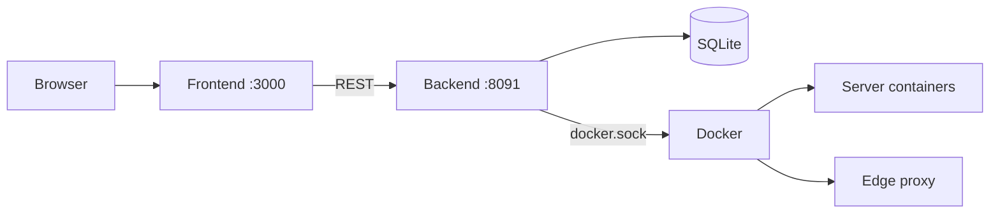
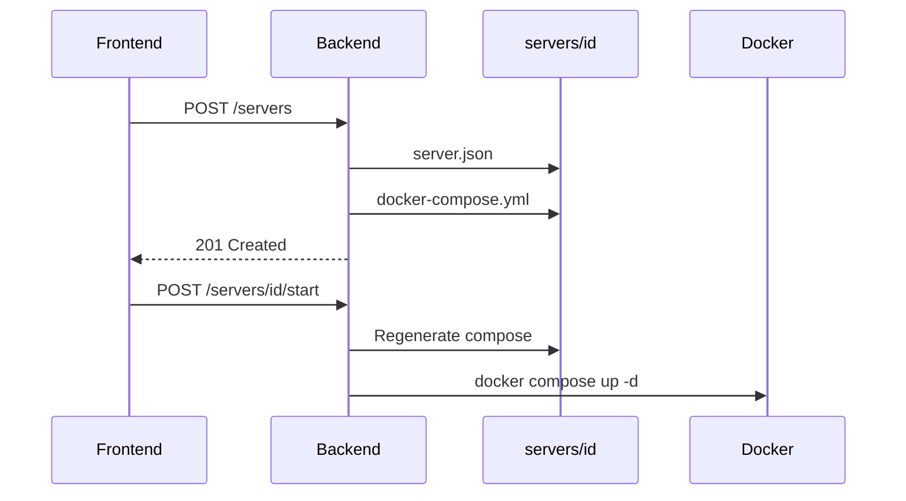
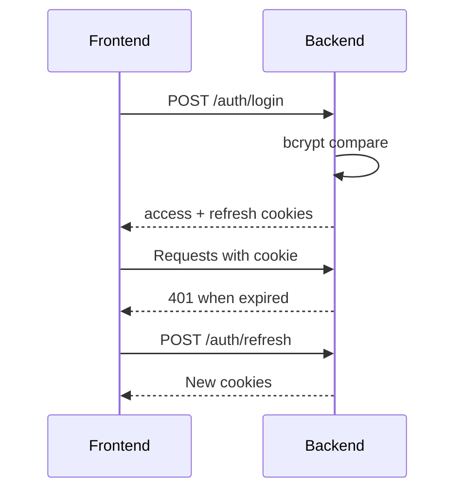
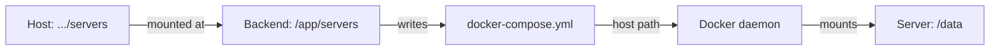

# Architecture

## Overview


```mermaid
flowchart LR
    B["Browser"] --> F["Frontend :3000"]
    F -->|"REST"| API["Backend :8091"]
    API --> DB[("SQLite")]
    API -->|"docker.sock"| D["Docker"]
    D --> MC["Server containers"]
    D --> E["Edge proxy"]
```

| Piece | Runs as | Notes |
| --- | --- | --- |
| Frontend | `frontend` container (Next.js) | Talks only to the backend API |
| Backend | `backend` container (NestJS) | Owns `servers/` and `data/`, drives Docker through the socket |
| Database | `data/minepanel.db` (SQLite via sql.js) | Users, settings, audit, metrics, player sessions |
| Minecraft servers | One compose project per server | `itzg/minecraft-server` or `itzg/minecraft-bedrock-server` |
| Edge proxy | Its own compose project | mc-router in `data/proxy/` or Velocity in `data/velocity/`, never both |

## Components

### Frontend (Next.js)

- **Tech:** Next.js 16, React 19, TypeScript, Tailwind CSS 4, shadcn/ui
- **Role:** Web interface, API calls, real-time updates

### Backend (NestJS)

- **Tech:** NestJS, TypeScript, TypeORM + sql.js (SQLite), Passport.js, bcrypt
- **Role:** REST API, Docker management, authentication

### Docker Integration

The backend runs the `docker` / `docker compose` CLI against the mounted
`/var/run/docker.sock` to:

| Task | How |
| --- | --- |
| Start / stop / restart | `docker compose up -d` / `down` in the server's folder |
| Logs | Bounded `docker logs` windows |
| Console commands | `rcon-cli` inside the container (RCON) |
| Resources and uptime | `docker stats`, `.State.StartedAt` |
| Players and version | The bundled `mc-monitor` probe (Java and Bedrock) |

## Data Flow

### Creating a Server

Creating a server only writes files; nothing runs until it is started.


```mermaid
sequenceDiagram
    participant UI as Frontend
    participant API as Backend
    participant FS as servers/id
    participant D as Docker
    UI->>API: POST /servers
    API->>FS: server.json
    API->>FS: docker-compose.yml
    API-->>UI: 201 Created
    UI->>API: POST /servers/id/start
    API->>FS: Regenerate compose
    API->>D: docker compose up -d
```

`server.json` is the source of truth. `docker-compose.yml` is regenerated from it before
every start and is never read back.

### Server Container

Each server uses [itzg/docker-minecraft-server](https://github.com/itzg/docker-minecraft-server):

```yaml
# Simplified excerpt of a generated servers/survival/docker-compose.yml
services:
  mc:
    image: itzg/minecraft-server:latest
    environment:
      ID_MANAGER: survival
      EULA: 'TRUE'
      TYPE: PAPER
      VERSION: 1.21.4
      INIT_MEMORY: 1G
      MAX_MEMORY: 2G
      ENABLE_RCON: 'true'
    ports:
      - '25565:25565'
    volumes:
      - /home/user/minepanel/servers/survival/mc-data:/data
      - /home/user/minepanel/servers/survival/modpacks:/modpacks:ro
```

Volume sources are absolute **host** paths, see [Host paths](#base-dir-explained).

## Directory Structure

```
minepanel/
├── docker-compose.yml
├── .env
├── data/                       # mounted at /app/data
│   ├── minepanel.db            # SQLite database
│   ├── proxy/                  # mc-router compose project + routes.json
│   └── velocity/               # Velocity compose project + server/
└── servers/                    # mounted at /app/servers
    ├── servers.json            # Derived index (cache, safe to delete)
    ├── .world/worlds/          # World Library (shared by all servers)
    └── survival/
        ├── server.json         # Source of truth for this server
        ├── docker-compose.yml  # Generated from server.json
        ├── mc-data/            # /data in the container: world, plugins, mods
        ├── worlds/             # This server's world sources (folders, zip, tar)
        ├── modpacks/           # Uploaded modpacks, mounted read-only
        └── backups/            # mc-backup output (default location)
```

## Security


```mermaid
sequenceDiagram
    participant UI as Frontend
    participant API as Backend
    UI->>API: POST /auth/login
    API->>API: bcrypt compare
    API-->>UI: access + refresh cookies
    UI->>API: Requests with cookie
    API-->>UI: 401 when expired
    UI->>API: POST /auth/refresh
    API-->>UI: New cookies
```

| | |
| --- | --- |
| Passwords | bcrypt, 12 rounds |
| Access token | JWT, 15 minutes, `httpOnly` cookie |
| Refresh token | Random, 7 days, stored hashed, rotated on every refresh |
| CORS | Allowed origin is `FRONTEND_URL` |

Details and endpoints: [API Reference](/api#authentication).

### Docker Socket

::: warning
Access to the Docker socket is root access to the host. Only give Minepanel accounts to people
you trust with that.
:::

Optional: Use [Docker Socket Proxy](https://github.com/Tecnativa/docker-socket-proxy) for additional security.

## BASE_DIR Explained

The backend writes files through its own mounts (`/app/servers`, `/app/data`), but the compose
files it generates are run by the Docker daemon **on the host**, so their volume sources must be
host paths:


```mermaid
flowchart LR
    H["Host: .../servers"] -->|"mounted at"| C["Backend: /app/servers"]
    C -->|"writes"| Y["docker-compose.yml"]
    Y -->|"host path"| D["Docker daemon"]
    D -->|"mounts"| S["Server: /data"]
```

At startup the backend inspects its own container and reads the host `Source` of the
`/app/servers` and `/app/data` mounts (`backend/src/config.ts`). `BASE_DIR` is only the
fallback when that is not possible (local development without Docker). See
[Storage & Scaling](/storage-scaling) for named volumes and network filesystems.

This is the same pattern used by Portainer, Yacht, and other Docker management panels.

## Tech Stack

| Layer      | Technology            | Why                           |
| ---------- | --------------------- | ----------------------------- |
| Frontend   | Next.js               | SSR, great DX                 |
| Backend    | NestJS                | TypeScript native, modular    |
| Database   | SQLite (sql.js)       | Simple, no setup              |
| Containers | Docker                | Isolation, portability        |
| MC Images  | itzg/minecraft-server | Most popular, well maintained |

## Related

- [Development](/development) - Contributing
- [Configuration](/configuration) - Settings
- [Features](/features) - Capabilities

## Game-performance monitoring

`MetricsController` checks server access for live and history queries.
`MonitoringService` combines runtime status with fixed, bounded, container-local
RCON probes; it shares cached results between the UI and the background sampler.
NeoForge/CurseForge uses native overall tick data first, with spark support on
compatible Java servers. An admin-set `tickCommand` in `server.json` replaces both
and is parsed by `tick-stats.ts` (TabTPS, NeoForge, spark or regex patterns). `MetricSample` stores the source alongside distinct
mean, median and P95 columns; schema synchronization adds nullable fields so
existing resource history is preserved. No generated compose files are parsed.

## Player activity collection

`backend/src/player-activity/` polls bounded Docker log windows through
`ServerManagementService.readPlayerLogWindow`. Each server's session changes and cursor
commit together in a SQLite transaction (`player_sessions`, `player_tracking`). The sampler
prevents overlapping runs and handles servers sequentially. Container boot identity and
sampling gaps prevent open sessions from silently spanning unknown downtime. On Java servers
with the activity log on, a live join and a leave hand the session to `ActivityService`, which
adds the uuid, a stats baseline and inventory snapshots, then the per-session stat deltas; an
interrupted session drops its baseline, since its deltas are unknown.

`PlayerStatsService` reads only bounded, server-contained Java `usercache.json`,
`server.properties`, and world `stats/<uuid>.json` files. It resolves symlinks before reading,
rejects escapes and returns selected numeric counters. Game files are never modified.
The frontend lazily loads the Players tab, polls after request completion, and cancels
requests on player/server/page changes.
