# Architecture

## Overview

```mermaid
flowchart TB
    User["👤 User"] --> Browser["🌐 Browser"]
    Browser --> Frontend["⚛️ Frontend<br/>Next.js :3000"]
    Frontend <-->|REST API| Backend["🔧 Backend<br/>NestJS :8091"]
    Backend <-->|Docker Socket| Docker["🐳 Docker Engine"]
    Backend <-->|SQLite| DB["💾 Database"]

    subgraph servers["Minecraft Servers"]
        MC1["🎮 Server 1"]
        MC2["🎮 Server 2"]
    end

    Docker --> servers

    style Frontend fill:#0f172a,stroke:#3b82f6,color:#fff
    style Backend fill:#0f172a,stroke:#22c55e,color:#fff
    style Docker fill:#0f172a,stroke:#0ea5e9,color:#fff
```



## Components

### Frontend (Next.js)

- **Tech:** Next.js 14, React 18, TypeScript, TailwindCSS, shadcn/ui
- **Role:** Web interface, API calls, real-time updates

### Backend (NestJS)

- **Tech:** NestJS, TypeScript, Passport.js, bcrypt
- **Role:** REST API, Docker management, authentication

### Docker Integration

Backend communicates via `/var/run/docker.sock` to:

- Create/start/stop containers
- Read logs
- Execute commands (RCON)
- Monitor resources

## Data Flow

### Creating a Server


### Server Container

Each server uses [itzg/docker-minecraft-server](https://github.com/itzg/docker-minecraft-server):

```yaml
services:
  my-server:
    image: itzg/minecraft-server:latest
    environment:
      EULA: 'TRUE'
      TYPE: 'PAPER'
      VERSION: '1.20.1'
      MEMORY: '2G'
    ports:
      - '25565:25565'
    volumes:
      - ./mc-data:/data
```

## Directory Structure

```
minepanel/
├── docker-compose.yml
├── .env
├── data/
│   └── minepanel.db      # SQLite database
└── servers/
    ├── server-1/
    │   ├── mc-data/      # World, plugins, mods
    │   └── backups/
    └── server-2/
```

## Security

```mermaid
sequenceDiagram
    User->>Frontend: Login
    Frontend->>Backend: POST /auth/login
    Backend->>Backend: Validate (bcrypt)
    Backend->>Frontend: JWT in httpOnly cookie
    Frontend->>User: ✅ Logged in
```



- Passwords: bcrypt (12 rounds)
- Sessions: JWT in httpOnly cookies
- CORS: Controlled via `FRONTEND_URL`

### Docker Socket

⚠️ Docker socket = root access. Only trusted users should access Minepanel.

Optional: Use [Docker Socket Proxy](https://github.com/Tecnativa/docker-socket-proxy) for additional security.

## BASE_DIR Explained

When Minepanel (in a container) creates Minecraft containers, volume paths are interpreted **from the host**:

```yaml
# Without BASE_DIR (fails)
volumes:
  - ./mc-data:/data  # Docker looks on HOST, not inside Minepanel container

# With BASE_DIR (works)
environment:
  - BASE_DIR=/home/user/minepanel
volumes:
  - /home/user/minepanel/servers/my-server/mc-data:/data
```

This is the same pattern used by Portainer, Yacht, and other Docker management panels.

## Tech Stack

| Layer      | Technology            | Why                           |
| ---------- | --------------------- | ----------------------------- |
| Frontend   | Next.js               | SSR, great DX                 |
| Backend    | NestJS                | TypeScript native, modular    |
| Database   | SQLite                | Simple, no setup              |
| Containers | Docker                | Isolation, portability        |
| MC Images  | itzg/minecraft-server | Most popular, well maintained |

## Related

- [Development](/development) - Contributing
- [Configuration](/configuration) - Settings
- [Features](/features) - Capabilities
