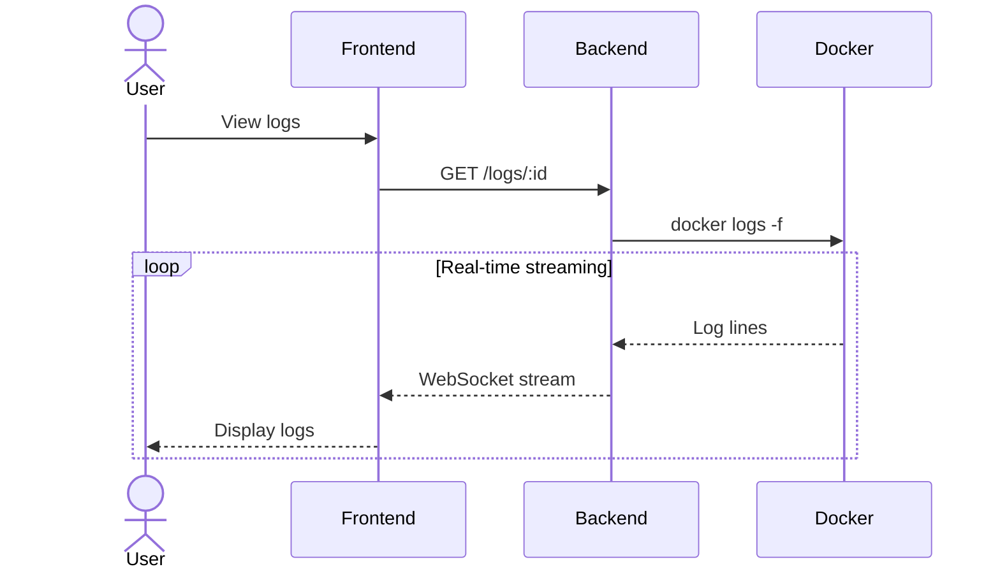

# Architecture

Understanding how Minepanel works under the hood.

## Overview

Minepanel is a web-based Minecraft server management panel built with modern technologies. It uses a **microservices architecture** where each component is containerized and communicates through well-defined interfaces.

```mermaid
flowchart TB
    User["👤 User"] --> Browser["🌐 Browser"]
    Browser --> Frontend["⚛️ Frontend<br/>Next.js :3000"]
    Frontend <-->|REST API| Backend["🔧 Backend<br/>NestJS :8091"]
    Backend <-->|Docker Socket| Docker["🐳 Docker Engine"]

    subgraph containers["Minecraft Servers"]
        MC1["🎮 Server 1<br/>:25565"]
        MC2["🎮 Server 2<br/>:25566"]
        MC3["🎮 Server 3<br/>:25567"]
    end

    Docker --> containers
    Backend <-->|SQLite| DB["💾 Database"]

    style Frontend fill:#0f172a,stroke:#3b82f6,color:#fff
    style Backend fill:#0f172a,stroke:#22c55e,color:#fff
    style Docker fill:#0f172a,stroke:#0ea5e9,color:#fff
    style containers fill:#1f2937,stroke:#6b7280,color:#fff
```



## Components

### 1. Frontend (Next.js)

**Technology Stack:**

- [Next.js 14](https://nextjs.org/) - React framework
- [React 18](https://react.dev/) - UI library
- [TypeScript](https://www.typescriptlang.org/) - Type safety
- [TailwindCSS](https://tailwindcss.com/) - Styling
- [shadcn/ui](https://ui.shadcn.com/) - UI components
- [React Query](https://tanstack.com/query/latest) - Data fetching

**Responsibilities:**

- Render the web interface
- Handle user interactions
- Manage application state
- Make API calls to backend
- Display real-time data
- Route management

**Key Features:**

- Server-side rendering (SSR) for fast initial load
- Static generation for optimal performance
- Client-side routing for smooth navigation
- Real-time updates without page refresh
- Responsive design for all devices

**Directory Structure:**

```
frontend/
├── src/
│   ├── app/              # Next.js 14 App Router
│   │   ├── page.tsx      # Home page
│   │   ├── layout.tsx    # Root layout
│   │   └── dashboard/    # Dashboard pages
│   ├── components/       # React components
│   │   ├── ui/           # Base UI components
│   │   ├── molecules/    # Composite components
│   │   └── organisms/    # Complex components
│   ├── lib/              # Utilities
│   │   ├── hooks/        # Custom React hooks
│   │   ├── translations/ # i18n files
│   │   └── types/        # TypeScript types
│   └── services/         # API clients
└── public/               # Static assets
```

### 2. Backend (NestJS)

**Technology Stack:**

- [NestJS](https://nestjs.com/) - Node.js framework
- [TypeScript](https://www.typescriptlang.org/) - Type safety
- [Dockerode](https://github.com/apocas/dockerode) - Docker API client
- [bcrypt](https://www.npmjs.com/package/bcrypt) - Password hashing
- [Passport.js](http://www.passportjs.org/) - Authentication

**Responsibilities:**

- Expose REST API
- Authenticate users
- Manage Docker containers
- Execute server commands
- Monitor resources
- Handle file operations
- Manage server lifecycle

**Key Features:**

- RESTful API design
- JWT authentication
- Docker integration via socket
- Real-time log streaming
- Error handling and validation
- Type-safe with TypeScript

**Directory Structure:**

```
backend/
├── src/
│   ├── main.ts                    # Application entry point
│   ├── app.module.ts              # Root module
│   ├── auth/                      # Authentication module
│   │   ├── auth.controller.ts
│   │   ├── auth.service.ts
│   │   ├── jwt.strategy.ts
│   │   └── local.strategy.ts
│   ├── server-management/         # Server management module
│   │   ├── server-management.controller.ts
│   │   ├── server-management.service.ts
│   │   └── dto/
│   │       └── server-config.model.ts
│   └── docker-compose/            # Docker Compose integration
│       ├── docker-compose.service.ts
│       └── docker-compose.service.spec.ts
└── test/                          # Tests
```

**API Endpoints:**

```typescript
// Authentication
POST   /auth/login          # Login
POST   /auth/logout         # Logout
GET    /auth/profile        # Get current user

// Servers
GET    /servers             # List all servers
POST   /servers             # Create new server
GET    /servers/:id         # Get server details
PUT    /servers/:id         # Update server
DELETE /servers/:id         # Delete server

// Server Control
POST   /servers/:id/start   # Start server
POST   /servers/:id/stop    # Stop server
POST   /servers/:id/restart # Restart server

// Server Data
GET    /servers/:id/logs    # Stream logs
POST   /servers/:id/command # Execute command
GET    /servers/:id/stats   # Get resource stats
GET    /servers/:id/players # Get online players
```

**Technology:**

**Responsibilities:**

- Browse server files
- Edit configuration files
- Upload/download files
- Manage permissions
- View file contents

**Integration:**

- Runs as separate container
- Accessed via iframe in frontend
- Independent authentication
- Direct file system access

### 4. Docker Engine

**Role:**

- Container runtime
- Resource isolation
- Network management
- Volume management

**Docker Socket:**
Minepanel communicates with Docker via `/var/run/docker.sock`:

```yaml
volumes:
  - /var/run/docker.sock:/var/run/docker.sock
```

This allows Minepanel to:

- Create containers
- Start/stop containers
- Monitor containers
- Read logs
- Execute commands
- Manage networks/volumes

### Docker Socket and Path Resolution

**The Challenge:**
When Minepanel (running in a container) creates Minecraft server containers via the Docker socket, volume paths are **interpreted from the host's perspective**, not from Minepanel's container.

**Example:**

```
Minepanel container internal path: /app/servers/my-server
Host machine actual path:          /Users/username/minepanel/servers/my-server
```

**Without BASE_DIR (doesn't work):**

```yaml
# Minepanel generates this docker-compose.yml for a Minecraft server:
services:
  mc:
    volumes:
      - ./mc-data:/data # ❌ Docker looks for ./mc-data on the HOST
```

When Docker tries to mount `./mc-data`, it looks for it **relative to where `docker compose up` runs**, not inside Minepanel's container. This fails with:

```
Error: path ./mc-data is not shared from the host
```

**With BASE_DIR (works correctly):**

```yaml
# Minepanel knows the host path via BASE_DIR environment variable
environment:
  - BASE_DIR=/Users/username/minepanel # Host path

# Generates docker-compose.yml with absolute paths:
services:
  mc:
    volumes:
      - /Users/username/minepanel/servers/my-server/mc-data:/data # ✅ Absolute host path
```

Now Docker correctly finds the directory on the host machine.

**Implementation:**

```typescript
// backend/src/docker-compose/docker-compose.service.ts
private parseVolumes(config: ServerConfig): string[] {
  return config.dockerVolumes
    .split('\n')
    .map((line) => {
      const volume = line.trim();
      // Convert relative paths to absolute paths using BASE_DIR
      if (volume.startsWith('./')) {
        const [hostPath, ...containerParts] = volume.split(':');
        const containerPath = containerParts.join(':');
        const absoluteHostPath = path.join(
          this.BASE_DIR,  // e.g., /Users/username/minepanel
          'servers',
          config.id,
          hostPath.substring(2)
        );
        return `${absoluteHostPath}:${containerPath}`;
      }
      return volume;
    });
}
```

**Configuration:**

```yaml
services:
  minepanel:
    environment:
      - BASE_DIR=${BASE_DIR:-$PWD} # Defaults to current directory
    volumes:
      - ${BASE_DIR:-$PWD}/servers:/app/servers # Mount with same BASE_DIR
      - /var/run/docker.sock:/var/run/docker.sock
```

**Key Points:**

- ✅ `BASE_DIR` is set to the host's working directory (typically where docker-compose.yml is located)
- ✅ Minepanel mounts `${BASE_DIR}/servers` to `/app/servers` internally
- ✅ When creating server containers, Minepanel uses `${BASE_DIR}/servers/server-name` for volumes
- ✅ Docker socket operations use these absolute host paths correctly
- ✅ All containers share the same base directory structure

This pattern is the same used by **Portainer**, **Yacht**, and other Docker management panels that communicate via the Docker socket.

---

## Data Flow

### Creating a Server

```mermaid
sequenceDiagram
    actor User
    participant Frontend
    participant Backend
    participant Docker

    User->>Frontend: Fill form
    Frontend->>Backend: POST /servers

    Note over Backend: Validate input
    Note over Backend: Create config
    Note over Backend: Build compose

    Backend->>Docker: docker compose up

    Note over Docker: Pull image
    Note over Docker: Create container
    Note over Docker: Start container

    Docker-->>Backend: Container ready
    Backend-->>Frontend: 201 Created
    Frontend-->>User: ✅ Server created!
```



### Viewing Logs



---

## Server Container Structure

Each Minecraft server runs in its own Docker container using [itzg/docker-minecraft-server](https://github.com/itzg/docker-minecraft-server).

::: info External Docs
For all available environment variables and advanced container configuration, see the [docker-minecraft-server documentation](https://docker-minecraft-server.readthedocs.io/).
:::

### Container Configuration

Example `docker-compose.yml` for a server:

```yaml
services:
  my-server:
    image: itzg/minecraft-server:latest
    container_name: minepanel-my-server
    environment:
      EULA: "TRUE"
      TYPE: "PAPER"
      VERSION: "1.20.1"
      MEMORY: "2G"
      MAX_PLAYERS: "20"
      DIFFICULTY: "normal"
      MODE: "survival"
      PVP: "true"
      ONLINE_MODE: "true"
    ports:
      - "25565:25565"
    volumes:
      - ./servers/my-server:/data
    labels:
      - 'minepanel.server=true'
      - 'minepanel.name=my-server'
      - 'minepanel.type=PAPER'
      - 'minepanel.version=1.20.1'
    restart: unless-stopped
```

::: tip
Labels use the list format (`- 'key=value'`) instead of the object format (`key: value`) to avoid escaping issues with special characters in values.
:::

### Volume Mapping

```mermaid
flowchart LR
    H["🖥️ Host<br/>servers/my-server/"] -->|"bind mount"| C["📦 Container<br/>/data"]

    style H fill:#065f46,stroke:#22c55e,color:#fff
    style C fill:#1e40af,stroke:#3b82f6,color:#fff
```



| Host Path               | Container        | Description           |
| ----------------------- | ---------------- | --------------------- |
| `servers/{id}/`         | `/data`          | Server root directory |
| `servers/{id}/world/`   | `/data/world/`   | World save files      |
| `servers/{id}/plugins/` | `/data/plugins/` | Paper/Spigot plugins  |
| `servers/{id}/mods/`    | `/data/mods/`    | Forge/Fabric mods     |
| `servers/{id}/logs/`    | `/data/logs/`    | Server logs           |
| `server.properties`     | Config           | Server configuration  |

### Labels

Minepanel uses Docker labels to track servers. Labels use the list format to avoid escaping issues:

```yaml
labels:
  - 'minepanel.server=true'      # Identifies as managed server
  - 'minepanel.name=my-server'   # Server identifier
  - 'minepanel.type=PAPER'       # Server type
  - 'minepanel.version=1.20.1'   # Minecraft version
  - 'minepanel.created=2024-10-24' # Creation date
```

Custom labels can be added via the UI. Use `key=value` format, one per line:

```
traefik.enable=true
traefik.http.routers.mc.rule=Host(`mc.example.com`)
my.custom.label=value with spaces
```

---

## Security Architecture

### Authentication Flow

```mermaid
sequenceDiagram
    actor User
    participant Frontend
    participant Backend
    participant Cookie

    User->>Frontend: Enter credentials
    Frontend->>Backend: POST /auth/login

    Note over Backend: Validate with bcrypt
    Note over Backend: Generate JWT token

    Backend->>Cookie: Set httpOnly cookie
    Backend-->>Frontend: 200 OK + user data
    Frontend-->>User: ✅ Logged in!

    Note over User,Cookie: Subsequent requests include cookie automatically
```



**Security Measures:**

- Passwords hashed with bcrypt (12 rounds)
- JWT tokens for stateless authentication
- httpOnly cookies prevent XSS
- CORS protection
- Input validation and sanitization

### Docker Socket Access

**Risk:** Direct access to Docker socket = root access

**Mitigation:**

- Minepanel container runs with minimal permissions
- Only necessary Docker operations allowed
- Can use Docker Socket Proxy for additional security
- Audit logs for all Docker operations

**Optional: Docker Socket Proxy**

```yaml
services:
  socket-proxy:
    image: tecnativa/docker-socket-proxy
    volumes:
      - /var/run/docker.sock:/var/run/docker.sock
    environment:
      CONTAINERS: 1
      IMAGES: 1
      NETWORKS: 1
      VOLUMES: 1
    restart: always

  minepanel:
    environment:
      DOCKER_HOST: tcp://socket-proxy:2375
```

### Network Isolation

```mermaid
flowchart LR
    Internet["🌍 Internet"] --> Bridge["🌐 Docker Bridge"]
    Bridge --> S1["🎮 Server 1<br/>:25565"]
    Bridge --> S2["🎮 Server 2<br/>:25566"]
    Bridge --> S3["🎮 Server 3<br/>:25567"]

    style Bridge fill:#1f2937,stroke:#6b7280,color:#fff
    style S1 fill:#065f46,stroke:#22c55e,color:#fff
    style S2 fill:#1e40af,stroke:#3b82f6,color:#fff
    style S3 fill:#7c2d12,stroke:#f97316,color:#fff
```



Each server runs in isolation:

- Cannot access other servers
- Limited network access
- Resource limits enforced
- Own filesystem namespace

---

## Storage Architecture

### Directory Structure

```mermaid
flowchart LR
    Root["📁 minepanel/"] --> Servers["📁 servers/"]
    Root --> Data["📁 data/"]
    Servers --> S1["📁 server-1/"]
    Servers --> S2["📁 server-2/"]
    Servers --> Backups["💾 backups/"]

    style Root fill:#1f2937,stroke:#6b7280,color:#fff
    style Servers fill:#065f46,stroke:#22c55e,color:#fff
    style Backups fill:#7c2d12,stroke:#f97316,color:#fff
```



```
minepanel/
├── docker-compose.yml      # Main compose file
├── .env                    # Environment variables
├── data/                   # SQLite database
├── servers/
│   ├── server-1/
│   │   ├── world/          # World save
│   │   ├── plugins/        # Paper/Spigot plugins
│   │   ├── mods/           # Forge/Fabric mods
│   │   └── logs/           # Server logs
│   ├── server-2/
│   └── backups/            # Automatic backups
```

### Volume Strategy

**Bind Mounts:**
Used for server data to allow easy access from host:

```yaml
volumes:
  - ./servers/my-server:/data
```

**Benefits:**

- Direct access from host filesystem
- Easy backups
- Simple file transfers
- Debug and inspect files

**Named Volumes:**
Could be used for better isolation (future option):

```yaml
volumes:
  my-server-data:

services:
  my-server:
    volumes:
      - my-server-data:/data
```

---

## Scaling Considerations

### Vertical Scaling

**Increase resources for existing servers:**

- Allocate more RAM
- Add more CPU cores
- Upgrade disk to SSD
- Optimize JVM parameters

### Horizontal Scaling

**Run more servers:**

- Add more server containers
- Use different ports (25565, 25566, 25567...)
- Share resources efficiently
- Consider network proxies (BungeeCord, Velocity)

### Multi-Node Setup

**Split services across machines (advanced):**

```
    ↓
Machine 2: Docker Engine → Minecraft Servers
```

Use Docker's remote API:

```yaml
environment:
  DOCKER_HOST: tcp://192.168.1.100:2376
```

---

## Performance Optimizations

### Backend Optimizations

1. **Caching**

   - Cache server list
   - Cache resource stats
   - Redis for distributed cache (future)

2. **Connection Pooling**

   - Reuse Docker API connections
   - Keep-alive for HTTP requests

3. **Async Operations**
   - Non-blocking I/O
   - Parallel container operations
   - Background tasks for heavy operations

### Frontend Optimizations

1. **Code Splitting**

   - Lazy load routes
   - Dynamic imports for heavy components

2. **Data Fetching**

   - React Query for caching
   - Prefetch data on hover
   - Stale-while-revalidate strategy

3. **Static Generation**
   - Pre-render static pages
   - ISR for dynamic content

### Docker Optimizations

1. **Image Caching**

   - Keep frequently used images
   - Pre-pull common versions

2. **Resource Limits**

   - Prevent resource exhaustion
   - Fair resource allocation

3. **Network Optimization**
   - Custom bridge networks
   - DNS caching

---

## Monitoring & Observability

### Logs

**Minepanel Logs:**

```bash
docker compose logs -f minepanel
```

**Individual Server Logs:**

```bash
docker logs -f minepanel-my-server
```

### Metrics

**Container Stats:**

```bash
docker stats
```

**Resource Usage:**

- CPU percentage
- Memory usage / limit
- Network I/O
- Block I/O

### Health Checks

Docker health checks monitor container status:

```yaml
healthcheck:
  test: ["CMD", "curl", "-f", "http://localhost:3000"]
  interval: 30s
  timeout: 10s
  retries: 3
  start_period: 40s
```

---

## Future Enhancements

### Planned Architecture Improvements

1. **Microservices Split**

   - Separate auth service
   - Dedicated metrics service
   - Queue for async operations

2. **Database Integration**

   - SQLite for persistent data
   - Store server configs
   - User management
   - Audit logs

3. **Message Queue**

   - RabbitMQ or Redis
   - Async task processing
   - Event-driven architecture

4. **Orchestration**

   - Kubernetes support
   - Docker Swarm mode
   - Auto-scaling

5. **Observability**
   - Prometheus metrics
   - Grafana dashboards
   - Loki for log aggregation
   - Jaeger for tracing

---

## Technology Choices

### Why Next.js?

- ✅ Server-side rendering for better SEO
- ✅ File-based routing
- ✅ API routes (not used, but available)
- ✅ Great developer experience
- ✅ Built-in optimizations

### Why NestJS?

- ✅ TypeScript native
- ✅ Modular architecture
- ✅ Dependency injection
- ✅ Similar to Angular (familiar patterns)
- ✅ Extensive ecosystem

### Why Docker?

- ✅ Isolation and security
- ✅ Consistent environments
- ✅ Easy deployment
- ✅ Resource control
- ✅ Portability

### Why itzg/minecraft-server?

- ✅ Most popular MC Docker image
- ✅ Supports all server types
- ✅ Well-maintained
- ✅ Extensive documentation
- ✅ Active community

---

## Next Steps

- 🛠️ [Development Guide](/development) - Contribute to the project
- ⚙️ [Configuration](/configuration) - Customize your setup
- 📖 [Features](/features) - Explore what's possible
