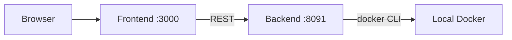
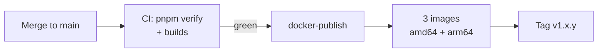

# Development

Want to contribute or run locally? Here's how.

## What you need

- Node.js 24+ and pnpm 10 (`corepack enable`)
- Docker & Docker Compose
- Git

## Setup

```bash
git clone https://github.com/Ketbome/minepanel.git
cd minepanel
```

## Project structure

```
minepanel/
├── backend/                  # NestJS API (read backend/AGENTS.md first)
│   ├── src/
│   │   ├── auth/             # JWT cookies, OIDC SSO
│   │   ├── server-management/ # start/stop, logs, commands
│   │   ├── docker-compose/   # server.json -> docker-compose.yml
│   │   ├── proxy/            # mc-router and Velocity
│   │   ├── files/  metrics/  players/  activity/  ...
│   │   ├── settings/
│   │   └── users/
│   └── test/
├── frontend/                 # Next.js UI (read frontend/AGENTS.md first)
│   └── src/  app/  components/  lib/  services/
└── doc/                      # VitePress docs
```

## Run locally

The repo is a pnpm workspace (`backend`, `frontend`, `doc`). `pnpm install` at the root
installs everything and the git hooks.



The backend needs a working `docker` CLI on the machine: it starts real server containers.

### Backend

```bash
pnpm install
pnpm dev:backend
```

Runs on `http://localhost:8091`

### Frontend

```bash
pnpm install
pnpm dev:frontend
```

Runs on `http://localhost:3000`

### Environment files

Start from `backend/.env.example` and `frontend/.env.example`. Keep comments on their own
line: a trailing `# comment` after a value can become part of the value.

**backend/.env:**

```bash
FRONTEND_URL='http://localhost:3000'
# Generate a strong random secret: openssl rand -base64 32
JWT_SECRET=
# Deprecated override of the 15m access token TTL; only useful to test the refresh flow
# JWT_EXPIRES_IN=20s
# Optional: SMTP for password recovery
SMTP_HOST=
SMTP_PORT=587
SMTP_SECURE=false
SMTP_USER=
SMTP_PASS=
SMTP_FROM='Minepanel <no-reply@example.com>'
PASSWORD_RESET_TOKEN_EXPIRES_IN_MINUTES=60
BASE_DIR=.
```

The SQLite database path is fixed at `/app/data/minepanel.db` (`backend/src/config.ts`).

**frontend/.env:**

```bash
# URL of the backend API, must start with http:// or https://
NEXT_PUBLIC_BACKEND_URL='http://localhost:8091'
# en, es, nl, de, pl, fr, ru, pt, tr
NEXT_PUBLIC_DEFAULT_LANGUAGE=en
```

## Tech stack

### Backend

- NestJS
- TypeORM + SQLite (sql.js)
- Docker API
- Passport JWT

### Frontend

- Next.js 16 (App Router)
- React
- TailwindCSS
- shadcn/ui

## Build for production

Images build from the repo root, where the pnpm lockfile lives:

| Image | Command |
| --- | --- |
| All-in-one (backend + frontend) | `docker build -t minepanel:local .` |
| Backend | `docker build -f backend/Dockerfile -t minepanel-backend:local .` |
| Frontend | `docker build -f frontend/Dockerfile -t minepanel-frontend:local .` |

The root `docker-compose.yml` pulls the published images; point its `image:` lines at your
local tags to run what you built, or use `docker compose -f docker-compose.development.yml up --build`.

## Contributing

Check [CONTRIBUTING.md](https://github.com/Ketbome/minepanel/blob/main/CONTRIBUTING.md)

### Quick version

1. Fork the repo
2. Create a branch: `git checkout -b feature/thing`
3. Make changes
4. Run `pnpm verify` (lint + typecheck + tests). It also runs on `git push` and in CI
5. Push and open PR

### Commit format

```
feat(server): add Purpur support
fix(ui): button alignment
docs: update install guide
```

## Code style

- Use TypeScript
- Follow ESLint rules
- Write meaningful variable names
- Keep functions small
- Add comments for complex logic

## Testing

```bash
pnpm test                      # backend unit tests (coverage gate: 90%)
pnpm --filter ./backend test:e2e
```

## Documentation

Docs are in `doc/` using VitePress.

```bash
pnpm install
pnpm docs:dev
```

Runs on `http://localhost:5173`

## Common tasks

### Add a new server type

1. Add to `backend/src/docker-compose/docker-compose.service.ts`
2. Add to frontend dropdown
3. Test it

### Add a translation

1. Create `frontend/src/lib/translations/[lang].ts`
2. Copy from `en.ts` and translate every key; the build fails if any key is missing
3. Register the dictionary, flag, and native name in `locales` in `index.ts`; both language selectors update automatically
4. Test it

### Debug

**Backend:**

```bash
pnpm --filter ./backend start:debug
```

**Frontend:**

```bash
# Check browser console
# Check Network tab
```

**Logs:**

```bash
docker compose logs -f backend
```

## Troubleshooting

### Port already in use

Change ports in `.env` or docker-compose

### Docker permission errors

```bash
sudo usermod -aG docker $USER
# Log out and back in
```

### Node modules issues

```bash
rm -rf node_modules backend/node_modules frontend/node_modules
pnpm install
```

## Release process

Releases are cut by CI on merge to `main`; there is no manual tagging and no
CHANGELOG file.



1. `config.json` holds the `major.minor` version. Bump it only for a feature or
   breaking release.
2. After CI passes on `main`, `.github/workflows/docker-publish.yml` derives the patch
   number from the existing `v<major>.<minor>.*` tags, builds and pushes the three images
   (`minepanel`, `minepanel-backend`, `minepanel-frontend`) to Docker Hub with
   `APP_VERSION` baked in, and creates the tag once all three are pushed.
3. Release notes are generated by GitHub from PR labels, configured in
   `.github/release.yml`.

Label a PR `breaking` when it changes existing behaviour. That puts it under the
"Breaking Changes" heading, which is what the panel reads to warn users before they
update.

## Need help?

- [GitHub Discussions](https://github.com/Ketbome/minepanel/discussions)
- [Issues](https://github.com/Ketbome/minepanel/issues)
- [FAQ](/faq)
