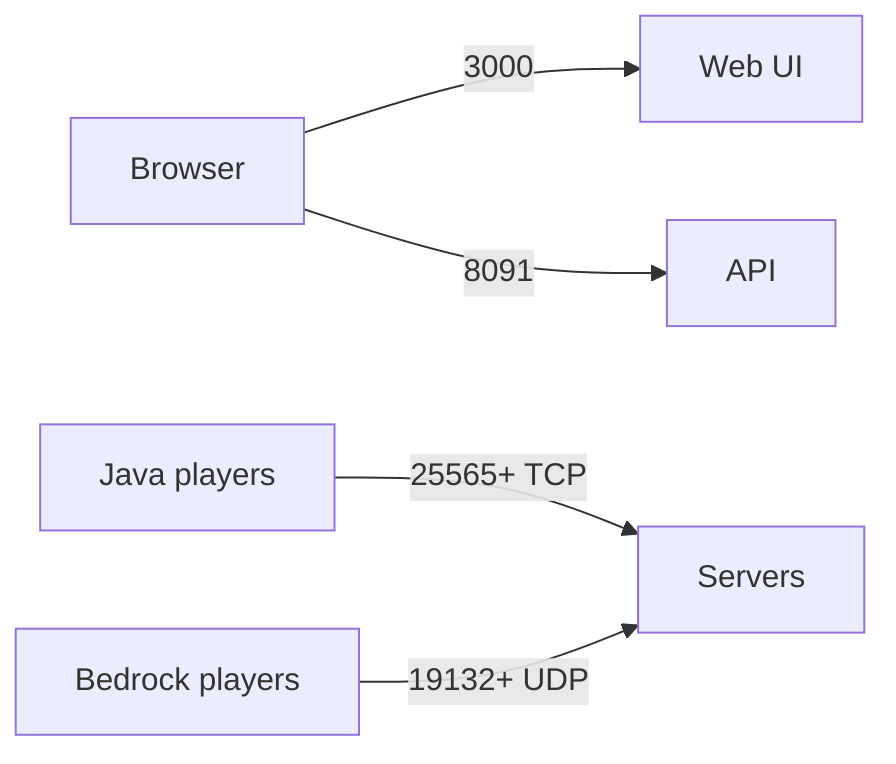

# FAQ

Quick answers. For detailed guides, see linked docs.

## Getting Started

**What is Minepanel?**
Web panel for managing Minecraft servers with Docker. No command-line needed.

**Is it free?**
Yes, open-source (MIT License).

**Requirements?**
Docker 20.10+, 2GB RAM minimum, Linux/macOS/Windows(WSL2).

**How to install?**

```bash
git clone https://github.com/Ketbome/minepanel.git && cd minepanel
echo "JWT_SECRET=$(openssl rand -base64 32)" > .env
docker compose up -d
```

Then open http://localhost:3000 and create the admin account.

**→** [Installation](/installation)

**How to update?**

```bash
docker compose pull && docker compose up -d
```

## Servers

**What server types work?**
All: Vanilla, Paper, Forge, Neoforge, Fabric, Spigot, Purpur, CurseForge modpacks.
**→** [Server Types](/server-types)

**Multiple servers?**
Yes, as many as hardware allows.

**Import existing server?**
Copy data to `servers/your-server/mc-data/`, then create a server with the ID `your-server`.
The panel keeps the files (and moves server files left in `servers/your-server/` into `mc-data/`).

**Add mods?**
Use Modrinth/CurseForge integration in panel.
**→** [Mods & Plugins](/mods-plugins)

## Networking

**Remote access?**
Update `FRONTEND_URL` to your IP/domain, open firewall ports.
**→** [Networking](/networking)

**HTTPS/SSL?**
Use Nginx/Caddy reverse proxy with Let's Encrypt.
**→** [SSL Setup](/networking#ssl-https)

**LAN IP?**
Configure in **Settings → Network**.

**Ports?**



| Port | Used by |
| --- | --- |
| 3000 | Web UI |
| 8091 | API |
| 25565+ (TCP) | Java servers, or the proxy |
| 19132+ (UDP) | Bedrock servers |

## Admin

**Change password?**
**Settings → Account → Security**.

**Forgot password?**
Use the login page recovery flow if SMTP is configured. Otherwise reset the database or update via SQL.
**→** [Administration](/administration#forgot-your-password)

**Where's data stored?**

- Database: `./data/minepanel.db`
- Servers: `./servers/`

## Troubleshooting

**Server won't start?**
Check the **Logs** tab. Common causes: port conflict, not enough RAM.
**→** [Troubleshooting](/troubleshooting)

**CORS errors?**
`FRONTEND_URL` doesn't match browser URL. Fix and restart.

**Docker errors?**

```bash
docker ps              # Check running
docker compose logs    # View logs
docker compose restart # Restart
```

## vs Others

|            | Minepanel | Pterodactyl | AMP    |
| ---------- | --------- | ----------- | ------ |
| Install    | 1 command | Complex     | Medium |
| Cost       | Free      | Free        | Paid   |
| Multi-user | Yes       | Yes         | Yes    |
| Weight     | Light     | Heavy       | Medium |

## Support

- [Troubleshooting](/troubleshooting)
- [GitHub Issues](https://github.com/Ketbome/minepanel/issues)
- [GitHub Discussions](https://github.com/Ketbome/minepanel/discussions)
