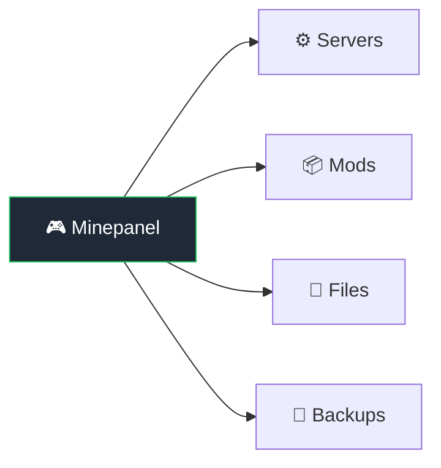

# Features



```mermaid
flowchart LR
    MP["🎮 Minepanel"]
    MP --> SM["⚙️ Servers"]
    MP --> MM["📦 Mods"]
    MP --> FM["📁 Files"]
    MP --> BK["💾 Backups"]
    style MP fill:#1f2937,stroke:#22c55e,color:#fff
```

## Server Management

| Feature          | Description                                                          |
| ---------------- | -------------------------------------------------------------------- |
| Java & Bedrock   | Both Minecraft editions supported                                    |
| Multiple servers | Run as many as hardware allows, isolated containers                  |
| All server types | Vanilla, Paper, Forge, Neoforge, Fabric, Purpur, GTNH, CurseForge, Modrinth and Feed The Beast (FTB) modpacks |
| Any version      | 1.8 to latest, snapshots included                                    |
| Templates        | Pre-configured: Survival, Creative, SkyBlock, PvP, Bedrock presets, and Paper cross-play |
| Java defaults    | Global defaults for new Java servers (offline mode, resources, backup switch) |
| Resource limits  | Set RAM, CPU per server                                              |
| Clone server     | Duplicate a server's configuration under a new ID (world data and files are not copied) |

## Real-time Monitoring

| Feature   | Description                               |
| --------- | ----------------------------------------- |
| Dashboard | Home cards show status, players, uptime, CPU and RAM; a running server's header adds the game version |
| Live logs | Streaming, errors highlighted, searchable |
| Log export | Download the last 10,000 log lines as a `.log` file from the Logs tab |
| Stats     | CPU%, RAM%, player count, uptime, game version |
| History   | TPS, tick duration, CPU/RAM and player graphs (1h–168h) in the Metrics tab, sampled every minute with 7-day retention |
| Tick performance | Native NeoForge estimated TPS and mean MSPT; compatible spark servers provide measured TPS and median/P95 MSPT |
| Alerts    | Opt-in Discord alerts per server: unexpected server down, crash loops (with an exit code and log tail) when a restart retry limit runs out, and sustained high CPU/RAM above configurable thresholds (Metrics tab; requires the Discord webhook from Settings > Integrations) |

Runtime stats refresh on their own on the home page and the server page, and only render for
running servers. Player totals and version come from a game status query that works on both Java
and Bedrock. If the container is up but the game is not answering yet, those values stay blank
instead of reporting zero players.

### CurseForge / NeoForge monitoring

Open **Monitoring → Metrics**. Live values refresh about every 10 seconds. For
NeoForge-based modpacks, Minepanel reads `neoforge tps` through the itzg container's
`rcon-cli`. Keep the CurseForge server type; there is no need to switch to Paper
or install an additional monitoring mod. RCON must be enabled in **Network**.

The overall NeoForge report provides mean tick duration (MSPT) and **estimated
TPS**, calculated by NeoForge from tick time. This is different from directly
counting ticks. At the default 20 TPS, the tick budget is 50 ms. These reference
lines do not imply that a deliberately changed tick rate is unhealthy.

On servers with a usable `spark tps` RCON response, Minepanel displays 1-minute
TPS and 10-second median/P95 tick duration. P95 is the duration below which 95%
of ticks fall; it is not the mean. Some spark versions return an empty RCON
response because commands are asynchronous. Installing spark alone does not
guarantee RCON monitoring works; NeoForge's native command avoids this.

Missing readings stay blank, and charts leave gaps for missing samples or server
downtime. Charts show the latest sample value, labelled vertical scales and the minimum/maximum of available samples in the selected window, without sliders. Memory charts use GiB; use the time-range
selector to change the history window. Older history contains resource data only. CPU uses Docker's scale:
100% represents one fully used core, so multi-core usage may exceed 100%.
Memory is container usage, not JVM heap alone. Bedrock retains resource/player
monitoring but has no tick measurements. Existing Discord alerts cover server
down and high CPU/RAM; TPS alerting is not included.

References: [itzg commands](https://docker-minecraft-server.readthedocs.io/en/latest/sending-commands/commands/),
[NeoForge TPS implementation](https://github.com/neoforged/NeoForge/blob/1.21.1/src/main/java/net/neoforged/neoforge/server/command/TPSCommand.java),
[spark TPS/MSPT](https://spark.lucko.me/docs/guides/TPS-and-MSPT).

## Server Control

| Feature        | Description                                               |
| -------------- | --------------------------------------------------------- |
| Basic controls | Start, Stop, Restart, Delete                              |
| Force stop     | Stops now instead of waiting for the shutdown announcement (`STOP_SERVER_ANNOUNCE_DELAY`, 60s by default). Sends `stop` over RCON so the world is still saved, and kills the container after 10s if it does not exit |
| Console        | RCON (Java) or send-command (Bedrock)                     |
| Quick actions  | Save world, toggle whitelist, set time/weather, broadcast |
| Scheduled tasks | Auto restarts and scheduled console commands, per server in the Tasks tab. Schedule by fixed interval or standard 5-field cron expression (e.g. `0 4 * * *` = daily at 04:00, backend timezone) |

## Roles and Access Control

This is the first phase of Minepanel roles.

| Feature | Description |
| ------- | ----------- |
| `ADMIN` role | Full panel access without permission restrictions |
| `USER` role | Access limited by explicit permissions |
| `manageUsers` permission | Lets delegated operators manage users, invitations, and audit access without full admin rights |
| Server access | All servers or selected server assignments |
| Logs vs console | Separate permissions for viewing logs and sending commands |
| File access | Separate permissions for global files and per-server files |
| Invitations | New users join through invitation links, with optional SMTP delivery |
| Audit log | Filterable activity history for account, invitation, and server actions |

### Authorization model

- The frontend can hide or show sections for convenience, but the backend is the real permission boundary.
- Minepanel keeps authentication in `httpOnly` cookies and does not rely on `localStorage` for authorization.
- The current user/session can be cached briefly **in memory only** to reduce repeated calls such as `/auth/me` or `/users/one`.
- Every protected backend route still resolves the current user and re-checks the required permission before returning data or executing the action.

### Audit coverage

The current audit phase includes:

- login
- invitation creation, copy, and acceptance
- password changes
- email change request and confirmation
- user access updates and deletion
- server configuration saves
- server start, stop, and restart
- console command execution

## Player Management

The **Players** tab (Java servers) lists everyone who has joined, with their skin avatar, and works
while the server is stopped because it reads the world files directly.

| Feature        | Description                                |
| -------------- | ------------------------------------------ |
| Player list    | Search and filter by online, whitelisted, operator or banned; last seen, play time and advancements at a glance |
| Profile        | Health, hunger, XP level, game mode and active effects; play time, deaths, mob and PvP kills, distance, blocks mined, last position and spawn point |
| Statistics     | Every vanilla (and modded) statistic, by category, searchable |
| Inventory      | Inventory, armor, offhand and ender chest with the game's own item icons, including renamed items and what carried shulker boxes and bundles hold. Hovering an item shows an in-game style tooltip with enchantments and durability; damaged tools show a durability bar and enchanted items shimmer |
| Find item      | "Who has my diamonds?": search every player's saved inventory, ender chest and carried containers by item or custom name |
| Advancements   | Completed ones with their date, and the ones still pending |
| Player actions | Gamemode, teleport, heal, give, kick, ban/unban, op/deop, whitelist add/remove (server running, needs console permission) |
| Whitelist      | Add players at runtime, or seed it from **Access** before the first boot |

Minecraft writes player files on autosave and on logout, so data for online players can be a few
minutes behind. Avatars are loaded by the browser from mc-heads.net using the player name.

Item icons are the vanilla textures of the server's game version (read from `level.dat`). The
backend downloads that version's official client jar from Mojang once and keeps only the item and
block images under `data/textures/<version>/` (about 6 MB). Until then, and for modded items or
items without a flat icon, slots fall back to the panel's built-in icons or the item name.

### Activity log

Opt-in per server (Java), from the **Activity** tab. When on, the panel reads `logs/latest.log`
every few seconds and keeps:

| Feature   | Description |
| --------- | ----------- |
| Timeline  | Joins, leaves, chat, deaths, advancements and player commands; filter by type and player, search text |
| Sessions  | Adds to the session history every server already records (Players tab → Sessions): per-session deaths, mob/PvP kills, blocks mined, chat and advancements |
| History   | One-off import of the archived `logs/*.log.gz` from before tracking was turned on, including the sessions older than the first one the panel recorded |
| Inventory history | Snapshots of inventory and ender chest on join, leave and every autosave (50 per player), with the changes since the previous one and the last snapshot before each death |

- Off by default: chat is personal data. The timeline needs the **view logs** permission.
- Everything the activity log stores expires: events and inventory snapshots are deleted after
  30 days, checked hourly. On top of that each server keeps at most 100,000 events and 50
  inventory snapshots per player, newest first. Sessions belong to the session history below and
  stay until the server is deleted.
- Chat, advancement and death counts only appear for sessions the log was read for; others show
  a dash, never zero.
- Recording starts when tracking is turned on; earlier lines only carry a time of day and are
  left to the history import, whose dates come from the archive file names.
- Per-session kills, distance and blocks mined come from the player's stats file, which Minecraft
  writes on logout; imported history only has what the log says (deaths, chat, advancements).
- Chat reformatted by server plugins may not be recognised.
- Minecraft does not write the inventory at the moment of death, so "before death" is the last
  save before it (join or autosave, up to 5 minutes earlier). Chests placed in the world are not tracked.

## Mod & Plugin Support

| Feature    | Description                          |
| ---------- | ------------------------------------ |
| Modrinth   | Auto-download, dependency resolution |
| CurseForge | Mods and modpacks                    |
| Combined   | Use both simultaneously              |
| In-panel search | Search and add mod slugs/IDs directly from the Mods tab |
| Cross-play template | One-click Paper preset with Geyser, Floodgate, ViaVersion, and UDP port 19132 |

**→ Details:** [Mods & Plugins](/mods-plugins)

## File Management

Built-in browser for each server under `servers/<id>/mc-data`:

- Upload/download files, with a live transfer panel (speed, ETA, cancel); folders are
  downloaded as a ZIP that streams while it is compressed, so only the transferred
  bytes are shown until it finishes
- Edit configs (syntax highlighting)
- Create/delete/rename
- Drag & drop support
- Filter the current folder as you type (Ctrl/Cmd+F focuses the box, Esc clears it); the
  footer counts folders, files and total size, and says how many of them the filter is showing
- Sort by name, size or modified date from the column headers; folders always stay on top

Common paths:

- Worlds source library for world switching: `servers/<id>/worlds/`
- Shared World Library for all servers: `servers/.world/worlds/`
- Active level data: `mc-data/<LEVEL>/`
- Java mods: `mc-data/mods/`
- Java plugins (Paper/Spigot/Purpur/etc): `mc-data/plugins/`
- Core config files: `mc-data/server.properties`, `mc-data/eula.txt`

Operational notes:

- Uploading/changing worlds, mods, plugins, and most configs usually requires restart.
- World switching supports folders with `level.dat` and archives (`.zip`, `.tar`, `.tar.gz`, `.tgz`).
- A selected world can be removed again: click it a second time (or use Clear selection) and apply.
  The server goes back to its own world; the copy already on disk is not deleted.
- `WORLD` clone source is mounted read-only by Minepanel to avoid accidental source overwrites.
- World Library includes **Discover Worlds** to search CurseForge worlds and import remote ZIP/TAR URLs directly into `servers/.world/worlds/`.
- The World Library page lists what you already have as searchable cards, filterable by name and by the folder imports landed in. The file browser is still there, folded away, for uploading, renaming and deleting.
- Each Java server has its own **Worlds** tab for picking which world it runs, with the same search across its local worlds and the shared library. Like every configuration tab, it needs the server stopped.

**→ Full guide:** [Worlds](/worlds)

## Backups

Backups run the `itzg/mc-backup` sidecar; the [backup guide](/guides/minecraft-server-backup-docker)
explains how it works under the hood.

| Feature   | Description           |
| --------- | --------------------- |
| Automatic | Schedule daily/weekly |
| Manual    | One-click backup      |
| Restore   | Select and restore    |
| Download  | Get backup files      |

Backup configuration is available in **Advanced -> Backup** (Java servers):

- `backupMethod`: `tar`, `rsync`, `restic`, `rclone`
- `backupInterval`, `backupInitialDelay`
- `backupPruneDays`, `backupDestDir`, `backupExcludes`
- `backupHostDir`: host path where backups are physically stored. Empty uses the global `BACKUP_BASE_DIR` or the default `${BASE_DIR}/servers/<id>/backups`
- `backupOnStartup`

Practical defaults:

- `backupMethod=tar`
- `backupInterval=24h`
- `backupPruneDays=7`
- `backupDestDir=/backups`

If you only need local compressed backups, start with `tar`. Use `restic` when you want encrypted, deduplicated backups on remote storage.

### Cloud backups (S3-compatible)

Selecting `backupMethod=restic` shows a **Restic repository** section where you configure a
remote destination. Any S3-compatible provider works:

| Provider     | Repository example                                        |
| ------------ | --------------------------------------------------------- |
| AWS S3       | `s3:https://s3.amazonaws.com/my-bucket/minecraft`          |
| MinIO        | `s3:https://minio.example.com:9000/minecraft-backups`      |
| Backblaze B2 | `s3:https://s3.us-west-002.backblazeb2.com/my-bucket`      |
| Wasabi       | `s3:https://s3.wasabisys.com/my-bucket`                    |
| Local path   | `/backups/restic` (stays on the host backups mount)        |

Fields:

- **Repository**: restic repository URL. `s3:` repositories also need the access/secret key fields.
- **Repository password**: encrypts the repository. Store it somewhere safe — without it snapshots cannot be restored.
- **Retention policy**: `restic forget` flags applied after each backup (default `--keep-within 7d`, e.g. `--keep-daily 7 --keep-weekly 4`).

The panel lists existing **snapshots** in the same section (the backup sidecar must be running).

::: warning Credentials on disk
Restic credentials are written to the server's generated `docker-compose.yml` under
`${BASE_DIR}/servers/<id>/` (same model as the RCON password). Use a dedicated bucket and
access keys scoped to it.
:::

Manual restore (until one-click restore ships):

```bash
# 1. List snapshots
docker exec <serverId>-backup restic snapshots

# 2. Stop the server from the panel, then restore into the data volume
docker exec <serverId>-backup restic restore latest --target /data
```

`/data` inside the backup container is the server's `mc-data` directory. Note the default
`/data` mount is read-only (`:ro`); for a restore, run a one-off container with the same
repository env vars and a writable mount instead:

```bash
docker run --rm \
  -e RESTIC_REPOSITORY=... -e RESTIC_PASSWORD=... \
  -e AWS_ACCESS_KEY_ID=... -e AWS_SECRET_ACCESS_KEY=... \
  -v ${BASE_DIR}/servers/<serverId>/mc-data:/data \
  restic/restic restore latest --target /
```

## Configuration

Edit from UI:

- Server name, MOTD
- Max players, difficulty, game mode
- View distance, PVP, command blocks
- Spawn protection radius (Java, `SPAWN_PROTECTION`; `0` disables it)
- JVM arguments, extra flags

Settings are grouped by the question you are asking, not by where the value is
stored: **Type**, **Game**, **Worlds**, **Access**, **Network**, **Resources**,
**Lifecycle**, mods/plugins/addons, **Backups** and **Advanced**. Configuration tabs
are disabled while the server is running — stop it to change anything there. Logs,
metrics and scheduled tasks stay available; commands need the server up.

A **Simple / Advanced** toggle above the tabs decides how much is shown. Simple
hides Network, Lifecycle and Advanced plus the JVM options, unless the server
already has something set in one of them — a tab you have configured is never
hidden. The choice is per browser and applies to every server. Ctrl/Cmd+K opens a
palette that jumps straight to any tab or setting by name.

## Server Resources (Java)

In **Resources** tab:

- **Memory/CPU:** set `INIT_MEMORY`, `MAX_MEMORY`, and CPU limits per server
- **JVM Options:** use `JVM_OPTS`, `JVM_XX_OPTS`, `JVM_DD_OPTS`, `EXTRA_ARGS`

Timezone, auto-stop, auto-pause, restart policy and rolling logs live in the
**Lifecycle** tab.

Recommended approach:

1. Set only `INIT_MEMORY` and `MAX_MEMORY` first.
2. Enable Aikar flags if you do not have a custom JVM tuning profile.
3. Change `JVM_XX_OPTS` only when you have measured a performance issue.

## Other

| Feature          | Description                               |
| ---------------- | ----------------------------------------- |
| Multi-language   | EN, ES, NL, DE, FR, PL, RU, PT            |
| Multi-arch       | x86_64, ARM64 (Pi, Apple Silicon)         |
| Discord webhooks | Server event notifications                |
| MC Proxy Router  | Single port for Java servers via hostname; started and configured by the panel |
| Proxy auto-scaling | Stop proxied Java servers while empty, wake them on the first connection, with a per-server opt-out |
| Update notices   | Release notes for every version between yours and the newest, flagged when a change is breaking |
| One-click update | Admins can pull and recreate the stack from the panel, with automatic rollback if it does not come back |
| End Portal expedition | Hidden 3D easter egg in Settings > Danger Zone: light a stronghold portal, break the End crystals, slay the dragon, catch its egg and read the End Poem. Works on desktop and touch; reduced-motion users get a static version |

## Edition Comparison

| Feature       | Java Edition                | Bedrock Edition         |
| ------------- | --------------------------- | ----------------------- |
| Server Types  | Vanilla, Paper, Forge, etc. | Vanilla only            |
| Default Port  | 25565 (TCP)                 | 19132 (UDP)             |
| Commands      | RCON console                | send-command (via logs) |
| Proxy Support | Yes (mc-router)             | No                      |
| Mods/Plugins  | Full support                | Addons/Behavior Packs   |
| Backups       | Full support                | Full support            |

::: tip Bedrock Commands
Bedrock servers use `send-command` instead of RCON. Command output appears in server logs rather than returning directly.
:::

## Coming Soon

- Export logs from the log viewer
- Dedicated `server.properties` editor with validation
- Cron-style scheduling (specific times) for scheduled tasks
- Bedrock console commands

**→ Full roadmap:** [Roadmap](/roadmap)

## Player profiles and session history


*Example data shown.*

Every server records its players' join/leave sessions, with no setting to turn on. On Java,
open **Players → (a player) → Sessions** for recorded playtime, totals, the weekday pattern,
day streak and paginated sessions; with the [activity log](#activity-log) on, each session also
gets its stat deltas, chat and advancements. On Bedrock, **Players** lists recorded players
with first/last observation and their sessions. Neither needs RCON or a game plugin.

- A backend sampler reads Docker join/leave logs every 30 seconds, independently of the browser.
  On first activation it reads up to 24 hours of retained logs. Only observed joins create sessions;
  players whose join is no longer in the logs appear after their next join.
- Session timestamps come from logs. Active duration advances to the last successful observation,
  rather than extrapolating indefinitely. A missing exit, changed container boot, sampling gap over
  two minutes, or more than 10,000 log lines in a window interrupts open sessions at their last
  observation. Their duration is a lower bound, not an exact departure time. Unavailable/stale
  tracking shows unknown presence, not zero players or a guessed offline status.
- History and collection cursors persist in SQLite. The total is **recorded playtime**, not a
  promise of lifetime playtime; logging changes, rotation and outages may leave gaps. Unsupported
  custom join/leave formats are ignored. Standard Java server INFO messages and Bedrock
  `Player connected/disconnected` messages are recognized; chat is not treated as a session event.
- Java profiles are grouped by case-insensitive name; a renamed Java account starts a separate
  history. Bedrock profiles use XUID. No external player lookup service is called.
- Java profiles additionally show the current world's saved playtime, deaths, mob/player kills
  and blocks mined, when the player is present in `usercache.json` and its statistics file exists.
  These are last-saved world totals, not live measurements or session deltas. World changes and
  restored backups can change them. Missing or unsupported values remain blank; Bedrock has no
  Java statistics section data.
- Both endpoints require authentication and access to the selected server. Only derived player
  activity and selected counters are returned, never raw logs or arbitrary world files.
