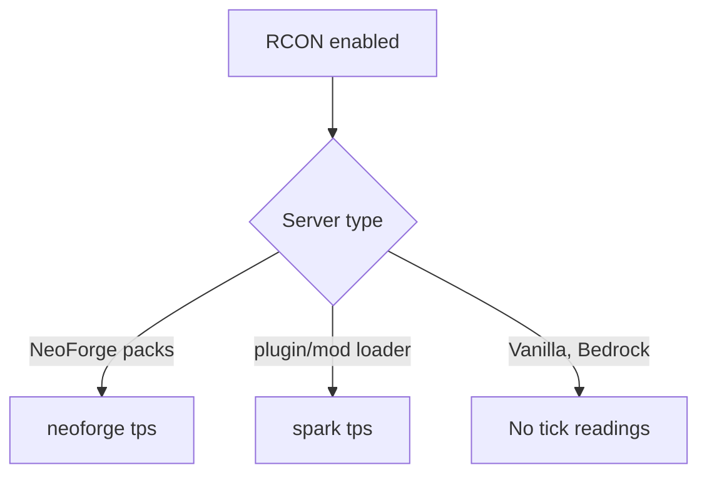
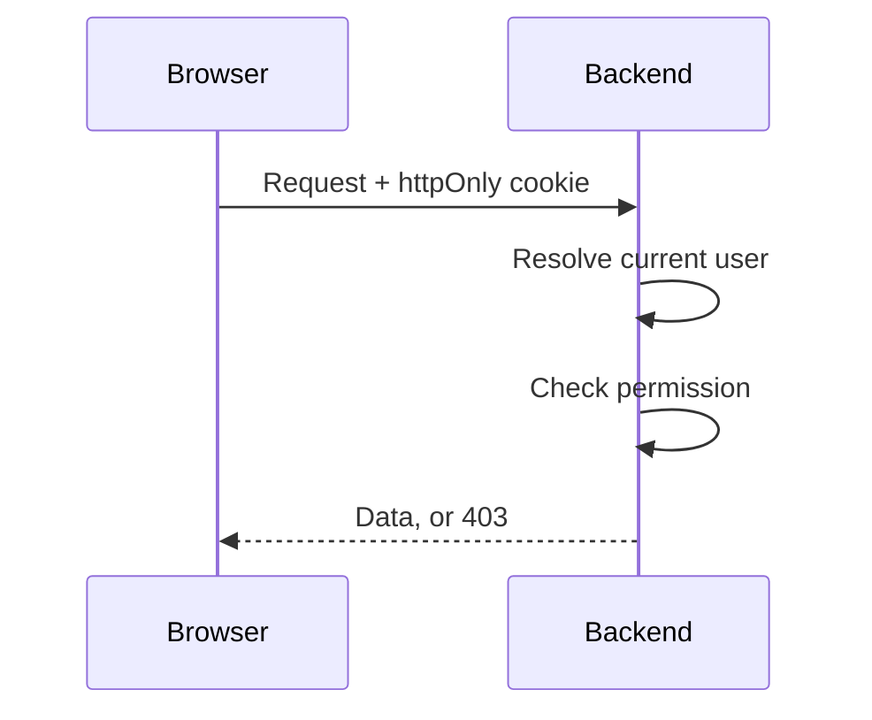
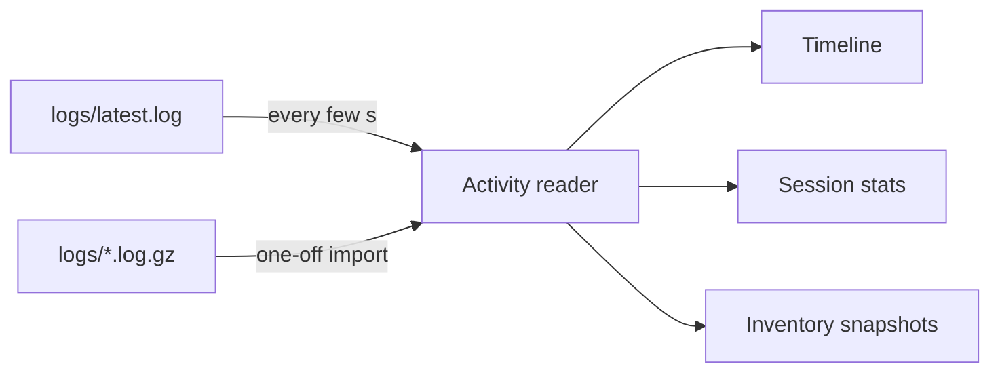
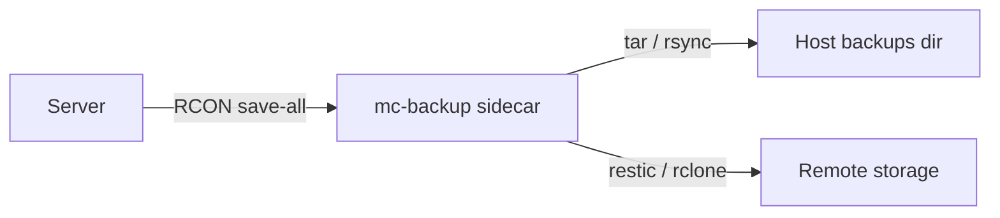
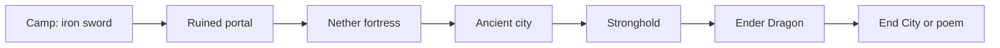
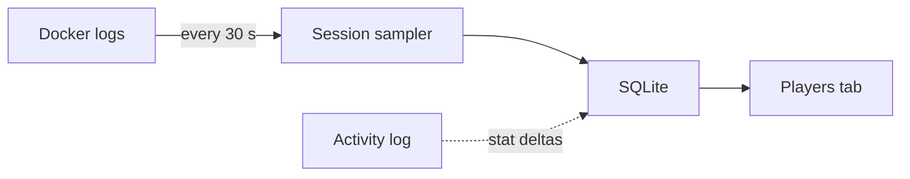

# Features


Every server has one page, with its tabs grouped the same way as the sidebar:

| Group | Tabs |
| --- | --- |
| Configuration | Server Type, Game, Worlds, Access, Network, Resources, Lifecycle, Plugins / Mods, Backups, Advanced |
| Operation | Logs, Commands, Players, Files |
| Monitoring | Metrics, Activity, Tasks |

## Server Management


| Feature          | Description                                                          |
| ---------------- | -------------------------------------------------------------------- |
| Java & Bedrock   | Both Minecraft editions supported                                    |
| Multiple servers | Run as many as hardware allows, isolated containers                  |
| All server types | Vanilla, Paper, Forge, Neoforge, Fabric, Purpur, GTNH, CurseForge, Modrinth and Feed The Beast (FTB) modpacks |
| Any version      | 1.8 to latest, snapshots included                                    |
| Templates        | Pre-configured: Survival, Creative, SkyBlock, PvP, Bedrock presets, and Paper cross-play |
| Java defaults    | Global defaults for new Java servers (offline mode, resources, backup switch) |
| Resource limits  | Set RAM, CPU per server                                              |
| Clone server     | Duplicate a server's configuration under a new ID (world data and files are not copied) |


New Java servers start from the instance-wide defaults in **Settings → Java Defaults**; existing servers are not changed.


## Real-time Monitoring


| Feature   | Description                               |
| --------- | ----------------------------------------- |
| Favorites | Star a server to pin it to the top of the Servers page and the home overview (kept in your browser) |
| Bulk actions | Select several servers on the Servers page and start or stop them one after another |
| Dashboard | Home cards show status, players, uptime, CPU and RAM; a running server's header adds the game version |
| Live logs | Streaming, errors highlighted, searchable |
| Log export | Download the last 10,000 log lines as a `.log` file from the Logs tab |
| Stats     | CPU%, RAM%, player count, uptime, game version |
| History   | TPS, tick duration, CPU/RAM and player graphs (1h–168h) in the Metrics tab, sampled every minute with 7-day retention |
| Tick performance | Native NeoForge estimated TPS and mean MSPT; compatible spark servers provide measured TPS and median/P95 MSPT |
| Alerts    | Opt-in alerts per server via Discord, email, Telegram, ntfy or Slack: unexpected server down, crash loops (with an exit code and a Discord-only log tail) when a restart retry limit runs out, and sustained high CPU/RAM above configurable thresholds (Metrics tab; configure channels in Settings > Integrations) |

- Runtime stats refresh on their own on the home page and the server page, and only render for
  running servers.
- Player totals and version come from a game status query that works on both Java and Bedrock.
- If the container is up but the game is not answering yet, those values stay blank instead of
  reporting zero players.


### TPS and tick time {#tps}

| Value | Meaning | Healthy |
| ----- | ------- | ------- |
| **TPS** (ticks per second) | Game ticks the server completes each second | 20 is full speed; lower is lag players can feel |
| **MSPT** (milliseconds per tick) | How long each tick takes | Under 50 ms: at 20 TPS a tick has a 50 ms budget, so MSPT over 50 drags TPS down |


Open **Monitoring → Metrics**. The panel reads these values over RCON, so every Java server
first needs **RCON enabled** in its **Access** tab, followed by a restart. Where the reading
comes from depends on the server type:


```mermaid
flowchart TD
    R["RCON enabled"] --> T{"Server type"}
    T -->|"NeoForge packs"| N["neoforge tps"]
    T -->|"plugin/mod loader"| S["spark tps"]
    T -->|"Vanilla, Bedrock"| X["No tick readings"]
```

| Server type | Source | What to do |
| ----------- | ------ | ---------- |
| CurseForge modpacks (`AUTO_CURSEFORGE`, `CURSEFORGE`), NeoForge | NeoForge's own `neoforge tps` | Nothing beyond RCON. Packs on another loader (Forge, Fabric) fall back to spark, see the Fabric/Forge row |
| Paper, Purpur and other Paper forks | spark | Nothing on 1.21+: Paper bundles spark. On older versions, add spark in the **Plugins** tab (Spiget resource `57242`) and restart |
| Spigot, Bukkit | spark | Add spark in the **Plugins** tab (Spiget resource `57242`) and restart |
| Fabric, Forge, Modrinth modpacks | spark | Add `spark` to **Modrinth projects** in the **Mods** tab (or search it from the mod browser) and restart |
| Vanilla | — | No tick readings: spark needs a mod or plugin loader. Switch to Paper or Fabric if you need them. CPU, RAM and players still work |
| Bedrock | — | No tick readings. CPU, RAM and players still work |

The status line under the live cards says which of these is missing: RCON off, spark not
installed, or no usable response yet (normal for a minute or two after start).

### CurseForge / NeoForge monitoring

| Source | Command | What it reports |
| ------ | ------- | --------------- |
| NeoForge (native) | `neoforge tps` through the itzg container's `rcon-cli`, about every 10 seconds | Mean tick duration (MSPT) and **estimated TPS**, calculated by NeoForge from tick time rather than by counting ticks |
| spark | `spark tps` over RCON | 1-minute TPS and 10-second median/P95 tick duration |

- For NeoForge-based modpacks, keep the CurseForge server type; there is no need to switch to
  Paper or install an additional monitoring mod.
- At the default 20 TPS, the tick budget is 50 ms. These reference lines do not imply that a
  deliberately changed tick rate is unhealthy.
- P95 is the duration below which 95% of ticks fall; it is not the mean.
- Spark often returns an empty RCON reply (see [lucko/spark#119](https://github.com/lucko/spark/issues/119)),
  so installing spark alone does not guarantee RCON monitoring works; NeoForge's native command
  and a custom command (below) avoid this.

### Custom tick command

Administrators choose how TPS is read from the **Custom tick command** card at the bottom of
the Metrics tab. The **Tick source** dropdown offers:

| Tick source | What it runs |
| ----------- | ------------ |
| **Automatic (built-in)** | The NeoForge and spark probes described above |
| **TabTPS (`tickinfo`)** | That one command, read with the built-in reader. TabTPS reports the 1-minute TPS and the 60-second average MSPT |
| **NeoForge (`neoforge tps`)** / **spark (`spark tps`)** | That one command, read with the built-in reader |
| **Custom command…** | Any other single-line RCON command (up to 100 characters, not starting with `-`). TabTPS, NeoForge and spark output is still recognized automatically |

- The reply must come back over RCON. **Run & test** runs the command once and shows the raw
  reply and what was read from it, without saving, so a command that answers with nothing is
  visible right away.
- For output nothing recognizes, **Advanced mode** (the Simple/Advanced toggle above the tabs)
  shows a TPS pattern and an optional MSPT pattern: case-insensitive regular expressions with one
  capture group around the number, matched against the first 4 KB of the reply. Patterns win
  over automatic detection and the source is shown as `custom`. Saved patterns stay visible in
  Simple mode.
- Values that cannot be read stay blank; the panel never falls back to another probe. Choosing
  **Automatic** and saving restores the defaults.
- The command runs on every metrics poll, so only administrators can set it.

Safety limits:

- Every pattern match is limited to 50 ms, so a badly written pattern (for example `(a+)+$`)
  cannot stall the panel; one that is too slow is rejected when you save or test it.
- A command that returns nothing usable (an empty reply, output nothing recognizes, or a pattern
  that times out) five polls in a row is **paused for 15 minutes**, then retried once. Failing to
  reach RCON, for example while the server starts, does not count. Editing the command or a
  pattern, or a passing **Run & test**, resumes it immediately.

Reading the charts:

- Missing readings stay blank, and charts leave gaps for missing samples or server downtime.
- Charts show the latest sample value, labelled vertical scales and the minimum/maximum of
  available samples in the selected window, without sliders. Use the time-range selector to
  change the history window. Older history contains resource data only.
- CPU uses Docker's scale: 100% represents one fully used core, so multi-core usage may exceed 100%.
- Memory charts use GiB and show container usage, not JVM heap alone.
- Bedrock retains resource/player monitoring but has no tick measurements.
- Existing notification alerts cover server down and high CPU/RAM; TPS alerting is not included.

References: [itzg commands](https://docker-minecraft-server.readthedocs.io/en/latest/sending-commands/commands/),
[NeoForge TPS implementation](https://github.com/neoforged/NeoForge/blob/1.21.1/src/main/java/net/neoforged/neoforge/server/command/TPSCommand.java),
[spark TPS/MSPT](https://spark.lucko.me/docs/guides/TPS-and-MSPT).

## Server Control


| Feature        | Description                                               |
| -------------- | --------------------------------------------------------- |
| Basic controls | Start, Stop, Restart, Delete                              |
| Force stop     | Stops now instead of waiting for the shutdown announcement (`STOP_SERVER_ANNOUNCE_DELAY`, 60s by default). Sends `stop` over RCON so the world is still saved, and kills the container after 10s if it does not exit |
| Console        | Commands tab over RCON (Java). Bedrock has no Commands tab yet; its commands go through `send-command` |
| Quick actions  | Save world, toggle whitelist, set time/weather, broadcast |
| Scheduled tasks | Auto restarts and scheduled console commands, per server in the Tasks tab. Schedule by fixed interval or standard 5-field cron expression (e.g. `0 4 * * *` = daily at 04:00, backend timezone). Rotating announcements: see below |


### Event commands

The **Lifecycle** tab has an **Event commands** card (Java): console commands that run by
themselves, one per line, at five moments:

| When | Runs |
| ---- | ---- |
| The server starts | once, after startup finishes |
| The first player joins | when someone joins an empty server |
| A player joins | every time the player count goes up |
| A player leaves | every time the player count goes down |
| The last player leaves | when the server becomes empty |

- The commands do not know who joined or left, so target players with selectors. **Add a starter
  kit for new players** fills in the usual recipe: players without a team join `New`, get the kit,
  then move to `Old` so they never get it twice.
- The player count is checked every 10 seconds, so two joins within the same 10 seconds run the
  join commands once.
- They run through RCON: with RCON turned off (Access tab) nothing is sent. Changes apply after a
  restart.
- They run as the server console, so changing them, or cloning a server that has them, needs the
  **console** permission. The `RCON_CMDS_*` variables they map to are admin-only in the custom
  environment variables.


### Scheduled announcements

An **Announcements** task in the Tasks tab sends a list of chat messages to all players, one
message per run, in order, and starts again after the last one.

| Rule | Detail |
| ---- | ------ |
| Size | Up to 20 messages, one per line, each up to 256 characters |
| Formatting | `&` color and format codes work (`&a` green, `&l` bold, `&r` reset) |
| Delivery | Sent with `tellraw`, so they show without a `[Server]` prefix |
| Server stopped | The due message is sent on the next run instead of being skipped. Editing the list starts again from the first message |
| Edition | Java only: it uses RCON, as command tasks do; Bedrock servers skip the task |

## Roles and Access Control

This is the first phase of Minepanel roles.


| Feature | Description |
| ------- | ----------- |
| `ADMIN` role | Full panel access without permission restrictions |
| `USER` role | Access limited by explicit permissions |
| `manageUsers` permission | Lets delegated operators manage users, invitations, and audit access without full admin rights |
| Server access | All servers or selected server assignments |
| Logs vs console | Separate permissions for viewing logs and sending commands |
| File access | Separate permissions for global files and per-server files |
| Invitations | New users join through invitation links, with optional SMTP delivery |
| Audit log | Filterable activity history for account, invitation, and server actions |

### Authorization model


```mermaid
sequenceDiagram
    participant B as Browser
    participant A as Backend
    B->>A: Request + httpOnly cookie
    A->>A: Resolve current user
    A->>A: Check permission
    A-->>B: Data, or 403
```

- The frontend can hide or show sections for convenience, but the backend is the real permission boundary.
- Minepanel keeps authentication in `httpOnly` cookies and does not rely on `localStorage` for authorization.
- The current user/session can be cached briefly **in memory only** to reduce repeated calls such as `/auth/me` or `/users/one`.
- Every protected backend route still resolves the current user and re-checks the required permission before returning data or executing the action.

### Audit coverage


| Area | Recorded actions |
| ---- | ---------------- |
| Account | login, password changes, email change request and confirmation |
| Users | invitation creation, copy, and acceptance; user access updates and deletion |
| Servers | configuration saves; start, stop, and restart; console command execution |

## Player Management

The **Players** tab (Java servers) lists everyone who has joined, with their skin avatar, and works
while the server is stopped because it reads the world files directly.


| Feature        | Description                                |
| -------------- | ------------------------------------------ |
| Player list    | Search and filter by online, whitelisted, operator or banned; last seen, play time and advancements at a glance |
| Profile        | Health, hunger, XP level, game mode and active effects; play time, deaths, mob and PvP kills, distance, blocks mined, last position and spawn point |
| Statistics     | Every vanilla (and modded) statistic, by category, searchable |
| Inventory      | Inventory, armor, offhand and ender chest with the game's own item icons, including renamed items and what carried shulker boxes and bundles hold. Hovering an item shows an in-game style tooltip with enchantments and durability; damaged tools show a durability bar and enchanted items shimmer |
| Find item      | "Who has my diamonds?": search every player's saved inventory, ender chest and carried containers by item or custom name |
| Advancements   | Completed ones with their date, and the ones still pending |
| Player actions | Gamemode, teleport, heal, give, kick, ban/unban, op/deop, whitelist add/remove (server running, needs console permission) |
| TP Spawn       | Teleports to a per-server default point (`0, 100, 0` until set), shown on the action and in the confirmation toast; settable from the Commands tab's world coordinates alongside "teleport all" |
| Whitelist      | Add players at runtime, or seed it from **Access** before the first boot |

| Data | Where it comes from |
| ---- | ------------------- |
| Player files | Minecraft writes them on autosave and on logout, so data for online players can be a few minutes behind |
| World layout | `players/data`, `players/stats` and `players/advancements` from Minecraft 26.1 on; the top-level `playerdata`, `stats` and `advancements` folders before it. Both are read |
| Avatars | Loaded by the browser from mc-heads.net by UUID (Mojang and Floodgate/Bedrock players), or by name for offline-mode servers and players whose UUID is not known yet |
| Item icons | Vanilla textures of the server's game version (read from `level.dat`). The backend downloads that version's official client jar from Mojang once and keeps only the item and block images under `data/textures/<version>/` (about 6 MB). Until then, and for modded items or items without a flat icon, slots fall back to the panel's built-in icons or the item name |

### Activity log

Opt-in per server (Java), from the **Activity** tab. When on, the panel reads `logs/latest.log`
every few seconds:


```mermaid
flowchart LR
    L["logs/latest.log"] -->|"every few s"| R["Activity reader"]
    G["logs/*.log.gz"] -->|"one-off import"| R
    R --> T["Timeline"]
    R --> S["Session stats"]
    R --> I["Inventory snapshots"]
```


| Feature   | Description |
| --------- | ----------- |
| Timeline  | Joins, leaves, chat, deaths, advancements and player commands; filter by type and player, search text |
| Sessions  | Adds to the session history every server already records (Players tab → Sessions): per-session deaths, mob/PvP kills, blocks mined, chat and advancements |
| History   | One-off import of the archived `logs/*.log.gz` from before tracking was turned on, including the sessions older than the first one the panel recorded |
| Inventory history | Snapshots of inventory and ender chest on join, leave and every autosave (50 per player), with the changes since the previous one and the last snapshot before each death |

Privacy and retention:

- Off by default: chat is personal data. The timeline needs the **view logs** permission.
- Events and inventory snapshots are deleted after 30 days, checked hourly. On top of that each
  server keeps at most 100,000 events and 50 inventory snapshots per player, newest first.
  Sessions belong to the session history below and stay until the server is deleted.

What gets recorded:

- Chat, advancement and death counts only appear for sessions the log was read for; others show
  a dash, never zero.
- Recording starts when tracking is turned on; earlier lines only carry a time of day and are
  left to the history import, whose dates come from the archive file names.
- Per-session kills, distance and blocks mined come from the player's stats file, which Minecraft
  writes on logout; imported history only has what the log says (deaths, chat, advancements).
- Chat reformatted by server plugins may not be recognised.
- Commands: Paper and Spigot log every player command (`issued server command`). Vanilla only logs
  the feedback that operators see (`[Steve: Set the time to 1000]`), so a vanilla timeline shows
  that text for commands with feedback, and nothing when `log_admin_commands` is off. Named
  command blocks and entities (`/execute as`) print the same line, so it only counts when the name
  belongs to a player who is online.
- Players who were already online when tracking was turned on are known from the session history,
  so their deaths are recorded even though their join happened before recording started.
- Minecraft does not write the inventory at the moment of death, so "before death" is the last
  save before it (join or autosave, up to 5 minutes earlier). Chests placed in the world are not tracked.

## Mod & Plugin Support

| Feature    | Description                          |
| ---------- | ------------------------------------ |
| Modrinth   | Auto-download, dependency resolution |
| CurseForge | Mods and modpacks                    |
| Combined   | Use both simultaneously              |
| In-panel search | Search and add mod slugs/IDs directly from the Mods tab |
| Cross-play template | One-click Paper preset with Geyser, Floodgate, ViaVersion, and UDP port 19132 |

**→ Details:** [Mods & Plugins](/mods-plugins)

## File Management

Built-in browser for each server under `servers/<id>/mc-data`.


| Area | What it does |
| ---- | ------------ |
| Downloads | Live transfer panel (speed, ETA, cancel). Files over 256 MB and folders (as a ZIP that streams while it is compressed) are handed to the browser's own download, which writes to disk as bytes arrive instead of holding the whole file in the tab's memory; cancelling a ZIP there stops the compression on the server as well |
| Uploads | Stream to disk (`servers/.uploads/`) rather than memory, so large files do not depend on the backend's RAM. An upload only lands in its folder once it is complete; a cancelled or interrupted one is discarded |
| Large uploads | Files over 8 MB upload in chunks, so a reverse proxy's body limit (Cloudflare allows 100 MB) or a slow link no longer cuts large worlds and modpacks short. A dropped chunk is retried from where the server stands, free disk space is checked before the first byte, and an upload never replaces a folder of the same name |
| Conflicts | Uploading something that already exists asks first: overwrite it, or skip what is there (for a folder upload, every file inside that already exists is kept) |
| Selection | Checkboxes, Ctrl/Cmd-click or Shift-click, then download as one ZIP or delete together |
| Keyboard | Arrows (Shift to extend), Enter to open, Backspace to go up, F2 to rename, Delete, Ctrl/Cmd+A, Escape to clear the selection, Ctrl/Cmd+F to search |
| Editor | Edit configs with syntax highlighting. Ctrl/Cmd+S saves and keeps the file open; leaving with unsaved changes asks first. Binary formats such as `.nbt` never open in the editor, since saving them back as text would corrupt them |
| Manage | Create/delete/rename; every delete asks for confirmation first, and warns when folders (deleted with their contents) are included. Each row has a menu button with the same actions as right-click. Drag & drop supported |
| Filter and sort | Filter the current folder as you type (Ctrl/Cmd+F focuses the box, Esc clears it); the footer counts folders, files and total size, and how many the filter is showing. Sort by name, size or modified date; folders always stay on top |

Common paths:

```txt
servers/
├── .world/worlds/          shared World Library for all servers
└── <id>/
    ├── worlds/             this server's world sources
    └── mc-data/
        ├── <LEVEL>/        active level data
        ├── mods/           Java mods
        ├── plugins/        Java plugins (Paper/Spigot/Purpur/etc)
        ├── server.properties
        └── eula.txt
```

Operational notes:

- Uploading/changing worlds, mods, plugins, and most configs usually requires restart.
- World switching supports folders with `level.dat` and archives (`.zip`, `.tar`, `.tar.gz`, `.tgz`).
- A selected world can be removed again: click it a second time (or use Clear selection) and apply.
  The server goes back to its own world; the copy already on disk is not deleted.
- `WORLD` clone source is mounted read-only by Minepanel to avoid accidental source overwrites.
- World Library includes **Discover Worlds** to search CurseForge worlds and import remote ZIP/TAR URLs directly into `servers/.world/worlds/`.
- The World Library page lists what you already have as searchable cards, filterable by name and by the folder imports landed in. The file browser is still there, folded away, for uploading, renaming and deleting.
- Each Java server has its own **Worlds** tab for picking which world it runs, with the same search across its local worlds and the shared library. Like every configuration tab, it needs the server stopped.

**→ Full guide:** [Worlds](/worlds)

## Backups

Backups run the `itzg/mc-backup` sidecar next to the server; the
[backup guide](/guides/minecraft-server-backup-docker) explains how it works under the hood.


```mermaid
flowchart LR
    MC["Server"] -->|"RCON save-all"| B["mc-backup sidecar"]
    B -->|"tar / rsync"| H["Host backups dir"]
    B -->|"restic / rclone"| R["Remote storage"]
```


Configure it in the **Backups** tab (Java servers; the sidecar drives the world save over RCON):

| Field | Variable | Default |
| ----- | -------- | ------- |
| Backup method | `BACKUP_METHOD`: `tar`, `rsync`, `restic`, `rclone` | `tar` |
| Backup name | `BACKUP_NAME` | `world` |
| Interval / initial delay | `BACKUP_INTERVAL`, `INITIAL_DELAY` | `24h`, `2m` |
| Prune days | `PRUNE_BACKUPS_DAYS` | `7` |
| Destination (in the sidecar) | `DEST_DIR` | `/backups` |
| Host backup directory | `backupHostDir`: where backups are physically stored | empty: `<BACKUP_BASE_DIR>/<id>` when that global is set, else `servers/<id>/backups` |
| Excludes | `EXCLUDES` | `*.jar,cache,logs,*.tmp` |
| Tar compression | `TAR_COMPRESS_METHOD`: `gzip`, `bzip2`, `zstd` | `gzip` |
| Backup on startup | `BACKUP_ON_STARTUP` | on |
| Pause backups when no players | `PAUSE_IF_NO_PLAYERS` | off |
| Save all / filesystem sync | `ENABLE_SAVE_ALL`, `ENABLE_SYNC` | on |

Backups run on the interval; there is no one-click backup or restore button yet. Archives land
in the host backup directory, which the global **Files** page can browse and download from when
it is the default `servers/<id>/backups`.

If you only need local compressed backups, start with `tar`. Use `restic` when you want encrypted, deduplicated backups on remote storage.

### Cloud backups (S3-compatible)

Selecting `backupMethod=restic` shows a **Restic repository** section where you configure a
remote destination. Any S3-compatible provider works:

| Provider     | Repository example                                        |
| ------------ | --------------------------------------------------------- |
| AWS S3       | `s3:https://s3.amazonaws.com/my-bucket/minecraft`          |
| MinIO        | `s3:https://minio.example.com:9000/minecraft-backups`      |
| Backblaze B2 | `s3:https://s3.us-west-002.backblazeb2.com/my-bucket`      |
| Wasabi       | `s3:https://s3.wasabisys.com/my-bucket`                    |
| Local path   | `/backups/restic` (stays on the host backups mount)        |

| Field | Notes |
| ----- | ----- |
| **Repository** | restic repository URL. `s3:` repositories also need the access/secret key fields |
| **Repository password** | Encrypts the repository. Store it somewhere safe — without it snapshots cannot be restored |
| **Retention policy** | `restic forget` flags applied after each backup (default `--keep-within 7d`, e.g. `--keep-daily 7 --keep-weekly 4`) |

The panel lists existing **snapshots** in the same section (the backup sidecar must be running).

::: warning Credentials on disk
Restic credentials are written to the server's generated `docker-compose.yml` under
`${BASE_DIR}/servers/<id>/` (same model as the RCON password). Use a dedicated bucket and
access keys scoped to it.
:::

Manual restore (until one-click restore ships):

```bash
# 1. List snapshots
docker exec <serverId>-backup restic snapshots

# 2. Stop the server from the panel, then restore into the data volume
docker exec <serverId>-backup restic restore latest --target /data
```

`/data` inside the backup container is the server's `mc-data` directory. Note the default
`/data` mount is read-only (`:ro`); for a restore, run a one-off container with the same
repository env vars and a writable mount instead:

```bash
docker run --rm \
  -e RESTIC_REPOSITORY=... -e RESTIC_PASSWORD=... \
  -e AWS_ACCESS_KEY_ID=... -e AWS_SECRET_ACCESS_KEY=... \
  -v ${BASE_DIR}/servers/<serverId>/mc-data:/data \
  restic/restic restore latest --target /
```

## Configuration


Edit from UI:

- Server name, MOTD
- Max players, difficulty, game mode
- View distance, PVP, command blocks
- Spawn protection radius (Java, `SPAWN_PROTECTION`; `0` disables it)
- JVM arguments, extra flags

| Concept | How it works |
| ------- | ------------ |
| Tabs | Grouped by the question you are asking, not by where the value is stored: **Type**, **Game**, **Worlds**, **Access**, **Network**, **Resources**, **Lifecycle**, mods/plugins/addons, **Backups** and **Advanced** |
| Locking | Configuration tabs are disabled while the server is running — stop it to change anything there. Logs, metrics and scheduled tasks stay available; commands need the server up |
| Simple / Advanced | The toggle above the tabs decides how much is shown. Simple hides Network, Lifecycle and Advanced plus the JVM options, unless the server already has something set in one of them — a tab you have configured is never hidden. The choice is per browser and applies to every server |
| Ctrl/Cmd+K | Palette that jumps straight to any tab or setting by name (accents optional) and scrolls to the field; picking a setting simple mode hides switches to Advanced. Tabs locked by the server state show greyed out there too |

## Server Resources (Java)


In **Resources** tab:

- **Memory/CPU:** set `INIT_MEMORY`, `MAX_MEMORY`, and CPU limits per server
- **JVM Options:** use `JVM_OPTS`, `JVM_XX_OPTS`, `JVM_DD_OPTS`, `EXTRA_ARGS`

Timezone, auto-stop, auto-pause, restart policy and rolling logs live in the
**Lifecycle** tab.

Recommended approach:

1. Set only `INIT_MEMORY` and `MAX_MEMORY` first.
2. Enable Aikar flags if you do not have a custom JVM tuning profile.
3. Change `JVM_XX_OPTS` only when you have measured a performance issue.

## Notifications


Admins configure channels under **Settings > Integrations > Notifications**.
These are instance-wide destinations: they receive events from **all servers**, including
Java and Bedrock. Channel switches and the **Server lifecycle events** / **Server alerts**
switches control automatic delivery. Existing Discord webhooks remain enabled by default;
email, Telegram, ntfy and Slack start disabled. The page separates delivery channels from alert rules,
shows saved configuration status, keeps tests beside each channel and offers **Discard changes**.

- **Discord:** uses the existing webhook field on the Integrations page. The
  existing selection rule is preserved: automatic events use the first user settings row
  with a webhook; this is not a separate per-user subscription system.
- **Email:** configure SMTP in the same page, then enter one recipient address and enable
  email notifications. Notifications reuse the instance SMTP configuration.
- **ntfy:** enter the server URL (default `https://ntfy.sh`) and topic, then subscribe to
  that topic in the ntfy app. Self-hosted HTTP/HTTPS servers and URL path prefixes are
  supported. An access token is optional for public topics; for private alerts use an
  access-controlled topic and a token permitted to publish. Public topics are readable
  by anyone who knows the name. Tokens are encrypted and write-only. Clear a saved token
  after disabling the channel; an unreadable saved token never falls back to anonymous delivery.
  Changing the server URL's scheme, host or port clears the saved token unless you explicitly
  supply a replacement. A path-only change on the same origin preserves it.
- **Slack:** create an [incoming webhook](https://docs.slack.dev/messaging/sending-messages-using-incoming-webhooks/)
  for the destination channel and save it here. Slack and GovSlack webhook URLs are
  supported. The whole webhook URL is encrypted and write-only; omit to retain it, or
  disable the channel and clear it. Messages use plain text without mentions or crash logs.
- **Telegram:** create a bot with [@BotFather](https://t.me/BotFather), start a private chat
  with the bot or add it to the target group, and enter its token and the chat ID. For a
  channel, add the bot with permission to post and use its `@channel_username` or numeric ID.
  For a new bot, send `/start` in the target chat and use the Bot API
  [getUpdates](https://core.telegram.org/bots/api#getupdates) response’s `message.chat.id`
  as the numeric ID. Bots already using a webhook cannot use `getUpdates`; obtain the ID
  through that bot’s existing integration instead.
  Tokens are encrypted at rest and never returned by the API. You can replace or clear a
  saved token; disable Telegram before clearing the token.

**Save changes before testing.** Every channel's test button (email, Telegram, Discord, ntfy and Slack) uses the saved
destination and works even when automatic delivery is disabled.
No live notification is sent merely by saving settings.

Lifecycle notifications cover start, stop, restart, delete and operation errors.
For unexpected server down, crash loops and sustained high CPU/RAM, enable the appropriate
per-server alerts in the **Metrics** tab. Their existing thresholds, sustain windows and
cooldowns still apply. Channels are attempted independently; email, Telegram, Discord, ntfy and Slack
requests have timeouts. Failed messages are logged without credentials; delivery is awaited and does not use a persistent queue. Explicit Discord/Telegram/ntfy/Slack rate-limit rejections may be retried once within a 12-second HTTP budget, with at most two seconds of provider-requested waiting. Other failures, including timeouts, are not retried.

Additional opt-in rules are configured in the Notifications section:

| Rule | Behavior |
| --- | --- |
| Low disk space | Checks the filesystem mounted at the backend’s server-data directory every minute. Warns when available space is at or below the configured percentage (1–50%, default 10%). Recovery requires more than two percentage points above the threshold to prevent flapping. |
| Backup failures | For servers with backups enabled and the game container running, resolves the Compose `mc` and `backup` service IDs and checks the backup sidecar for a nonzero exit/restart or the explicit `Backup failed with exit code` log marker. Clean exits and SIGTERM (143) do not trigger an alert. Probe failures stay unknown. |
| Incident recovery | Sends one informational notification when an observed down/crash, CPU/RAM or disk incident clears. Unknown readings do not count as recovery. This does not infer backup success from missing error logs. |

Disk and backup rules use a configurable **Repeat interval** (1–10080 minutes, default 60).
CPU/RAM/down/crash cooldowns remain per-server. Per-type switches control delivery.
Recovery closes the same warning/error level as the original incident. The **All alerts**
switch mutes all alert rules and clears incidents, sustained-sample counters and cooldowns
on the next monitoring evaluation. Re-enabling starts fresh, without recovery messages for
the muted period. Normal lifecycle messages have their own switch.
If recovery notification preparation fails (for example, settings cannot be read), the
incident is retained for another attempt on the next healthy sample. Provider timeouts
remain subject to the delivery policy above; they do not introduce a persistent retry queue.

If a saved Telegram token cannot be decrypted after rotating `JWT_SECRET`, Telegram is
unavailable until the token is replaced; Discord and email continue independently. Account
emails and notification emails share the existing SMTP transporter. Test failures expose and
log only sanitized reason codes or HTTP statuses. Crash notifications include the server log
tail only in Discord; email and Telegram receive a summary without the log or Discord markup.

The Integrations page shows the last attempt for each channel: **provider accepted**, **failed**
or **outcome unknown**, with time, automatic/test source and a sanitized reason. This state
is in memory and resets on panel restart or integration changes. SMTP acceptance does not
mean inbox delivery; timeout/connection loss may leave the result unknown. Discord sends
with `wait=true` and reports failures to the shared fan-out. Saved-destination tests also
support Discord and use the same first configured webhook as automatic delivery.

Three additional rules are available, disabled by default:

- **Scheduled task failures:** restart/command/announcement execution failures, excluding
  supported intentional skips. Messages contain only task ID/type, never raw command output.
  Failed scheduled restarts suppress the separate lifecycle error when this rule is enabled;
  repeats use the global cooldown.
- **Game query failures:** Java and Bedrock. Requires consecutive measured query failures
  after a configurable startup grace period (default three one-minute samples / five minutes).
  Missing binaries, Docker errors and unreadable probes stay unknown; they do not count as
  failed samples or recovery. Configured auto-pause/auto-stop suppresses this rule. It checks
  the container-local game endpoint, not external port/DNS reachability.
- **Overdue backups:** Java/restic only, checked at most every five minutes. Snapshot queries
  are filtered by server hostname and `/data`; grace follows `backupInitialDelay`,
  `backupOnStartup`, `backupInterval` and a configurable tolerance (default 60 minutes).
  Stopped servers, servers configured for no-player pauses, unknown durations and custom compose snippets
  are excluded. Unknown repository reads never mean a missing backup or recovery. A valid
  fresh snapshot can close an existing incident; this does not verify its file contents.

The additional rules default to disabled. Monitoring state is held in memory and resets on
panel restart. Backup log reads are bounded to 500 lines, 512 KiB and at most five minutes
(one minute on first observation); missing or truncated logs cannot prove backup success.
Raw backup logs are never included in notifications because they may contain repository
credentials. Failure detection follows the current
[itzg backup sidecar’s explicit log marker](https://github.com/itzg/docker-mc-backup/blob/master/scripts/opt/backup-loop.sh).

Telegram delivery uses the official [Bot API sendMessage method](https://core.telegram.org/bots/api#sendmessage).
This integration sends notifications; it does not receive chat commands.

## Other

| Feature          | Description                               |
| ---------------- | ----------------------------------------- |
| Multi-language   | EN, ES, NL, DE, FR, PL, RU, PT, TR        |
| Multi-arch       | x86_64, ARM64 (Pi, Apple Silicon)         |
| Notifications | Discord webhooks, SMTP email, Telegram, ntfy and Slack for server events and alerts with address, version and modpack. "Started"/"restarted" is sent once the server answers a status ping (not when the container starts); after 20 minutes without an answer a warning is sent instead |
| MC Proxy Router  | Single port for Java servers via hostname; started and configured by the panel |
| Proxy auto-scaling | Stop proxied Java servers while empty, wake them on the first connection, with a per-server opt-out |
| Velocity network | Lobby, fallback and `/server` switching for Paper-family servers, with modern forwarding set up by the panel |
| Update notices   | Release notes for every version between yours and the newest, flagged when a change is breaking |
| One-click update | Admins can pull and recreate the stack from the panel, with automatic rollback if it does not come back |
| End Portal expedition | Hidden first-person Minecraft-like run in Settings > Danger Zone, see below |

### End Portal expedition

A hidden first-person Minecraft-like run in **Settings > Danger Zone**. It loads only when you
press the button.


```mermaid
flowchart LR
    C["Camp: iron sword"] --> P["Ruined portal"]
    P --> N["Nether fortress"]
    N --> A["Ancient city"]
    A --> S["Stronghold"]
    S --> D["Ender Dragon"]
    D --> E["End City or poem"]
```

| Part | What is in it |
| ---- | ------------- |
| The route | Craft an iron sword at the camp in a 257×257 Overworld while a ten-minute day turns to night, light a ruined portal, raid a Nether fortress, sneak through an ancient city, find the stronghold, slay an Ender Dragon that perches, takes off, dives at you and enrages at half health, fly an End City elytra and meet the admins on their islet, or read the End Poem, then visit Server #48 (day 1: one block) |
| The Overworld | Snowy taiga, desert, swamp and coast around the story, each with one of Ketbome's unfinished servers, a desert temple with a TNT trap, an igloo, a swamp hut and a shipwreck whose note leads to buried treasure. The village is named after Minepanel's contributors, and around Halloween and Christmas the run gets the game's carved pumpkins and gift chests |
| Day and night | Skeletons come out in the dark and burn at dawn; the camp bed skips the night. At night zombies, spiders, witches, slimes, drowned and (after two nights without sleep) phantoms come out, and burn at dawn |
| Creatures | Tame a wolf with a bone, don't hit the village's iron golem, and don't hit one zombified piglin in the Nether (they all answer). Barter with piglins, and beware what the ancient city's button lets loose |
| Loot and crafting | Rotten flesh and porkchop to eat (cook it on the camp's campfire), string for the bow you now craft yourself, gunpowder from the creepers that come out at night (with sand, it makes TNT you light with flint and steel), gold nuggets that craft into ingots for the piglins and a full set of golden armor, iron from the village golem for a shield, a rare trident from the drowned and a rare wither skeleton skull; the rarest piglin barter is a totem of undying that takes one death for you. You can place blocks |
| The Sift | Play the right tune on the note blocks at the ancient city's frame and a sculk spirit rises to sing it open to The Sift, the new dimension: Singer's Meadow (pink sculk grass, white trees, ponds and friendly Blubs), Lullaby Hills (tall teal hills whose flowers sing as you pass) and the Carapace, a bone desert under a giant ribcage with ichor pools, Sifters, shell-hiding turtles and, in its skull, the diamond sword (an optional trip with its own secret achievement) |
| Achievements | Ten secret achievements reward the odd routes (keeping Bfuuny's dirt, sparing every enderman and Kevin, reaching the islet without elytra, outlasting The Rake, finding a wither skeleton skull, opening The Sift). Earned advancements are saved to your account and show as a dragon egg trophy in the header, with the ones still missing hidden as `???` |
| Replay modes | Once the End is freed: Speedrun (timer, splits and a panel leaderboard where BlasterDaster's 12:00 is the time to beat), Hardcore (one life) or Bfuuny mode (double damage, every death goes on his count). F2 saves a screenshot |
| Rendering | A shader-pack look (sun shadows, ambient occlusion, bloom on lava, torches and portals, foliage in the wind, water with waves, reflections and clear shallows) that steps down on its own on slower devices |
| Devices | The run goes full screen when you press Play, so Ctrl+W (sprint and walk) cannot close the tab in Chrome and Edge. Works on desktop and touch; reduced motion keeps the camera steady, and browsers without WebGL2 get the poem with a hint |

## Edition Comparison

| Feature       | Java Edition                | Bedrock Edition         |
| ------------- | --------------------------- | ----------------------- |
| Server Types  | Vanilla, Paper, Forge, etc. | Vanilla only            |
| Default Port  | 25565 (TCP)                 | 19132 (UDP)             |
| Commands      | RCON console                | send-command (via logs) |
| Proxy Support | Yes (mc-router or Velocity) | No                      |
| Mods/Plugins  | Full support                | Addons/Behavior Packs   |
| Backups       | Backups tab                 | No Backups tab          |

::: tip Bedrock Commands
Bedrock servers use `send-command` instead of RCON. Command output appears in server logs rather than returning directly.
:::

## File editing

The Files tab opens `server.properties` as searchable settings grouped by category.

- Changed and invalid fields can be filtered, and a raw text view shares the same unsaved draft.
- A change summary appears before saving.
- Each save creates a timestamped backup; the editor can preview and restore those backups.
- Properties managed by the panel link to Server Settings.
- Every vanilla key is known to the editor with its type, allowed range or options and a description, and it follows the server's Minecraft version: keys the version does not read are flagged (for example `snooper-enabled` after 1.18), and keys it does read but the file lacks, such as `pause-when-empty-seconds`, can be added from the "Add a missing property" list. A server on `LATEST` or a modpack id counts as the newest release; `SNAPSHOT` also gets the keys of the upcoming version.

## Coming Soon

- Bedrock console commands in the Commands tab
- One-click restore from a backup snapshot
- More flexible backup scheduling (beyond the current interval)

**→ Full roadmap:** [Roadmap](/roadmap)

## Player profiles and session history

Every server records its players' join/leave sessions, with no setting to turn on. Neither
edition needs RCON or a game plugin.


```mermaid
flowchart LR
    D["Docker logs"] -->|"every 30 s"| S["Session sampler"]
    S --> Q["SQLite"]
    Q --> P["Players tab"]
    A["Activity log"] -.->|"stat deltas"| Q
```

| Edition | Where | What you see |
| ------- | ----- | ------------ |
| Java | **Players → (a player) → Sessions** | Recorded playtime, totals, the weekday pattern, day streak and paginated sessions; with the [activity log](#activity-log) on, each session also gets its stat deltas, chat and advancements |
| Bedrock | **Players** | Recorded players with first/last observation and their sessions |

How sessions are recorded:

- A backend sampler reads Docker join/leave logs every 30 seconds, independently of the browser.
  On first activation it reads up to 24 hours of retained logs. Only observed joins create sessions;
  players whose join is no longer in the logs appear after their next join.
- Session timestamps come from logs. Active duration advances to the last successful observation,
  rather than extrapolating indefinitely. A missing exit, changed container boot, sampling gap over
  two minutes, or more than 10,000 log lines in a window interrupts open sessions at their last
  observation. Their duration is a lower bound, not an exact departure time. Unavailable/stale
  tracking shows unknown presence, not zero players or a guessed offline status.
- History and collection cursors persist in SQLite. The total is **recorded playtime**, not a
  promise of lifetime playtime; logging changes, rotation and outages may leave gaps. Unsupported
  custom join/leave formats are ignored. Standard Java server INFO messages and Bedrock
  `Player connected/disconnected` messages are recognized; chat is not treated as a session event.

Identity and world totals:

- Java profiles are grouped by case-insensitive name; a renamed Java account starts a separate
  history. Bedrock profiles use XUID. No external player lookup service is called.
- Java profiles additionally show the current world's saved playtime, deaths, mob/player kills
  and blocks mined, when the player is present in `usercache.json` and its statistics file exists.
  These are last-saved world totals, not live measurements or session deltas. World changes and
  restored backups can change them. Missing or unsupported values remain blank; Bedrock has no
  Java statistics section data.
- Both endpoints require authentication and access to the selected server. Only derived player
  activity and selected counters are returned, never raw logs or arbitrary world files.
