# Features

What Minepanel can do.

```mermaid
flowchart LR
    MP["🎮 Minepanel"]
    MP --> SM["⚙️ Server<br/>Management"]
    MP --> MM["📦 Mod<br/>Management"]
    MP --> FM["📁 File<br/>Manager"]
    MP --> BK["💾 Backups"]

    style MP fill:#1f2937,stroke:#22c55e,color:#fff
    style SM fill:#065f46,stroke:#22c55e,color:#fff
    style MM fill:#1e40af,stroke:#3b82f6,color:#fff
    style FM fill:#581c87,stroke:#a855f7,color:#fff
    style BK fill:#7c2d12,stroke:#f97316,color:#fff
```




---

## Server Management

### Multiple servers

Run as many servers as your hardware allows. Each one in its own container.

- Isolated from each other
- Start/stop individually
- Assign CPU and RAM per server

### All server types

Vanilla, Paper, Spigot, Purpur, Fabric, Forge, NeoForge, Quilt, Sponge, etc.

### Any version

From 1.8 to latest. Snapshots too.

### CurseForge modpacks

1. Get the modpack URL
2. Paste it
3. Wait
4. Done

### Server Templates

Create servers quickly with predefined configurations:

| Template          | Type    | Description                           |
| ----------------- | ------- | ------------------------------------- |
| Vanilla Survival  | VANILLA | Classic experience, normal difficulty |
| Vanilla Creative  | VANILLA | Unlimited creativity, no monsters     |
| Vanilla Hardcore  | VANILLA | One life, hard difficulty             |
| Paper Performance | PAPER   | Optimized with Aikar flags            |
| SkyBlock          | PAPER   | Flat world, no structures             |
| PvP Arena         | PAPER   | Adventure mode, combat-focused        |
| Peaceful Paradise | VANILLA | No hostile mobs                       |
| Amplified World   | VANILLA | Extreme terrain generation            |

### Mod Management

**Modrinth Integration:**

- Auto-download mods from Modrinth
- Support for Fabric, Forge, and modded servers
- Automatic dependency resolution
- Version type selection (release/beta/alpha)
- Multiple reference formats (slug, version, project ID)

**CurseForge Files:**

- Download individual mods from CurseForge
- Multiple reference formats (URL, slug, file ID)
- Auto-select latest compatible versions
- Works alongside Modrinth

**Combined Support:**

- Use both Modrinth and CurseForge simultaneously
- Automatic cleanup of removed mods
- File listing support for easier management

## Monitoring

### Dashboard

Quick overview of all servers:

- Server status cards (Running/Stopped/Starting)
- Resource usage per server (CPU/RAM percentages)
- Visual alerts for high resource usage
- Real-time sidebar synchronization

### Status at a glance

- Running/Stopped/Starting
- Player count
- CPU/RAM usage with configured limits
- Uptime

### Live logs

- Real-time streaming
- Errors highlighted in red
- Search and filter
- Auto-scroll
- Download logs

## File Management

Built-in file browser:

- Edit configs (server.properties, etc.)
- Upload/download files
- Delete files
- Works through the browser

## Server Control

### Basic commands

- Start
- Stop
- Restart
- Delete

### RCON console

Send commands directly:

```
/say Hello
/op PlayerName
/whitelist add PlayerName
```

### Player Management

Full player control from the panel:

**Online Players:**

- View current players
- Quick actions per player:
  - Change gamemode (Survival/Creative/Spectator)
  - Teleport to spawn
  - Heal player
  - Give items
  - Kick/Ban

**Whitelist:**

- Add/remove players
- Visual list with OP indicators

**Operators:**

- Manage OPs from panel
- Promote players from whitelist
- View permission levels

**Banned Players:**

- View ban list with reasons
- Unban players easily

### Quick Admin Actions

One-click server administration:

- 💾 Save World
- 🛡️ Whitelist ON/OFF toggle
- ☀️ Set Day/Night
- 🌧️ Set Weather (Clear/Rain)
- 📢 Broadcast message to all players

## Backups

Automatic backup system:

- Schedule backups (daily, weekly, etc.)
- Manual backups anytime
- Restore from backup
- Download backup files

## Configuration

### Server settings

Edit from the UI:

- Server name and MOTD
- Max players
- Difficulty
- Game mode
- View distance
- Online mode
- PVP
- Command blocks
- Flight

### Resource limits

- Memory (RAM)
- CPU cores
- Swap memory

### Advanced

- JVM arguments
- Extra flags
- Environment variables
- Custom startup commands

## Multi-language

- English
- Spanish
- Dutch
- German

## Multi-architecture

Works on:

- x86_64 (Intel/AMD)
- ARM64 (Raspberry Pi, Apple Silicon)

## What's next

Check the [roadmap](/roadmap) to see what's planned.
