# Features

```mermaid
flowchart LR
    MP["🎮 Minepanel"]
    MP --> SM["⚙️ Servers"]
    MP --> MM["📦 Mods"]
    MP --> FM["📁 Files"]
    MP --> BK["💾 Backups"]
    style MP fill:#1f2937,stroke:#22c55e,color:#fff
```

## Server Management

| Feature          | Description                                                          |
| ---------------- | -------------------------------------------------------------------- |
| Java & Bedrock   | Both Minecraft editions supported                                    |
| Multiple servers | Run as many as hardware allows, isolated containers                  |
| All server types | Vanilla, Paper, Forge, Neoforge, Fabric, Purpur, CurseForge modpacks |
| Any version      | 1.8 to latest, snapshots included                                    |
| Templates        | Pre-configured: Survival, Creative, SkyBlock, PvP, etc.              |
| Resource limits  | Set RAM, CPU per server                                              |

## Real-time Monitoring

| Feature   | Description                               |
| --------- | ----------------------------------------- |
| Dashboard | Status cards, resource usage at a glance  |
| Live logs | Streaming, errors highlighted, searchable |
| Stats     | CPU%, RAM%, player count, uptime          |

## Server Control

| Feature        | Description                                               |
| -------------- | --------------------------------------------------------- |
| Basic controls | Start, Stop, Restart, Delete                              |
| Console        | RCON (Java) or send-command (Bedrock)                     |
| Quick actions  | Save world, toggle whitelist, set time/weather, broadcast |

## Player Management

| Feature        | Description                                |
| -------------- | ------------------------------------------ |
| Online players | View, kick, ban, change gamemode, teleport |
| Whitelist      | Add/remove players                         |
| Operators      | Manage OPs from panel                      |
| Ban list       | View reasons, unban                        |

## Mod & Plugin Support

| Feature    | Description                          |
| ---------- | ------------------------------------ |
| Modrinth   | Auto-download, dependency resolution |
| CurseForge | Mods and modpacks                    |
| Combined   | Use both simultaneously              |
| In-panel search | Search and add mod slugs/IDs directly from the Mods tab |

**→ Details:** [Mods & Plugins](/mods-plugins)

## File Management

Built-in browser:

- Upload/download files
- Edit configs (syntax highlighting)
- Create/delete/rename
- Drag & drop support

## Backups

| Feature   | Description           |
| --------- | --------------------- |
| Automatic | Schedule daily/weekly |
| Manual    | One-click backup      |
| Restore   | Select and restore    |
| Download  | Get backup files      |

## Configuration

Edit from UI:

- Server name, MOTD
- Max players, difficulty, game mode
- View distance, PVP, command blocks
- JVM arguments, extra flags

## Other

| Feature          | Description                               |
| ---------------- | ----------------------------------------- |
| Multi-language   | EN, ES, NL, DE, PL                        |
| Multi-arch       | x86_64, ARM64 (Pi, Apple Silicon)         |
| Discord webhooks | Server event notifications                |
| MC Proxy Router  | Single port for Java servers via hostname |

## Edition Comparison

| Feature       | Java Edition                | Bedrock Edition         |
| ------------- | --------------------------- | ----------------------- |
| Server Types  | Vanilla, Paper, Forge, etc. | Vanilla only            |
| Default Port  | 25565 (TCP)                 | 19132 (UDP)             |
| Commands      | RCON console                | send-command (via logs) |
| Proxy Support | Yes (mc-router)             | No                      |
| Mods/Plugins  | Full support                | Addons/Behavior Packs   |
| Backups       | Full support                | Full support            |

::: tip Bedrock Commands
Bedrock servers use `send-command` instead of RCON. Command output appears in server logs rather than returning directly.
:::

## Coming Soon

- Better log viewer with search/filter
- Edit server.properties from UI
- Scheduled tasks (auto restart, commands)
- Plugin browser

**→ Full roadmap:** [Roadmap](/roadmap)
