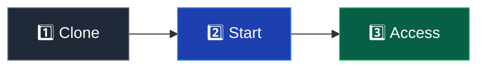

# Getting Started

Get Minepanel running in about 2 minutes.


::: tip
You can use Vue components directly in the documentation:
:::

<CounterButton />

::: warning
Remember to change your password after the first login.
:::

## Requirements

- Docker 20.10+ & Docker Compose v2.0+
- 2GB+ RAM
- Linux, macOS, or Windows (WSL2)

::: tip Verify

```bash
docker --version && docker compose version
```

:::

## Install



```bash
git clone https://github.com/Ketbome/minepanel.git
cd minepanel
docker compose up -d
```

**Access:** http://localhost:3000

**Login:** `admin` / `admin`

::: warning Change password
Go to Profile → Change Password after first login.
:::

## Create Your First Server


1. Click **"New Server"**
2. Fill: Name, Type (Paper/Forge/etc.), Version, Port, Memory
3. Click **Create**
4. Wait for download → Play!

## Remote Access

To access from outside your network, update `docker-compose.yml`:

```yaml
environment:
  - FRONTEND_URL=http://your-ip:3000
  - NEXT_PUBLIC_BACKEND_URL=http://your-ip:8091
```

Then restart:

```bash
docker compose restart
```

**→ Full guide:** [Networking](/networking)

## Next Steps

| Topic                           | What you'll learn                         |
| ------------------------------- | ----------------------------------------- |
| [Configuration](/configuration) | Environment variables, ports, directories |
| [Server Types](/server-types)   | Paper, Forge, Neoforge, Fabric, modpacks  |
| [Networking](/networking)       | Remote access, SSL, proxy                 |
| [Features](/features)           | Everything Minepanel can do               |

## Troubleshooting

**Permission errors (Linux):**

```bash
sudo usermod -aG docker $USER
# Log out and back in
```

**Check logs:**

```bash
docker compose logs -f
```

**→ More help:** [Troubleshooting](/troubleshooting) | [FAQ](/faq)
