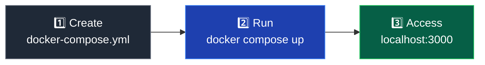

# Getting Started

Get Minepanel running in about 2 minutes.


## What you need

- Docker 20.10+
- Docker Compose v2.0+
- 2GB+ RAM
- Linux, macOS, or Windows with WSL2

::: tip Check your install
`docker --version` and `docker compose version`
:::

## Installation



::: tip Cross-Platform
This configuration works on all operating systems (Linux, macOS, Windows). The `:-` syntax provides sensible defaults that work everywhere.
:::

### 1. Create docker-compose.yml

```yaml
services:
  minepanel:
    image: ketbom/minepanel:latest
    ports:
      - "${BACKEND_PORT:-8091}:8091"
      - "${FRONTEND_PORT:-3000}:3000"
    environment:
      # Backend Configuration
      - BASE_DIR=${BASE_DIR:-$PWD}
      - FRONTEND_URL=${FRONTEND_URL:-http://localhost:3000}
      - JWT_SECRET=${JWT_SECRET} # Generate with: openssl rand -base64 32
      - CLIENT_PASSWORD=${CLIENT_PASSWORD:-admin}
      - CLIENT_USERNAME=${CLIENT_USERNAME:-admin}

      # Frontend Configuration
      - NEXT_PUBLIC_BACKEND_URL=${NEXT_PUBLIC_BACKEND_URL:-http://localhost:8091}
      - NEXT_PUBLIC_DEFAULT_LANGUAGE=${NEXT_PUBLIC_DEFAULT_LANGUAGE:-en}
    volumes:
      - ${BASE_DIR:-$PWD}/servers:/app/servers
      - /var/run/docker.sock:/var/run/docker.sock
      - ${BASE_DIR:-$PWD}/data:/app/data
    restart: always
```

### 2. Launch

```bash
# Generate JWT secret
export JWT_SECRET=$(openssl rand -base64 32)

# Start services (volumes are created automatically)
docker compose up -d
```

### 3. Access

- **Minepanel**: http://localhost:3000

#### Remote Access (Outside Your Network)

If you want to access Minepanel from outside your local network, you need to configure the environment variables with your server's public IP or domain name.

**Update your docker-compose.yml:**

```yaml
environment:
  # Backend - CRITICAL: Controls CORS
  - FRONTEND_URL=http://your-server-ip:3000 # or https://minepanel.yourdomain.com

  # Frontend - Must point to your server's address
  - NEXT_PUBLIC_BACKEND_URL=http://your-server-ip:8091 # or https://api.yourdomain.com
```

**Then access via:**

- **Minepanel**: `http://your-server-ip:3000` or `https://minepanel.yourdomain.com`

::: warning Important

- Always include `http://` or `https://` in the URLs
- `FRONTEND_URL` is critical - it controls CORS in the backend
- After changing these variables, restart: `docker compose restart`
- For production, use HTTPS with a reverse proxy (see [Installation](/installation#split-services-installation))
- Make sure ports are open in your firewall/router
  :::

## First login

### Minepanel

- Username: `admin`
- Password: `admin`

::: warning Change this
Change the password after first login. See [Configuration](/configuration#change-admin-password).
:::

## Create your first server


1. Click "New Server"
2. Fill in:
   - Name
   - Type (Vanilla, Paper, Forge, etc.)
   - Minecraft version
   - Port (default: 25565)
   - Memory (e.g., 2G)
3. Click "Create"
4. Wait a few minutes (first time downloads files)

## File Management

Minepanel includes a built-in file browser:

- Navigate to Dashboard → Files
- Or access the "Files" tab on any server
- Features: Upload, download, edit, delete, create folders
- Drag & drop support for file uploads
- Code editor with syntax highlighting

## Next

- [Features](/features)
- [Configuration](/configuration)
- [Architecture](/architecture)

## Troubleshooting

### Docker permission errors (Linux)

```bash
sudo usermod -aG docker $USER
# Log out and back in
```

### Containers restarting

```bash
docker compose logs minepanel
```

### Need help?

- 📚 Check the [FAQ](/faq)
- 🐛 [Report an issue on GitHub](https://github.com/Ketbome/minepanel/issues)
- 💬 [Join the discussion](https://github.com/Ketbome/minepanel/discussions)
