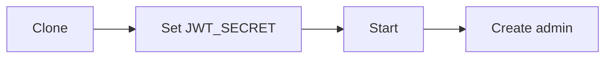
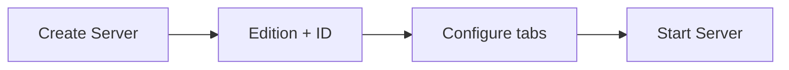
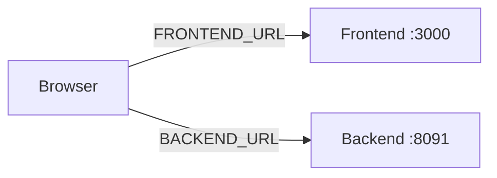

# Getting Started

Get Minepanel running in about 2 minutes.


## Requirements

| Need     | Minimum                                     |
| -------- | ------------------------------------------- |
| Docker   | 20.10+ with Docker Compose v2.0+            |
| Memory   | 2GB+ RAM (plus what your servers use)       |
| OS       | Linux, macOS, or Windows (WSL2)             |

::: tip Verify

```bash
docker --version && docker compose version
```

:::

## Install


```mermaid
flowchart LR
    A["Clone"] --> B["Set JWT_SECRET"] --> C["Start"] --> D["Create admin"]
```

<TerminalSequence
  title="first-install"
  :steps="[
    {
      command: 'git clone https://github.com/Ketbome/minepanel.git',
      outputs: ['Cloning into \'minepanel\'...']
    },
    {
      command: 'cd minepanel',
      outputs: ['Now in ./minepanel']
    },
    {
      command: 'echo JWT_SECRET=$(openssl rand -base64 32) > .env',
      outputs: ['Wrote .env']
    },
    {
      command: 'docker compose up -d',
      outputs: [
        '[+] Running 3/3',
        ' ✔ Network minepanel-network  Created',
        ' ✔ minepanel-backend          Started',
        ' ✔ minepanel-frontend         Started'
      ]
    }
  ]"
/>

```bash
git clone https://github.com/Ketbome/minepanel.git
cd minepanel
echo "JWT_SECRET=$(openssl rand -base64 32)" > .env
docker compose up -d
```

`JWT_SECRET` is required: the backend refuses to start without it. Keeping it in `.env`
means it survives restarts.

**Open** http://localhost:3000. There are no default credentials: the first visit shows a
setup screen where you create the admin account.

## Create Your First Server


```mermaid
flowchart LR
    A["Create Server"] --> B["Edition + ID"] --> C["Configure tabs"] --> D["Start Server"]
```

| Step | Where | What |
| --- | --- | --- |
| 1 | **Dashboard** | **Create Server** |
| 2 | Dialog | **Quick Create** (empty server) or **From Template**; pick Java or Bedrock and a Server ID |
| 3 | Server page | Set type, version, memory... in the tabs, then **Save Changes** |
| 4 | Server page | **Start Server**. The first start downloads the server; follow it in **Logs** |


Once it is running, the server header shows the address players connect to, with a copy button:


## Remote Access


```mermaid
flowchart LR
    B["Browser"] -->|"FRONTEND_URL"| F["Frontend :3000"]
    B -->|"BACKEND_URL"| API["Backend :8091"]
```

The browser talks to both containers, so both URLs must be reachable from it. Add to `.env`:

```bash
FRONTEND_URL=http://your-ip:3000
NEXT_PUBLIC_BACKEND_URL=http://your-ip:8091
ALLOW_INSECURE_AUTH_COOKIES=true # Only if staying on HTTP (LAN/dev)
```

Then recreate the containers (`restart` does not reload `.env`):

```bash
docker compose up -d
```

**→ Full guide:** [Networking](/networking)

::: warning HTTP authentication
`ALLOW_INSECURE_AUTH_COOKIES=true` is a fallback for HTTP-only setups.
For production/public access, use HTTPS and keep this variable disabled.
:::

## Next Steps

| Topic                           | What you'll learn                         |
| ------------------------------- | ----------------------------------------- |
| [Configuration](/configuration) | Environment variables, ports, directories |
| [Server Types](/server-types)   | Paper, Forge, Neoforge, Fabric, modpacks  |
| [Networking](/networking)       | Remote access, SSL, proxy                 |
| [Features](/features)           | Everything Minepanel can do               |

## Troubleshooting

| Problem | Fix |
| --- | --- |
| `permission denied` on the Docker socket (Linux) | `sudo usermod -aG docker $USER`, then log out and back in |
| Backend exits with `JWT_SECRET is not set` | Create `.env` as above, then `docker compose up -d` |
| Anything else | `docker compose logs -f` |

**→ More help:** [Troubleshooting](/troubleshooting) | [FAQ](/faq)
