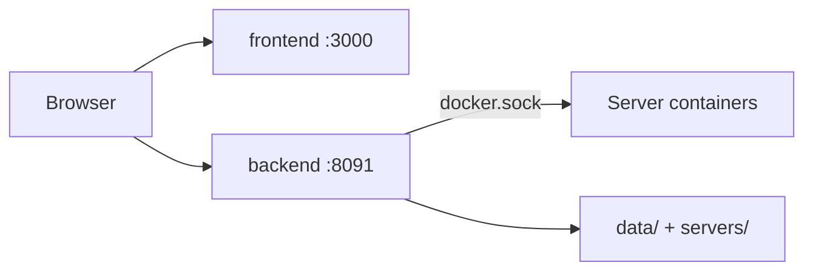

# Installation


## Quick Install (Recommended)

<TerminalCommand
  title="install-flow"
  command="docker compose up -d"
  :outputs="[
    '[+] Running 3/3',
    ' ✔ Network minepanel-network  Created',
    ' ✔ minepanel-backend          Started',
    ' ✔ minepanel-frontend         Started'
  ]"
/>

```bash
git clone https://github.com/Ketbome/minepanel.git
cd minepanel
echo "JWT_SECRET=$(openssl rand -base64 32)" > .env
docker compose up -d
```

**Access:** http://localhost:3000. The first visit asks you to create the admin account;
there are no default credentials.



The backend drives Docker through the mounted socket: every Minecraft server runs in its own
container next to the panel, and its files live in `servers/<id>/`.

## Configuration

`JWT_SECRET` is the only required variable. Everything else in `.env` is optional:

```bash
# Authentication
JWT_SECRET=your_secret_here  # openssl rand -base64 32
ALLOW_INSECURE_AUTH_COOKIES=false  # Set true only if using HTTP (LAN/dev)

# Ports (optional)
FRONTEND_PORT=3000
BACKEND_PORT=8091

# Base directory
BASE_DIR=$PWD
```

**→ All variables:** [Configuration](/configuration)

::: tip HTTP access note
If you access Minepanel via plain HTTP (local IP) and login gets stuck on "Verifying authentication...", set `ALLOW_INSECURE_AUTH_COOKIES=true`.
Use this only on trusted networks and prefer HTTPS.
:::

## Update

<TerminalCommand
  title="update-flow"
  command="docker compose pull && docker compose up -d"
  :outputs="[
    'Pulling frontend ... done',
    'Pulling backend  ... done',
    '[+] Running 3/3',
    ' ✔ Containers updated successfully'
  ]"
  :typing-ms="2600"
/>

```bash
cd minepanel
git pull             # updates the compose files
docker compose pull  # downloads the new images
docker compose up -d
```

## Installation Options

| Option | Command | Use it for |
| --- | --- | --- |
| Split images (default) | `docker compose up -d` | Normal installs |
| Single image | `docker compose -f docker-compose.single.yml up -d` | One container for UI + API |
| Development build | `docker compose -f docker-compose.development.yml up --build -d` | Building from source |
| Test images | `docker compose -f docker-compose.test.yml up -d` | Pre-release testing |

::: warning
Test images are built from non-main branches and may contain unstable features. Use them for
testing only, not production.
:::

### With Reverse Proxy (SSL)

For nginx-proxy/Traefik setups:

```yaml
# Add to docker-compose.yml
networks:
  default:
    name: nginx-proxy
    external: true

services:
  frontend:
    environment:
      - VIRTUAL_HOST=minepanel.yourdomain.com
      - LETSENCRYPT_HOST=minepanel.yourdomain.com
```

**→ Full guide:** [Networking - SSL](/networking#ssl-https)

## Platform Notes

| Platform | Note |
| --- | --- |
| Linux | `sudo usermod -aG docker $USER`, then log out and back in |
| Windows | Use WSL2 with Docker Desktop |
| Raspberry Pi | Works on ARM64. Same commands; Docker pulls the right architecture |

## Uninstall

Each Minecraft server (and the mc-router or Velocity proxy) is its own compose project, so
stopping the panel does not stop them. Stop your servers and the proxy from the panel first.

```bash
docker compose down          # Stop the panel
rm -rf servers/ data/        # Remove data (CAREFUL!)
docker rmi ketbom/minepanel-backend ketbom/minepanel-frontend  # or ketbom/minepanel for the single image
```

## Next

- [Configuration](/configuration) - All settings
- [Networking](/networking) - Remote access, SSL
- [Features](/features) - What you can do
