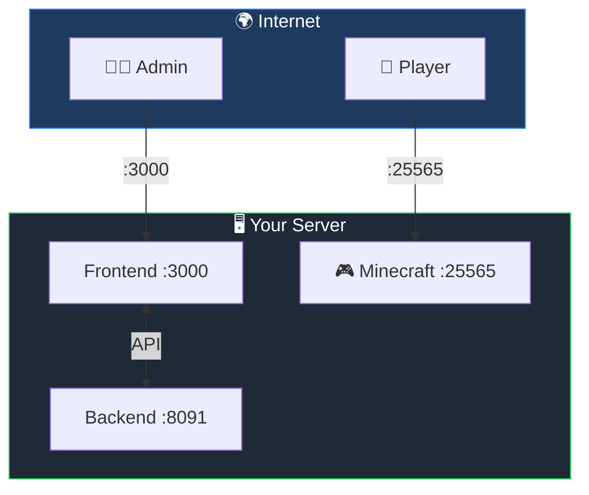
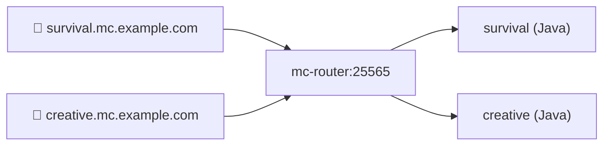

# Networking


## Overview


```mermaid
flowchart TB
    subgraph internet["🌍 Internet"]
        Player["👤 Player"]
        Admin["👨‍💻 Admin"]
    end

    subgraph server["🖥️ Your Server"]
        FE["Frontend :3000"]
        BE["Backend :8091"]
        MC["🎮 Minecraft :25565"]
    end

    Admin -->|":3000"| FE
    FE <-->|"API"| BE
    Player -->|":25565"| MC

    style internet fill:#1e3a5f,stroke:#3b82f6,color:#fff
    style server fill:#1f2937,stroke:#22c55e,color:#fff
```

## Remote Access

<TerminalCommand
  title="remote-access"
  command="docker compose restart"
  :outputs="[
    'Restarting minepanel-frontend ... done',
    'Restarting minepanel-backend  ... done',
    'Minepanel is now available at your LAN IP'
  ]"
/>

Update `docker-compose.yml`:

```yaml
environment:
  - FRONTEND_URL=http://your-ip:3000
  - NEXT_PUBLIC_BACKEND_URL=http://your-ip:8091
```

```bash
docker compose restart
```

## Network Settings (UI)

Configure IPs in **Settings → Network Settings**:

| Setting            | Use                                     |
| ------------------ | --------------------------------------- |
| Public IP / Domain | Discord notifications, external players |
| LAN IP             | Local network players                   |

**Find your LAN IP:**

```bash
# Mac
ipconfig getifaddr en0

# Linux
hostname -I | awk '{print $1}'

# Windows
(Get-NetIPAddress -AddressFamily IPv4 -InterfaceAlias "Ethernet").IPAddress
```

## Connectivity Tab (per server)

Minepanel server configuration includes **General -> Connectivity**.

Key fields:

| Field | What it affects |
| --- | --- |
| `serverPort` | Published game port (`25565` Java, `19132` Bedrock by default) |
| `onlineMode` | Mojang auth verification for Java servers |
| `preventProxyConnections` | Blocks bypass connections when using Java proxy routing |
| `ops` | Operator usernames |
| `opPermissionLevel` | Java op permission level (1-4) |

Notes:

- If Java proxy is enabled globally, port mapping may be controlled by proxy mode.
- Bedrock uses UDP and does not use Java proxy routing.

## Ports

| Service        | Default | Protocol | Description         |
| -------------- | ------- | -------- | ------------------- |
| Frontend       | 3000    | TCP      | Web UI              |
| Backend        | 8091    | TCP      | API                 |
| Java Servers   | 25565+  | TCP      | Java Edition games  |
| Bedrock Servers| 19132+  | UDP      | Bedrock Edition games |

::: warning Bedrock UDP
Bedrock uses UDP, not TCP. Make sure your firewall rules specify the correct protocol.
:::

**Open firewall:**

```bash
# Minepanel
sudo ufw allow 3000/tcp
sudo ufw allow 8091/tcp

# Java servers
sudo ufw allow 25565/tcp

# Bedrock servers
sudo ufw allow 19132/udp
```

## SSL/HTTPS

<NetworkPulseFlow />

### Nginx + Let's Encrypt

```nginx
# /etc/nginx/sites-available/minepanel
server {
    listen 80;
    server_name minepanel.yourdomain.com;

    location / {
        proxy_pass http://localhost:3000;
        proxy_http_version 1.1;
        proxy_set_header Upgrade $http_upgrade;
        proxy_set_header Connection 'upgrade';
        proxy_set_header Host $host;
    }
}
```

```bash
sudo certbot --nginx -d minepanel.yourdomain.com
```

Update environment:

```yaml
- FRONTEND_URL=https://minepanel.yourdomain.com
- NEXT_PUBLIC_BACKEND_URL=https://api.yourdomain.com
```

### Caddy (Auto SSL)

```caddyfile
minepanel.yourdomain.com {
    reverse_proxy localhost:3000
}

api.yourdomain.com {
    reverse_proxy localhost:8091
}
```

## MC Proxy Router (Java Only)

Single port (25565) for all Java servers via hostname routing.

::: warning Java Edition Only
mc-router only works with Java Edition (TCP protocol). Bedrock servers use UDP and cannot be proxied this way. Each Bedrock server needs its own port.
:::


```mermaid
flowchart LR
    P1["👤 survival.mc.example.com"] --> Router["mc-router:25565"]
    P2["👤 creative.mc.example.com"] --> Router
    Router --> MC1["survival (Java)"]
    Router --> MC2["creative (Java)"]
```

### Setup

1. **DNS:** Create wildcard record `*.mc.example.com → your-ip`

2. **Settings:** Set the base domain in **Settings → Network** and turn the proxy on.

That is the whole setup. Minepanel generates the router's compose file and starts
the container itself, the same way it does for servers; there is no profile to
enable and nothing to add to `.env`.

Java servers auto-get hostnames: `{server-id}.mc.example.com`

::: tip Upgrading from 1.x
Earlier versions shipped mc-router inside the panel's own `docker-compose.yml`
behind a `proxy` profile. That service is gone in 2.0. Run
`docker compose --profile proxy down` once to remove the old container; the panel
will not stop a router it did not create, so until you do, both would fight over
port 25565.
:::

The router listens on **Router port** (25565 by default). If you route traffic
through another stack, list its networks under **Extra Docker networks** so they
survive when the file is regenerated.

### Auto-scaling (sleep when idle)

mc-router can keep idle servers stopped and start them again on the first
connection. The router does not talk to Docker: it calls the panel, which starts
and stops the server the same way the UI does.

Turn on **Auto-scaling** in **Settings → Network**. The panel generates the shared
secret the router authenticates with, so there is nothing to copy anywhere.

**Stop after** controls how long a server stays empty before it is stopped
(`10m` by default).

While a server is asleep, its MOTD shows `Server is asleep. Join to wake it up!`.
Joining triggers the wake-up; the router waits up to 180s for the server to accept
connections, so the first join on a heavy modpack may time out. Reconnect and it
will be ready.

::: warning This stops running servers
With auto-scaling on, any proxied Java server with no players for the configured
time is stopped, including ones you started manually. Bedrock servers are never
touched.
:::

### Excluding a server

Heavy modpacks take minutes to boot, which makes sleeping them a poor trade. Turn
**Auto-scaling** off under **Server → Settings → Connectivity → Proxy Settings** to
leave that server out: the panel then ignores both wake-up and sleep requests for
it, so it keeps running 24/7 while the rest still sleep. The switch only appears
once auto-scaling is on, and it is on by default, so nothing changes for servers
you never touch.

::: tip The asleep MOTD is router-side
mc-router prints `Server is asleep. Join to wake it up!` for any route whose
backend is down, and it cannot be configured per route. An excluded server that
you stopped yourself still shows that MOTD, but joining will not start it — start
it from the panel.
:::

The panel exposes `POST /servers/autoscale` for this. It is the only
unauthenticated endpoint that controls servers, it is rejected unless the
auto-scale token matches, and it only accepts servers that are currently in the
proxy routes.

### Bedrock Connection

Bedrock servers connect directly via IP and port:

```
Server Address: your-ip
Port: 19132 (or assigned port)
```

## Troubleshooting

| Issue                 | Fix                                           |
| --------------------- | --------------------------------------------- |
| CORS errors           | `FRONTEND_URL` must match browser URL exactly |
| Can't access remotely | Check firewall, update FRONTEND_URL           |
| Connection refused    | `docker ps` to check containers running       |

**→ More:** [Troubleshooting](/troubleshooting)
