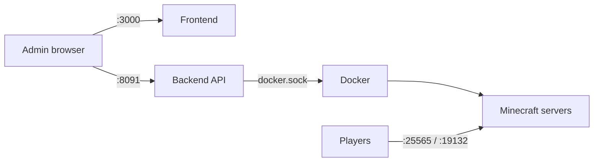
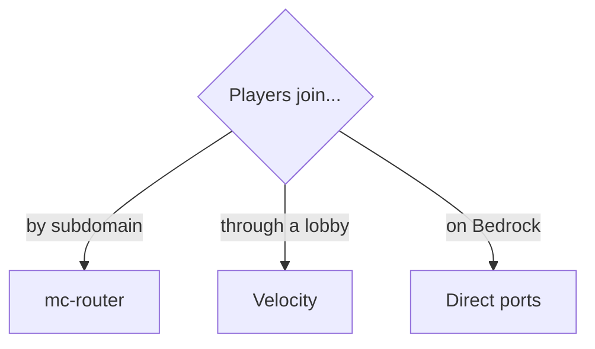
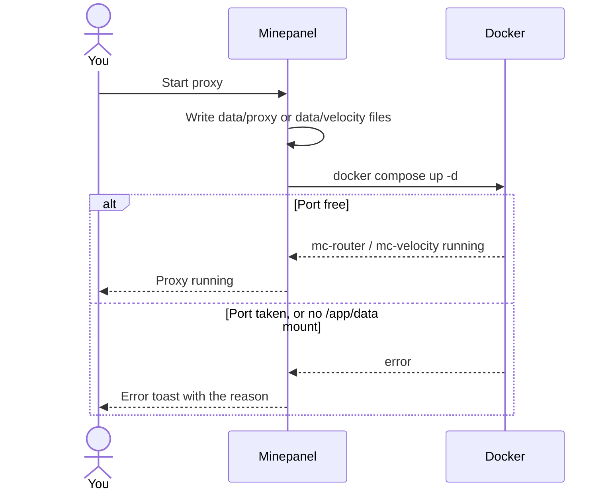
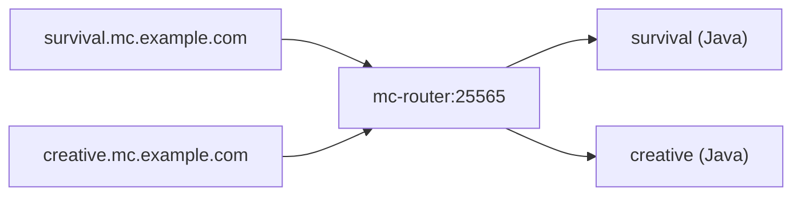
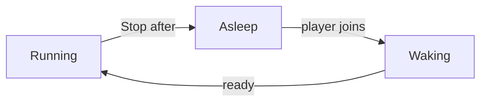
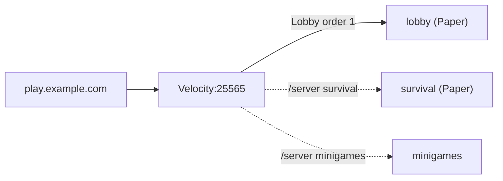
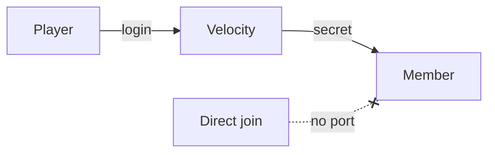

# Networking


Every server's header shows the address players use (public and LAN, with a copy button).
The public one comes from **Settings → Network → Public IP / Domain**.

## Overview


```mermaid
flowchart LR
    Admin["Admin browser"] -->|":3000"| FE["Frontend"]
    Admin -->|":8091"| BE["Backend API"]
    BE -->|"docker.sock"| D["Docker"]
    D --> MC["Minecraft servers"]
    Player["Players"] -->|":25565 / :19132"| MC
```

## Remote Access

<TerminalCommand
  title="remote-access"
  command="docker compose restart"
  :outputs="[
    'Restarting minepanel-frontend ... done',
    'Restarting minepanel-backend  ... done',
    'Minepanel is now available at your LAN IP'
  ]"
/>

Update `docker-compose.yml`:

```yaml
environment:
  - FRONTEND_URL=http://your-ip:3000
  - NEXT_PUBLIC_BACKEND_URL=http://your-ip:8091
```

```bash
docker compose restart
```

## Network Settings (UI)

Configure IPs in **Settings → Network Settings**:

| Setting            | Use                                     |
| ------------------ | --------------------------------------- |
| Public IP / Domain | Discord notifications, external players |
| LAN IP             | Local network players                   |

**Find your LAN IP:**

```bash
# Mac
ipconfig getifaddr en0

# Linux
hostname -I | awk '{print $1}'

# Windows
(Get-NetIPAddress -AddressFamily IPv4 -InterfaceAlias "Ethernet").IPAddress
```

## Network and Access tabs (per server)

A server's connection settings are split across two tabs: **Network** for how the
server is reached, **Access** for who is allowed in once they get there.


| Field | Tab | What it affects |
| --- | --- | --- |
| `serverPort` | Network | Published game port (`25565` Java, `19132` Bedrock by default) |
| `serverPortV6` | Network | IPv6 port, Bedrock only |
| `preventProxyConnections` | Network | Blocks bypass connections when using Java proxy routing |
| `proxyHostname` / `useProxy` / `useAutoScale` | Network | Per-server proxy routing and auto-scaling |
| `extraPorts` | Network | Extra host port mappings (voice chat, Dynmap, ...) |
| `onlineMode` | Access | Mojang auth verification for Java servers |
| `ops` | Access | Operator usernames |
| `whiteList` | Access | Turns the whitelist on (`ENABLE_WHITELIST` on Java, `WHITE_LIST` on Bedrock) |
| `whitelistPlayers` | Access | Java players merged into the whitelist on boot (`WHITELIST`); additive, removing a name here does not revoke access |
| `opPermissionLevel` | Access | Java op permission level (1-4) |
| `enableRcon` / `rconPort` / `rconPassword` | Access | Remote console, required by backups |

Notes:

- If Java proxy is enabled globally, port mapping may be controlled by proxy mode.
- Bedrock uses UDP and does not use Java proxy routing.
- `extraPorts` entries use Docker Compose short syntax: `[ip:]host:container[/tcp|udp|sctp]`,
  ranges allowed (`7000-7010:7000-7010/udp`). The protocol defaults to TCP; to expose one port
  on both protocols, add two entries (`3091:3091/tcp` and `3091:3091/udp`). Typing just `3091` or
  `3091/udp` in the panel expands to `3091:3091` / `3091:3091/udp`. Malformed entries are rejected
  on save instead of breaking `docker compose up`.

## Ports

| Service        | Default | Protocol | Description         |
| -------------- | ------- | -------- | ------------------- |
| Frontend       | 3000    | TCP      | Web UI              |
| Backend        | 8091    | TCP      | API                 |
| Java Servers   | 25565+  | TCP      | Java Edition games  |
| Bedrock Servers| 19132+  | UDP      | Bedrock Edition games |

::: warning Bedrock UDP
Bedrock uses UDP, not TCP. Make sure your firewall rules specify the correct protocol.
Minepanel runs Bedrock with `TRANSPORT=raknet` so that single UDP port is enough. To use
NetherNet instead, set `TRANSPORT=nethernet` and `SERVER_UDP_PORTS=<public-ip>:19140-19155:19140-19155`
in the server's environment variables and add `19132:19132/tcp` and `19140-19155:19140-19155/udp`
as extra ports.
:::

**Open firewall:**

```bash
# Minepanel
sudo ufw allow 3000/tcp
sudo ufw allow 8091/tcp

# Java servers
sudo ufw allow 25565/tcp

# Bedrock servers
sudo ufw allow 19132/udp
```

## Custom Compose Snippets

The panel generates each server's `docker-compose.yml` from `server.json`, so edits made
to that file by hand are overwritten on the next save. For settings the panel has no field
for (an extra Docker network, `dns`, `extra_hosts`, a sidecar service...), open the server's
**Advanced** tab and add a **Compose Snippet**.


Each snippet has a placement and some YAML:

| Placement | Merged into | Typical use |
| --- | --- | --- |
| Top level | the root of the compose file | `networks:`, `volumes:`, `x-` extension fields |
| Services | the `services:` map | add a sidecar service next to the server |
| Minecraft service | `services.mc` | `networks`, `dns`, `extra_hosts`, `cap_add`... |

Example: attach the server to an existing external network. Add two snippets.

```yaml
# placement: Top level
networks:
  my-network:
    external: true
```

```yaml
# placement: Minecraft service
networks:
  my-network: {}
```

How snippets are merged, in the order they are listed:

- Maps are merged key by key, so a snippet adds to what the panel generated.
- Lists are appended (a duplicate entry is not added twice).
- Any other value replaces the panel's. That includes a value of a different type: a
  list-form `networks:` replaces the panel's map-form one, which drops the proxy network.
  Use the map form, as above.

::: warning Advanced and fragile
A snippet can override anything the panel manages (image, ports, volumes, labels), and the
panel does not check that the result is a valid compose file. A wrong snippet can stop the
server from starting; remove it and save again to recover. Snippets are also a way to
mount host paths or run privileged containers, so only admins can edit them (see
[Admin-only container settings](/administration#admin-only-container-settings)).
:::

A snippet must be valid YAML and a single mapping; the panel refuses to save it otherwise.

## SSL/HTTPS

<NetworkPulseFlow />

### Nginx + Let's Encrypt

```nginx
# /etc/nginx/sites-available/minepanel
server {
    listen 80;
    server_name minepanel.yourdomain.com;

    location / {
        proxy_pass http://localhost:3000;
        proxy_http_version 1.1;
        proxy_set_header Upgrade $http_upgrade;
        proxy_set_header Connection 'upgrade';
        proxy_set_header Host $host;
    }
}

server {
    listen 80;
    server_name api.yourdomain.com;

    # nginx rejects request bodies over 1 MB by default, which breaks file uploads.
    client_max_body_size 0;
    # Stream uploads to the panel instead of buffering them to nginx's disk first.
    proxy_request_buffering off;
    proxy_read_timeout 600s;
    proxy_send_timeout 600s;

    location / {
        proxy_pass http://localhost:8091;
        proxy_http_version 1.1;
        proxy_set_header Upgrade $http_upgrade;
        proxy_set_header Connection 'upgrade';
        proxy_set_header Host $host;
    }
}
```

```bash
sudo certbot --nginx -d minepanel.yourdomain.com -d api.yourdomain.com
```

Update environment:

```yaml
- FRONTEND_URL=https://minepanel.yourdomain.com
- NEXT_PUBLIC_BACKEND_URL=https://api.yourdomain.com
```

### Caddy (Auto SSL)

```caddyfile
minepanel.yourdomain.com {
    reverse_proxy localhost:3000
}

api.yourdomain.com {
    reverse_proxy localhost:8091
}
```

## Choosing a proxy

A proxy puts every Java server behind one public port. Minepanel runs it for you as its own
container; pick the type in **Settings → Network**.


```mermaid
flowchart TD
    Q{"Players join..."}
    Q -->|"by subdomain"| R["mc-router"]
    Q -->|"through a lobby"| V["Velocity"]
    Q -->|"on Bedrock"| D["Direct ports"]
```

|                              | mc-router                      | Velocity                               |
| ---------------------------- | ------------------------------ | -------------------------------------- |
| Players join with            | `{server}.mc.example.com`      | One address, then `/server <name>`     |
| Base domain + wildcard DNS   | Required                       | Optional (adds forced hosts)           |
| Server types                 | Any Java server                | Paper, Purpur, Leaf, Folia, Pufferfish 1.19+ |
| Fallback lobby               | No                             | Yes                                    |
| Sleep idle servers           | Yes (auto-scaling)             | No                                     |
| Container                    | `mc-router`                    | `mc-velocity`                          |

Only one runs at a time: both listen on the **Router port** (25565 by default).


```mermaid
sequenceDiagram
    actor You
    participant Panel as Minepanel
    participant Docker
    You->>Panel: Start proxy
    Panel->>Panel: Write data/proxy or data/velocity files
    Panel->>Docker: docker compose up -d
    alt Port free
        Docker-->>Panel: mc-router / mc-velocity running
        Panel-->>You: Proxy running
    else Port taken, or no /app/data mount
        Docker-->>Panel: error
        Panel-->>You: Error toast with the reason
    end
```

If it does not start, see [Proxy issues](/troubleshooting#proxy-issues).

## MC Proxy Router (Java Only)

Each Java server with **Use Proxy** on (the default) gets its own hostname on one port. For
mc-router on its own, see the
[mc-router setup guide](/guides/mc-router-setup).


```mermaid
flowchart LR
    P1["survival.mc.example.com"] --> Router["mc-router:25565"]
    P2["creative.mc.example.com"] --> Router
    Router --> MC1["survival (Java)"]
    Router --> MC2["creative (Java)"]
```

### Setup


| Step | Where | What |
| --- | --- | --- |
| 1 | Your DNS provider | Wildcard record `*.mc.example.com → your-ip` |
| 2 | **Settings → Network** | Proxy type **mc-router**, set the **Base Domain**, **Save** |
| 3 | **Settings → Network** | **Start proxy** |

Every Java server with **Use Proxy** on is now reachable at `{server-id}.mc.example.com` (or its
custom hostname). Turn it off in **Server → Network → Proxy Settings** to keep direct port access.
There is no `.env` variable or compose profile to enable.

| Field | Use |
| --- | --- |
| **Router port** | Host port players connect to. Save before **Start proxy**. |
| **Auto-scaling** | Sleep idle servers, see below. |
| **Extra Docker networks** | Only if you route traffic through another stack. |

**Start proxy / Stop proxy** applies immediately, without a save. Stopping frees the port,
which also tells you whether the router is what breaks a connection.

::: tip Upgrading from 1.x
1.x shipped mc-router in the panel's own `docker-compose.yml` behind a `proxy` profile.
Run `docker compose --profile proxy down` once: the panel never stops a router it did not
create, so the old one would keep port 25565.
:::

### Auto-scaling (sleep when idle)


```mermaid
flowchart LR
    R["Running"] -->|"Stop after"| A["Asleep"]
    A -->|"player joins"| W["Waking"]
    W -->|"ready"| R
```

Turn on **Auto-scaling** in **Settings → Network**. The router asks the panel to start and
stop servers; the shared secret is generated for you.

- Asleep servers show the MOTD `Server is asleep. Join to wake it up!`.
- **Stop after** is how long a server stays empty before it sleeps (`10m` by default).
- The panel waits up to 150s for a woken server to accept connections (mc-router's own wake
  timeout is 180s by default). Heavy modpacks may miss that on the first join; reconnect.

::: warning This stops running servers
Any proxied Java server with no players for **Stop after** is stopped, including ones you
started by hand. Bedrock servers are never touched.
:::

### Excluding a server

Turn **Auto-scaling** off in **Server → Network → Proxy Settings** so auto-scaling never stops
that server while it is idle (useful for slow-booting modpacks). The switch shows only when auto-scaling is
on, and it is on by default.

::: tip The asleep MOTD is router-side
mc-router shows the asleep MOTD for any route whose server is down. An excluded server you
stopped yourself still shows it, but joining will not start it.
:::

The router calls `POST /servers/autoscale`. It is rejected unless the auto-scale token
matches, only accepts servers in the proxy routes, and ignores sleep requests for servers
that are stopped or still have players.

### Bedrock Connection

Bedrock uses UDP and cannot go through mc-router. Players connect to each server directly:

```
Server Address: your-ip
Port: 19132 (or assigned port)
```

## Velocity Network (Java Only)

Players join a lobby, move with `/server <name>`, and land on the next lobby if one goes down.


```mermaid
flowchart LR
    P["play.example.com"] --> V["Velocity:25565"]
    V -->|"Lobby order 1"| L["lobby (Paper)"]
    V -.->|"/server survival"| S["survival (Paper)"]
    V -.->|"/server minigames"| M["minigames"]
```

### Setup

**1. Start the proxy** in **Settings → Network**: pick **Velocity**, **Save**, then **Start proxy**.


**2. Add servers** in **Server → Advanced → Network → Velocity network**: turn on
**Join the Velocity network** and give lobbies a **Lobby order** (lowest first).


**3. Restart** each server you changed.

The **Base Domain** is optional. With one, each member also gets a forced host
(`{server-id}.mc.example.com` or its custom hostname) that skips the lobby. If two members
end up with the same host, only the first keeps it and the backend logs a warning.

### What joining changes


```mermaid
flowchart LR
    P["Player"] -->|"login"| V["Velocity"]
    V -->|"secret"| S["Member"]
    O["Direct join"] -.-x|"no port"| S
```

| | Inside the network |
| --- | --- |
| Supported | Paper, Purpur, Leaf, Folia, Pufferfish on 1.19+. The switch is disabled for anything else. |
| Host port | None: only Velocity reaches it, over `minepanel-network` |
| Online mode | `online-mode=false` on the server; Velocity checks accounts and keeps real UUIDs and skins. Leaving restores your setting. |
| `paper-global.yml` | Before each start the panel writes only `proxies.velocity`; the rest is yours |
| Changes | Adding, removing or reordering members uses `velocity reload`; nobody is kicked |

While mc-router is the edge, changing a member to another type or an older version takes it
out of the network.

::: warning Keep members unreachable from outside
Do not publish a member's game port (extra ports or a compose snippet) and do not turn off
Velocity forwarding in its `paper-global.yml`.
:::

::: danger Only admins add servers to the network
Every member holds the forwarding secret, and whoever has it can join any member as any
player, ops included. Only admins can change membership or lobby order, and clones never
inherit them. Anyone with file or plugin access to a member is trusted with the whole network.
:::

The forwarding secret is stored encrypted with a key derived from `JWT_SECRET`. If you change
`JWT_SECRET`, the panel keeps the secret from `data/velocity/server/forwarding.secret`; without
that file it mints a new one and every member needs a restart.

### Proxy plugins

```txt
data/velocity/
|- docker-compose.yml     generated by the panel
|- server/
   |- velocity.toml       owned by the panel (overwritten)
   |- forwarding.secret   owned by the panel
   |- plugins/            yours: loaded on the next proxy restart
```

### Not supported yet

Spigot/Bukkit (legacy forwarding), Fabric/Quilt and Forge/NeoForge backends, Paper
before 1.19, auto-scaling, and Bedrock. See the [roadmap](/roadmap).

## Troubleshooting

| Issue                 | Fix                                           |
| --------------------- | --------------------------------------------- |
| CORS errors           | `FRONTEND_URL` must match browser URL exactly |
| Can't access remotely | Check firewall, update FRONTEND_URL           |
| Connection refused    | `docker ps` to check containers running       |
| Start proxy goes back to stopped | [Proxy issues](/troubleshooting#proxy-issues) |

**→ More:** [Troubleshooting](/troubleshooting)
