# Networking & Remote Access

Configure remote access, LAN connectivity, SSL/HTTPS, and port management.


## Network Overview

```mermaid
flowchart TB
    subgraph internet["🌍 Internet"]
        Player1["👤 Remote Player"]
        Admin["👨‍💻 Admin"]
    end

    subgraph lan["🏠 Local Network"]
        Player2["👤 LAN Player"]

        subgraph server["🖥️ Your Server"]
            FE["Frontend :3000"]
            BE["Backend :8091"]
            MC["🎮 Minecraft :25565"]
        end
    end

    Admin -->|"http://your-ip:3000"| FE
    FE <-->|"API calls"| BE
    BE -->|"Docker"| MC

    Player1 -->|"your-ip:25565"| MC
    Player2 -->|"192.168.x.x:25565"| MC

    style internet fill:#1e3a5f,stroke:#3b82f6,color:#fff
    style lan fill:#1f2937,stroke:#22c55e,color:#fff
    style server fill:#0f172a,stroke:#6b7280,color:#fff
```



## Remote Access Configuration

To access Minepanel from outside your local network:

### 1. Update Environment Variables

Edit your `docker-compose.yml`:

```yaml
environment:
  # Backend - Controls CORS
  - FRONTEND_URL=http://your-server-ip:3000

  # Frontend - API endpoints
  - NEXT_PUBLIC_BACKEND_URL=http://your-server-ip:8091
```

### 2. Using a Domain Name

If you have a domain:

```yaml
environment:
  # Backend
  - FRONTEND_URL=https://minepanel.yourdomain.com

  # Frontend
  - NEXT_PUBLIC_BACKEND_URL=https://api.yourdomain.com
```

### 3. Restart Services

```bash
docker compose restart
```

::: warning Security

- Always use HTTPS for production deployments
- See [SSL/HTTPS](#ssl-https) section below for setup
- Make sure your firewall allows the required ports
- Don't expose ports publicly without proper authentication
  :::

## Public IP Configuration

When deploying MinePanel on a VPS or remote server, the auto-detected public IP (via ipify.org) may show the client's IP instead of the server's IP. To fix this, set `HOST_PUBLIC_IP` to your server's public IP or domain.

### Configuration

Add to your `docker-compose.yml`:

```yaml
services:
  minepanel:
    environment:
      # ... other variables
      - HOST_PUBLIC_IP=123.45.67.89  # Or use a domain: play.example.com
```

Or in your `.env` file:

```bash
HOST_PUBLIC_IP=play.example.com
```

::: tip
If `HOST_PUBLIC_IP` is not set, MinePanel falls back to client-side IP detection (ipify.org). This works for local deployments but shows incorrect IPs when accessing remotely.
:::

## LAN Network Configuration

When you create a Minecraft server, Minepanel automatically shows the connection information to share with players. By default, it shows your **public IP** (configured via `HOST_PUBLIC_IP` or auto-detected via ipify.org). However, if you want players on your **local network (LAN)** to see your local IP address, you need to configure it manually.

### Why Configure LAN IP?

- **Better performance**: Players on your local network will connect directly without going through your router
- **No port forwarding needed**: For LAN players, you don't need to configure port forwarding
- **Both options**: The panel will show both public IP (for internet players) and LAN IP (for local players)

### How to Get Your LAN IP

**On macOS:**

```bash
ipconfig getifaddr en0
# Example output: 192.168.3.208
```

**On Linux:**

```bash
hostname -I | awk '{print $1}'
# Example output: 192.168.1.100
```

**On Windows (PowerShell):**

```powershell
(Get-NetIPAddress -AddressFamily IPv4 -InterfaceAlias "Ethernet").IPAddress
# Example output: 192.168.1.50
```

::: tip
Your LAN IP typically starts with `192.168.x.x` or `10.x.x.x`
:::

### Configuration

Add the `HOST_LAN_IP` variable to your `docker-compose.yml`:

```yaml
services:
  minepanel:
    environment:
      # ... other variables
      - HOST_LAN_IP=192.168.3.208 # Replace with your actual LAN IP
```

Or in your `.env` file:

```bash
HOST_LAN_IP=192.168.3.208
```

### Restart Services

```bash
docker compose down
docker compose up -d
```

### How It Works

When a Minecraft server is running, the panel will show a **Server Connection** section with:

1. **Public IP/Domain**: `203.0.113.50:25565` (for external players)
2. **LAN IP**: `192.168.3.208:25565` (for local network players)

Both addresses are easily copyable with one click.

::: info
If you don't configure `HOST_LAN_IP`, only the public IP will be shown. This is fine if all your players are connecting from the internet.
:::

## Port Configuration

### Default Ports

| Service           | Port   | Description   |
| ----------------- | ------ | ------------- |
| Frontend          | 3000   | Web interface |
| Backend           | 8091   | API server    |
| Minecraft Servers | 25565+ | Game servers  |

### Changing Ports

Edit your `.env` file or `docker-compose.yml`:

```bash
BACKEND_PORT=8091
FRONTEND_PORT=3000
```

### Port Conflicts

If a port is already in use:

```bash
# Check what's using the port
sudo lsof -i :3000

# Change to a different port
FRONTEND_PORT=3001
```

### Firewall Configuration

**For remote access, open these ports:**

```bash
# UFW (Ubuntu/Debian)
sudo ufw allow 3000/tcp   # Frontend
sudo ufw allow 8091/tcp   # Backend
sudo ufw allow 25565/tcp  # Minecraft (default)

# firewalld (CentOS/RHEL)
sudo firewall-cmd --permanent --add-port=3000/tcp
sudo firewall-cmd --permanent --add-port=8091/tcp
sudo firewall-cmd --permanent --add-port=8080/tcp
sudo firewall-cmd --permanent --add-port=25565/tcp
sudo firewall-cmd --reload
```

## SSL/HTTPS

For production deployments, use HTTPS with a reverse proxy.

```mermaid
flowchart LR
    User["👤 User"] -->|"HTTPS :443"| Proxy["🔒 Reverse Proxy<br/>Nginx/Caddy"]
    Proxy -->|":3000"| FE["Frontend"]
    Proxy -->|":8091"| BE["Backend"]

    subgraph docker["Docker"]
        FE
        BE
    end

    style Proxy fill:#065f46,stroke:#22c55e,color:#fff
    style docker fill:#1f2937,stroke:#6b7280,color:#fff
```



### Using Nginx

1. **Install Nginx and Certbot:**

```bash
sudo apt update
sudo apt install nginx certbot python3-certbot-nginx
```

2. **Create Nginx config:**

```nginx
# /etc/nginx/sites-available/minepanel
server {
    listen 80;
    server_name minepanel.yourdomain.com;

    location / {
        proxy_pass http://localhost:3000;
        proxy_http_version 1.1;
        proxy_set_header Upgrade $http_upgrade;
        proxy_set_header Connection 'upgrade';
        proxy_set_header Host $host;
        proxy_cache_bypass $http_upgrade;
    }

    location /api {
        proxy_pass http://localhost:8091;
        proxy_http_version 1.1;
        proxy_set_header Host $host;
    }
}
```

3. **Enable and get SSL:**

```bash
sudo ln -s /etc/nginx/sites-available/minepanel /etc/nginx/sites-enabled/
sudo nginx -t
sudo systemctl reload nginx
sudo certbot --nginx -d minepanel.yourdomain.com
```

4. **Update environment variables:**

```yaml
environment:
  - FRONTEND_URL=https://minepanel.yourdomain.com
  - NEXT_PUBLIC_BACKEND_URL=https://minepanel.yourdomain.com/api
```

### Using Caddy

Caddy automatically handles SSL certificates:

```caddyfile
# Caddyfile
minepanel.yourdomain.com {
    reverse_proxy localhost:3000

    handle /api/* {
        reverse_proxy localhost:8091
    }
}
```

```bash
caddy start
```

### Behind a Reverse Proxy

Update all three critical variables:

```yaml
environment:
  # Backend - CRITICAL for CORS
  - FRONTEND_URL=https://your-domain.com

  # Frontend - API endpoints
  - NEXT_PUBLIC_BACKEND_URL=https://api.your-domain.com
```

## Subdirectory Routing

If you want to host Minepanel on a subdirectory instead of a subdomain (e.g., `mydomain.com/minepanel` instead of `minepanel.mydomain.com`), you need to build the images yourself.

::: warning Build-time Configuration
The frontend `NEXT_PUBLIC_BASE_PATH` must be set at **build time**, not runtime. This is a Next.js limitation - the basePath affects how assets are generated during compilation.
:::

### Using docker-compose.example.yml (Recommended)

The easiest way is to use `docker-compose.example.yml` which builds both frontend and backend:

1. Clone the repository
2. Edit `docker-compose.example.yml`:

```yaml
frontend:
  build:
    context: ./frontend
    args:
      - NEXT_PUBLIC_BASE_PATH=/minepanel  # Your subdirectory
  environment:
    - NEXT_PUBLIC_BACKEND_URL=https://mydomain.com/api

backend:
  environment:
    - BASE_PATH=/api
    - FRONTEND_URL=https://mydomain.com/minepanel
```

3. Build and run:

```bash
docker compose -f docker-compose.example.yml up --build -d
```

### Manual Build

Alternatively, build the frontend image manually:

```bash
docker build --build-arg NEXT_PUBLIC_BASE_PATH=/minepanel -t minepanel-frontend ./frontend
```

### Nginx Example (Subdirectory)

```nginx
# /etc/nginx/sites-available/mysite
server {
    listen 80;
    server_name mydomain.com;

    # Frontend on /minepanel
    location /minepanel {
        proxy_pass http://localhost:3000;
        proxy_http_version 1.1;
        proxy_set_header Upgrade $http_upgrade;
        proxy_set_header Connection 'upgrade';
        proxy_set_header Host $host;
        proxy_cache_bypass $http_upgrade;
    }

    # Backend API on /api
    location /api {
        proxy_pass http://localhost:8091;
        proxy_http_version 1.1;
        proxy_set_header Host $host;
    }
}
```

### Caddy Example (Subdirectory)

```caddyfile
mydomain.com {
    handle_path /minepanel/* {
        reverse_proxy localhost:3000
    }

    handle_path /api/* {
        reverse_proxy localhost:8091
    }
}
```

::: tip
When using subdirectory routing, make sure your `NEXT_PUBLIC_BACKEND_URL` includes the full path including the `BASE_PATH` prefix.
:::

## Custom Network

If you need a custom Docker network:

```yaml
networks:
  minepanel:
    driver: bridge
    ipam:
      config:
        - subnet: 172.20.0.0/16

services:
  minepanel:
    networks:
      - minepanel
```

## Troubleshooting Network Issues

### Can't access from remote

1. Check `FRONTEND_URL` matches the URL you're using
2. Verify firewall ports are open
3. Check router port forwarding (if applicable)
4. Restart after changing network variables

### CORS Errors

The `FRONTEND_URL` variable controls CORS. It must match exactly how you access the frontend:

- Local: `FRONTEND_URL=http://localhost:3000`
- Remote IP: `FRONTEND_URL=http://192.168.1.100:3000`
- Domain: `FRONTEND_URL=https://minepanel.yourdomain.com`

Always restart after changing: `docker compose restart`

### Connection Refused

1. Check Docker is running: `docker ps`
2. Check logs: `docker compose logs`
3. Verify ports aren't conflicting: `sudo lsof -i :3000`

## Next Steps

- Configure [Administration Settings](/administration)
- Set up [Server Types](/server-types)
- Review [Troubleshooting Guide](/troubleshooting)
