# Networking


## Overview

```mermaid
flowchart TB
    subgraph internet["🌍 Internet"]
        Player["👤 Player"]
        Admin["👨‍💻 Admin"]
    end

    subgraph server["🖥️ Your Server"]
        FE["Frontend :3000"]
        BE["Backend :8091"]
        MC["🎮 Minecraft :25565"]
    end

    Admin -->|":3000"| FE
    FE <-->|"API"| BE
    Player -->|":25565"| MC

    style internet fill:#1e3a5f,stroke:#3b82f6,color:#fff
    style server fill:#1f2937,stroke:#22c55e,color:#fff
```



## Remote Access

Update `docker-compose.yml`:

```yaml
environment:
  - FRONTEND_URL=http://your-ip:3000
  - NEXT_PUBLIC_BACKEND_URL=http://your-ip:8091
```

```bash
docker compose restart
```

## Network Settings (UI)

Configure IPs in **Settings → Network Settings**:

| Setting            | Use                                     |
| ------------------ | --------------------------------------- |
| Public IP / Domain | Discord notifications, external players |
| LAN IP             | Local network players                   |

**Find your LAN IP:**

```bash
# Mac
ipconfig getifaddr en0

# Linux
hostname -I | awk '{print $1}'

# Windows
(Get-NetIPAddress -AddressFamily IPv4 -InterfaceAlias "Ethernet").IPAddress
```

## Ports

| Service   | Default | Description  |
| --------- | ------- | ------------ |
| Frontend  | 3000    | Web UI       |
| Backend   | 8091    | API          |
| Minecraft | 25565+  | Game servers |

**Open firewall:**

```bash
sudo ufw allow 3000/tcp
sudo ufw allow 8091/tcp
sudo ufw allow 25565/tcp
```

## SSL/HTTPS

```mermaid
flowchart LR
    User["👤"] -->|"HTTPS :443"| Proxy["🔒 Nginx/Caddy"]
    Proxy --> FE[":3000"]
    Proxy --> BE[":8091"]
```



### Nginx + Let's Encrypt

```nginx
# /etc/nginx/sites-available/minepanel
server {
    listen 80;
    server_name minepanel.yourdomain.com;

    location / {
        proxy_pass http://localhost:3000;
        proxy_http_version 1.1;
        proxy_set_header Upgrade $http_upgrade;
        proxy_set_header Connection 'upgrade';
        proxy_set_header Host $host;
    }
}
```

```bash
sudo certbot --nginx -d minepanel.yourdomain.com
```

Update environment:

```yaml
- FRONTEND_URL=https://minepanel.yourdomain.com
- NEXT_PUBLIC_BACKEND_URL=https://api.yourdomain.com
```

### Caddy (Auto SSL)

```caddyfile
minepanel.yourdomain.com {
    reverse_proxy localhost:3000
}

api.yourdomain.com {
    reverse_proxy localhost:8091
}
```

## MC Proxy Router

Single port (25565) for all servers via hostname routing.

```mermaid
flowchart LR
    P1["👤 survival.mc.example.com"] --> Router["mc-router:25565"]
    P2["👤 creative.mc.example.com"] --> Router
    Router --> MC1["survival"]
    Router --> MC2["creative"]
```



### Setup

1. **DNS:** Create wildcard record `*.mc.example.com → your-ip`

2. **Settings:** Configure base domain in **Settings → Proxy Settings**

3. **Start mc-router:**

```bash
docker compose --profile proxy up -d
```

Servers auto-get hostnames: `{server-id}.mc.example.com`

## Troubleshooting

| Issue                 | Fix                                           |
| --------------------- | --------------------------------------------- |
| CORS errors           | `FRONTEND_URL` must match browser URL exactly |
| Can't access remotely | Check firewall, update FRONTEND_URL           |
| Connection refused    | `docker ps` to check containers running       |

**→ More:** [Troubleshooting](/troubleshooting)
