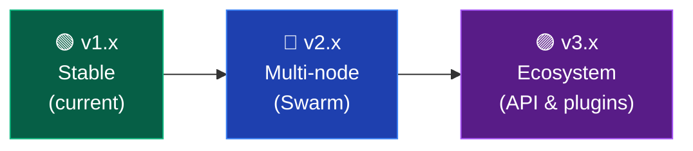
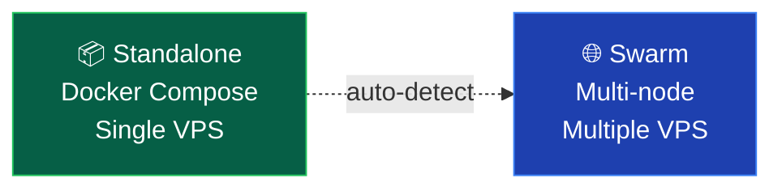
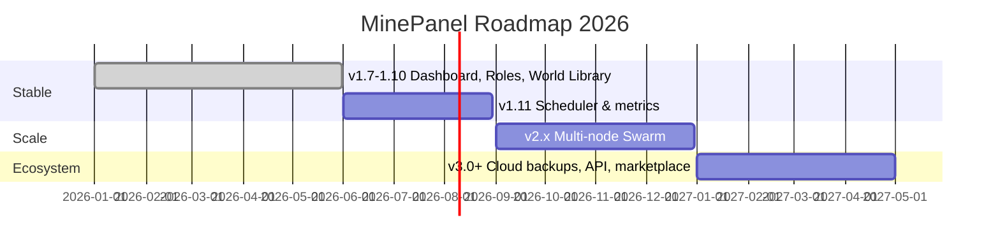

# Roadmap

What's shipped and what's planned for Minepanel. Current stable line: `v1.10.8`.

```mermaid
flowchart LR
    A["🟢 v1.x<br/>Stable<br/>(current)"] --> B["🔵 v2.x<br/>Multi-node<br/>(Swarm)"]
    B --> C["🟣 v3.x<br/>Ecosystem<br/>(API & plugins)"]

    style A fill:#065f46,stroke:#10b981,color:#fff
    style B fill:#1e40af,stroke:#3b82f6,color:#fff
    style C fill:#581c87,stroke:#a855f7,color:#fff
```

> This page tracks intent, not guarantees. Priorities shift with community
> feedback, technical constraints, and available time.

---

## Shipped

Already available in the current stable line.

### ✅ Roles & access control

- `ADMIN` and `USER` roles
- Per-user permissions: server access, logs vs console, global vs per-server files
- `manageUsers` delegated permission
- Invitation links with optional SMTP delivery
- Filterable audit log (logins, invitations, password/email changes, server actions, console commands)

### ✅ World Library & Discover Worlds

- Per-server world source library and a shared library for all servers
- World switching from folders (`level.dat`) and archives (`.zip`, `.tar`, `.tar.gz`, `.tgz`)
- **Discover Worlds**: search CurseForge worlds and import remote ZIP/TAR URLs

### ✅ Multi-language

- 6 languages: English, Spanish, French, German, Dutch, Polish

### ✅ Mods & plugins

- In-panel search and install for Modrinth and CurseForge (mods, plugins, modpacks)
- Modrinth dependency resolution (required/optional)
- CurseForge individual files alongside Modrinth
- Fabric support (loader/launcher version config)
- Cross-play Paper template (Geyser, Floodgate, ViaVersion, UDP 19132)

### ✅ Bedrock Edition

- Full Bedrock server support and Bedrock-specific settings
- Addon Manager: upload `.mcaddon`/`.mcpack`/`.zip`, auto-extract, priority ordering, generate `world_*_packs.json`
- Browse and import addons from CurseForge

### ✅ File manager

- Integrated text editor with syntax highlighting
- Folder uploads and drag & drop
- `server.properties` editing from the UI

### ✅ Dashboard & monitoring (live)

- Status cards: status, players, CPU/RAM at a glance
- Visual alerts for high CPU/RAM
- Real-time sidebar sync
- Log viewer with search, filtering, error highlighting, live stats

### ✅ Historical metrics

- Per-server CPU and memory samples collected every minute
- Usage graphs with 1h / 6h / 24h / 72h ranges (Metrics tab)
- 7-day retention with automatic pruning

### ✅ Scheduled tasks

- Auto restarts at configurable intervals
- Scheduled console commands (Java RCON)
- Enable/disable, run-now, and per-server management (Tasks tab)

### ✅ Server creation & templates

- Quick-create wizard
- Built-in templates (Survival, Creative, SkyBlock, PvP, Bedrock presets, Paper cross-play)
- Server types: Vanilla, Paper, Forge, NeoForge, Fabric, Purpur, GTNH, CurseForge & Modrinth modpacks

### ✅ Player management

- Online players, whitelist, ops, ban/kick
- Quick actions: gamemode, teleport, heal, give
- Admin actions: save, whitelist toggle, time/weather, broadcast

### ✅ Integrations & networking

- Discord webhooks (start/stop notifications)
- mc-router proxy: single port for multiple Java servers by hostname
- Multi-arch images (x86_64, ARM64)

---

## In progress / next (v1.11+)

Smaller, high-value items that fit the current single-node architecture.

### More scheduling options

- Cron-style scheduling at specific times (current scheduled tasks run at fixed minute intervals)
- More flexible backup scheduling (beyond the current `backupInterval`)
- Uptime tracking on top of the metrics history

### Bedrock console commands

- Re-enable command execution for Bedrock servers (currently disabled due to
  TTY/permission issues with `send-command`)

### File manager

- Large file uploads (chunked)

### Log viewer

- Export logs
- Saved log views / presets

### `server.properties` editor

- Field validation and per-setting tooltips
- Backup before save

> Basic `server.properties` editing already ships; this adds a guided editor.

### Docker named volumes (under evaluation)

- Optional Docker named volumes instead of host directory paths
- Volume lifecycle management (create, list, inspect, prune)

**Why not now?** The file manager reads host paths (`BASE_DIR/servers/*/mc-data`)
for direct access. Named volumes would require reading data through the Docker
API or mount points — a filebrowser refactor with a migration path.

---

## Phase 2: Multi-node with Docker Swarm (v2.x)

> Connect multiple VPS from a single panel.

MinePanel would auto-detect the environment:

```mermaid
flowchart LR
    A["📦 Standalone<br/>Docker Compose<br/>Single VPS"] -.->|"auto-detect"| B["🌐 Swarm<br/>Multi-node<br/>Multiple VPS"]

    style A fill:#065f46,stroke:#22c55e,color:#fff
    style B fill:#1e40af,stroke:#3b82f6,color:#fff
```

| Mode           | Description                   | Use case                         |
| -------------- | ----------------------------- | -------------------------------- |
| **Standalone** | Docker Compose, single server | Current setup, no changes needed |
| **Swarm**      | Multi-node cluster            | Multiple VPS, auto balancing     |

- Node management: view connected nodes, status/resources, labels, join instructions
- Server-to-node assignment: automatic, specific node, or by label
- Technical groundwork: an `IOrchestrator` abstraction with `LocalOrchestrator`
  (current Docker Compose) and a new `SwarmOrchestrator`, chosen by a factory

> This is the largest planned effort. It starts with a design spike, not code.

---

## Phase 3: Pro features (v2.x)

### Cloud backups

The backup sidecar already supports `restic` and `rclone` methods. This phase is
about productizing setup:

- Guided UI for S3-compatible (MinIO, Backblaze B2, Wasabi), Google Cloud Storage, SFTP/FTP
- Retention policies and one-click restore

### Alerts

- Server down notifications
- High resource usage and log-error alerts
- Notify via Discord/Email

### Network features

- Velocity/BungeeCord integration
- Lobby + game server networks managed from the panel

### Resource limits per user

- Build on the existing roles system: quotas and per-user resource caps

---

## Phase 4: Ecosystem (v3.0+)

### Public API

- Token / API-key authentication for automation and third parties
- Reference docs and SDKs (JS, Python)
- Outbound webhooks beyond Discord

### Template marketplace

- Share and import community templates and pre-configured modpacks

### MinePanel plugins

- Plugin system, community apps, panel themes

---

## Quick wins (anytime)

- Dark/Light mode toggle
- Keyboard shortcuts
- Favorites (frequent servers at top)
- Global search
- Copy server (clone configuration)
- Bulk actions (start/stop multiple)
- Server groups/folders
- Reverse proxy helper (NGINX/Caddy)
- Config import/export

---

## Maybe (future consideration)

- Native mobile app (iOS/Android)
- Server performance comparison
- RCON console with autocomplete

---

## Timeline

```mermaid
gantt
    title MinePanel Roadmap 2026
    dateFormat YYYY-MM-DD

    section Stable
    v1.7-1.10 Dashboard, Roles, World Library :done, a1, 2026-01-01, 150d
    v1.11 Scheduler & metrics                 :a1b, 2026-06-01, 90d

    section Scale
    v2.x Multi-node Swarm                     :a2, 2026-09-01, 120d

    section Ecosystem
    v3.0+ Cloud backups, API, marketplace     :a4, 2027-01-01, 120d
```

**Milestones:**

| Period      | Version | Focus       | Key features                                                        |
| ----------- | ------- | ----------- | ------------------------------------------------------------------ |
| Q1–Q2 2026  | v1.7–1.10 | **Stable** ✅ | Dashboard, roles & audit, World Library, multi-language, Bedrock addons, mods search |
| Q3 2026     | v1.11   | **Stable**  | Bedrock console commands, guided server.properties editor, cron-style scheduling |
| Q4 2026     | v2.x    | **Scale**   | Swarm mode, multi-node, node UI                                    |
| 2027+       | v3.0+   | **Ecosystem** | Cloud backup UI, alerts, public API, marketplace                |

---

## How to contribute

Want to help build these features? Check [CONTRIBUTING.md](https://github.com/Ketbome/minepanel/blob/main/CONTRIBUTING.md)

Ideas? Open an issue or discussion on GitHub.

## Stay updated

- Watch the [GitHub repo](https://github.com/Ketbome/minepanel)
- Check [releases](https://github.com/Ketbome/minepanel/releases)
- Follow updates on Docker Hub
