# Roadmap

What's planned for MinePanel.

```mermaid
flowchart LR
    A["🟢 v1.x<br/>Stable<br/>(current)"] --> B["🔵 v2.x<br/>Multi-node<br/>(Swarm)"]
    B --> C["🟣 v3.x<br/>Complete<br/>(Pro)"]

    style A fill:#065f46,stroke:#10b981,color:#fff
    style B fill:#1e40af,stroke:#3b82f6,color:#fff
    style C fill:#581c87,stroke:#a855f7,color:#fff
```

---

## Recently Completed

### ✅ CurseForge browser

- ~~Search modpacks~~
- ~~Filter by version/loader~~
- ~~One-click install~~
- ~~Auto updates~~

### ✅ Fabric Support

- ~~Full Fabric server type support~~
- ~~Loader and launcher version configuration~~
- ~~Compatible with mod management features~~

### ✅ Modrinth Integration

- ~~Auto-download mods from Modrinth~~
- ~~Support for Fabric, Forge, and modded servers~~
- ~~Dependency resolution (required/optional)~~
- ~~Multiple project reference formats~~

### ✅ CurseForge Files

- Individual mod downloads from CurseForge
- Works alongside Modrinth
- Multiple reference formats
- Auto-version selection

### ✅ Discord webhooks

- ~~Server start/stop notifications~~
- Error alerts
- Custom events

### ✅ Dashboard improvements (v1.7)

- ~~Quick view of all servers (status, players, resources)~~
- ~~Visual alerts (high CPU/RAM usage)~~
- ~~Real-time sidebar sync~~
- Usage graphs (CPU/RAM last 24h) - _pending, requires historical data_

### ✅ Server creation wizard (v1.7)

- ~~"Quick create" for advanced users~~
- ~~Predefined templates (Survival, Creative, SkyBlock, PvP, etc.)~~
- ~~8 built-in templates with pre-configured settings~~

### ✅ Player management (v1.7)

- ~~View online players~~
- ~~Whitelist management from panel~~
- ~~Ops management from panel~~
- ~~Ban/kick from panel~~
- ~~Quick actions per player (gamemode, tp, heal, give items)~~
- ~~Server admin actions (save, whitelist toggle, time/weather, broadcast)~~

---

## Phase 1: Stabilization & UX (v1.8 - v1.9)

### Plugin/Mod browser

- Search Modrinth/CurseForge from panel
- One-click install
- Update plugins

### Scheduled tasks

- Auto restarts at intervals
- Execute commands at scheduled times
- Flexible backup scheduling

### File manager improvements

- Integrated text editor
- Large file uploads (chunked)
- Drag & drop folders

### Better log viewer

- Search and filtering
- Export logs
- Error highlighting
- Stats

### server.properties editor

- Edit from UI
- Validation
- Tooltips for each setting
- Backup before save

---

## Phase 2: Multi-node with Docker Swarm (v2.0 - v2.2)

> Allow connecting multiple VPS from a single panel.

### Dual operation mode

MinePanel auto-detects the environment:

| Mode           | Description                   | Use case                         |
| -------------- | ----------------------------- | -------------------------------- |
| **Standalone** | Docker Compose, single server | Current setup, no changes needed |
| **Swarm**      | Multi-node cluster            | Multiple VPS, auto balancing     |

### Node management

- View nodes connected to swarm
- Status of each node (online, resources)
- Labels for organization (gaming, modpacks, etc.)
- Instructions for joining new nodes

### Server-to-node assignment

- Node selector when creating server
- "Automatic" (wherever resources are available)
- Specific node selection
- By label (e.g., "only nodes with SSD")

### Technical changes

- IOrchestrator interface abstraction
- LocalOrchestrator (current Docker Compose)
- SwarmOrchestrator (new)
- OrchestratorFactory (decides which to use)

---

## Phase 3: Pro Features (v2.3 - v2.5)

### Cloud backups

- Supported providers:
  - S3 / Compatible (MinIO, Backblaze B2, Wasabi)
  - Google Cloud Storage
  - SFTP/FTP
- Configurable schedule
- Retention policies
- One-click restore

### Metrics & Monitoring

- CPU/RAM per server (historical)
- Players per hour/day
- Uptime tracking
- TPS monitoring
- Prometheus integration (optional)

### Alerts

- Server down notifications
- High resource usage
- Log errors
- Notify via Discord/Email

### Network features

- Velocity/BungeeCord integration
- Create connected server networks
- Lobby + game servers
- Manage from panel

### User roles

- Multiple users
- Custom permissions (Admin, Operator, Viewer)
- Per-server access
- Resource limits per user

---

## Phase 4: Ecosystem (v3.0+)

### Template marketplace

- Community templates
- Pre-configured modpacks
- Optimized configs
- Share templates

### Public API

- Complete documentation
- SDKs (JS, Python)
- Webhooks
- Third-party integrations

### MinePanel plugins

- Plugin system
- Community apps
- Panel themes

---

## Quick wins (anytime)

Small things that improve the experience:

- Dark/Light mode toggle
- Keyboard shortcuts
- Favorites (frequent servers at top)
- Global search
- Import/Export configs
- Copy server (clone configuration)
- Bulk actions (start/stop multiple)
- Server groups/folders
- Better toast notifications
- Reverse proxy helper (NGINX/Caddy)
- Resource limits UI
- Config import/export

---

## Maybe (future consideration)

### Mobile app

Native iOS/Android app

### Server comparison

Compare performance between servers

### RCON improvements

Better console with autocomplete

---

## Timeline

**2026 Milestones:**

| Quarter | Version  | Focus         | Key Features                                        |
| ------- | -------- | ------------- | --------------------------------------------------- |
| Q1      | v1.7     | **Stable** ✅ | Dashboard, Templates, Player Management             |
| Q1      | v1.8-1.9 | **Stable**    | Scheduler, Plugins, File Manager, Logs              |
| Q2      | v2.0-2.2 | **Scale**     | Swarm Mode, Multi-node, Node UI                     |
| Q3      | v2.3-2.5 | **Pro**       | Cloud backup, Metrics, Alerts, Multi-user, Velocity |
| Q4      | v3.0+    | **Ecosystem** | Marketplace, Public API, Panel plugins              |

---

## How to contribute

Want to help build these features? Check [CONTRIBUTING.md](https://github.com/Ketbome/minepanel/blob/main/CONTRIBUTING.md)

Ideas? Open an issue or discussion on GitHub.

## Priority changes

Priorities might change based on:

- Community feedback
- Technical constraints
- Available time
- Dependencies

## Stay updated

- Watch the [GitHub repo](https://github.com/Ketbome/minepanel)
- Check [releases](https://github.com/Ketbome/minepanel/releases)
- Follow updates on Docker Hub
