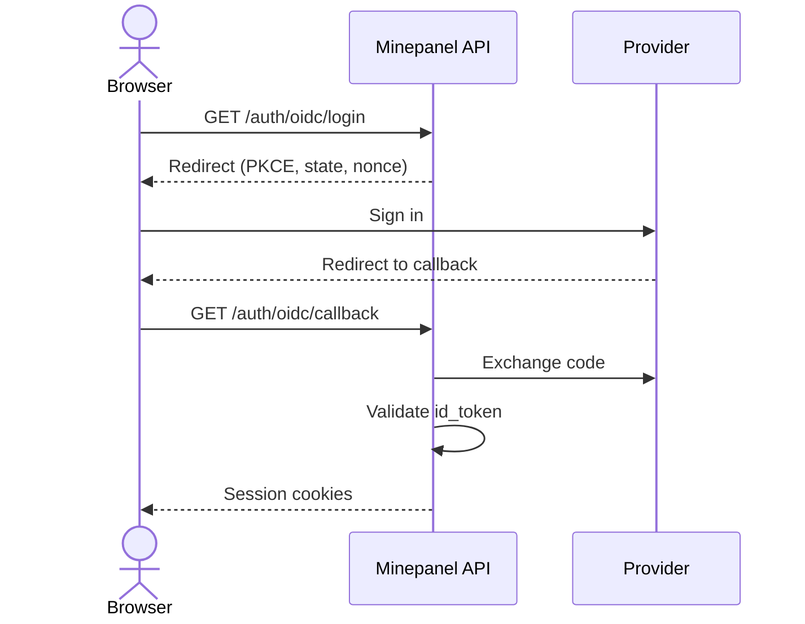
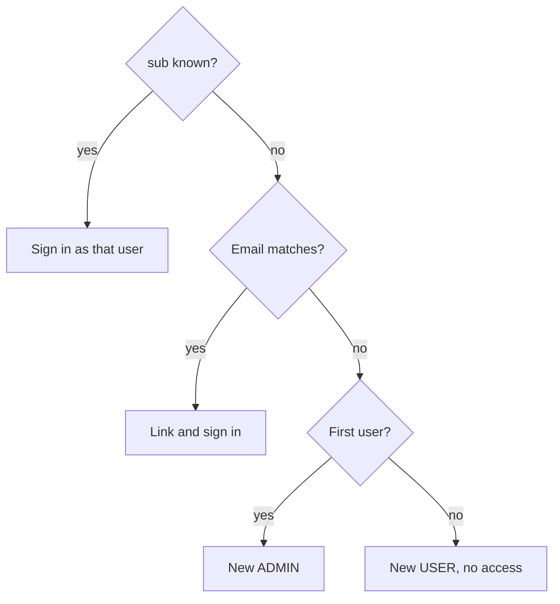
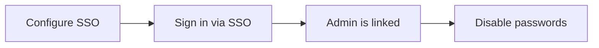

# Single Sign-On (SSO)

Minepanel can delegate authentication to any standard **OpenID Connect (OIDC)** provider:
Authentik, Authelia, Keycloak, Zitadel, Google, and others. This centralizes access for a
homelab and lets you optionally **disable username/password login** so only SSO is allowed.

## How it works

Minepanel acts as a confidential OIDC client (BFF pattern): the browser never sees a
provider token.



- The button reads **Sign in with {provider}** on the login screen.
- The session is Minepanel's **own**: the same `httpOnly` cookies used by password login.
- On success the browser lands on `/dashboard/home`; on any failure on `/?ssoError=1`.

The identity provider only authenticates; **roles and permissions are still managed inside
Minepanel**.

## Provisioning



- A matched account that is disabled is rejected.
- The bootstrap admin gets full access. Every later SSO user is a regular `USER` with **no
  permissions** until an admin grants access under **Settings → Roles & Access**.
- To give an SSO account full rights, an admin flips its **Administrator** switch under
  **Settings → Roles & Access**. Permissions alone do not unlock admin-only screens such as
  **Settings → Integrations**.

## Configuration

::: tip Configure from the panel (recommended)
OIDC can now be managed from **Settings → Integrations** (admin only). Values are stored
**encrypted** in the database and take effect without a restart. The environment variables
below still work as a fallback/default; a value set in the panel **overrides** the matching
variable. Secrets are write-only in the UI — the client secret is never sent back to the
browser.
:::


SSO can also be configured with environment variables. It is enabled only when `OIDC_ISSUER`,
`OIDC_CLIENT_ID`, `OIDC_CLIENT_SECRET` and `OIDC_REDIRECT_URI` are all set (in the panel or `.env`).

| Variable | Required | Description |
| --- | --- | --- |
| `OIDC_ISSUER` | yes | Issuer URL (the backend auto-discovers endpoints from it) |
| `OIDC_CLIENT_ID` | yes | Client ID from your provider |
| `OIDC_CLIENT_SECRET` | yes | Client secret (kept server-side only) |
| `OIDC_REDIRECT_URI` | yes | Backend callback, e.g. `https://api.example.com/auth/oidc/callback` |
| `OIDC_SCOPES` | no | Defaults to `openid email profile` |
| `OIDC_PROVIDER_NAME` | no | Label shown on the login button (default `SSO`) |
| `OIDC_DISABLE_PASSWORD_LOGIN` | no | `true` hides and blocks password login (SSO only) |

> The redirect URI points to the **backend**, not the frontend.

With Docker, just add these variables to your `.env` file — the Compose files load optional
settings from `.env` automatically (no need to edit `docker-compose.yml`).

## Example: Authentik

1. In Authentik create an **OAuth2/OpenID Provider**:
   - Redirect URI: `https://api.example.com/auth/oidc/callback`
   - Signing key: default; scopes: `openid`, `email`, `profile`.
2. Create an **Application** bound to that provider and assign the users/groups that may
   access Minepanel (Authentik enforces who can reach the app).
3. Copy the **Client ID** and **Client Secret** and set:

```bash
OIDC_ISSUER=https://auth.example.com/application/o/minepanel/
OIDC_CLIENT_ID=...
OIDC_CLIENT_SECRET=...
OIDC_REDIRECT_URI=https://api.example.com/auth/oidc/callback
OIDC_PROVIDER_NAME=Authentik
```

## Example: Google

```bash
OIDC_ISSUER=https://accounts.google.com
OIDC_CLIENT_ID=...
OIDC_CLIENT_SECRET=...
OIDC_REDIRECT_URI=https://api.example.com/auth/oidc/callback
OIDC_PROVIDER_NAME=Google
```

## SSO-only mode

Set `OIDC_DISABLE_PASSWORD_LOGIN=true` to hide the username/password form and the
password-reset flow. The backend also rejects `POST /auth/login` and `POST /auth/setup-admin`
so the restriction cannot be bypassed from the API. The first admin is still bootstrapped
through the first SSO login.

The flag is ignored unless SSO is fully configured. When it is switched on from
**Settings → Integrations**, Minepanel also refuses the change until **at least one admin
account is linked to the provider** (that is, an admin has already signed in through SSO at
least once). Otherwise the panel would be left with admins that can only log in with a
password that no longer works.



::: warning Order matters
Link an **admin** to the provider (sign in with the admin's email, or promote the SSO account
under **Settings → Roles & Access**) before disabling password login.
:::

With password login disabled, invitation links cannot be accepted either (accepting one creates
a password account). New users sign in through SSO and an admin grants their access afterwards.

The setting is stored in the database when saved from the panel, so it **overrides**
`OIDC_DISABLE_PASSWORD_LOGIN` in `.env`. If a panel is already locked out, see
[Locked out with SSO only](/administration#locked-out-with-sso-only).

## Troubleshooting

| Symptom | Cause | Fix |
| --- | --- | --- |
| No SSO button | One of the four required values is missing | Set issuer, client ID, secret and redirect URI; if they come from `.env`, recreate the backend (`docker compose up -d`). `GET /auth/setup-status` must return `sso.enabled: true` |
| Back on login with `?ssoError=1` | Callback failed: state/nonce mismatch, expired transaction, clock skew or wrong redirect URI | `OIDC_REDIRECT_URI` must match the provider exactly; sync backend and provider clocks |
| `disabled` account | The matched Minepanel user is inactive | Re-enable it under **Settings → Roles & Access** |
