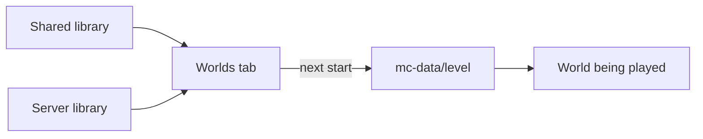
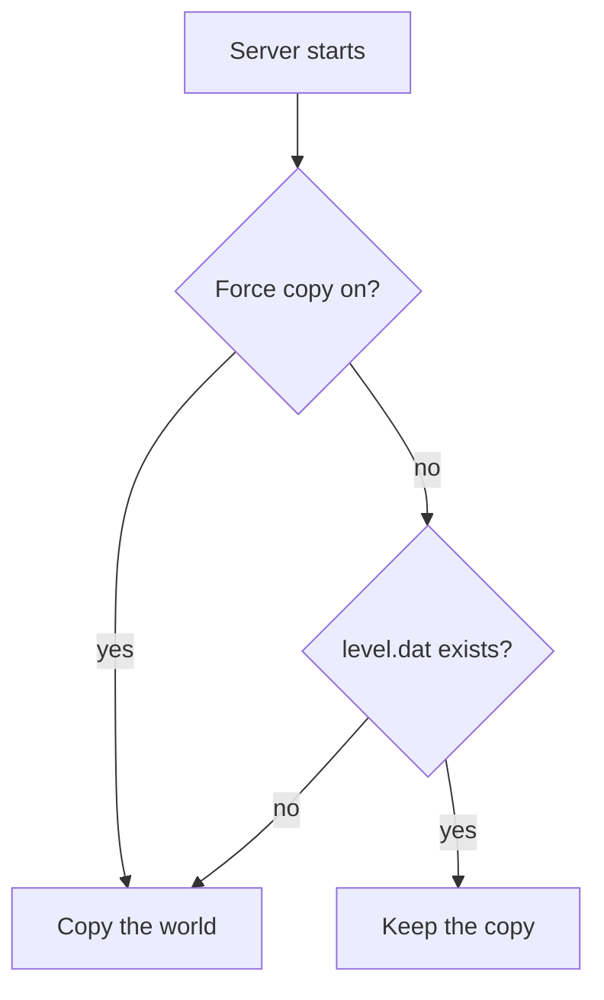

# Worlds

Minepanel keeps the worlds you *can* run separate from the world a server *is*
running. You drop worlds into a library, pick one from the server's **Worlds** tab,
and the server copies it into its data directory on the next start.



::: warning Java Edition only
World switching uses `WORLD`, `LEVEL` and `FORCE_WORLD_COPY` from
`itzg/docker-minecraft-server`, which Bedrock does not support. Bedrock servers have
no Worlds tab; put the world in `mc-data/worlds/` yourself.
:::

## The two libraries

| Library | Path | Scope |
| --- | --- | --- |
| Server | `servers/<server-id>/worlds/` | Only that server sees it |
| Shared | `servers/.world/worlds/` | Every server sees it |

Both are mounted **read-only** into the container (`/data/.world-library/local` and
`/data/.world-library/global`), so a running server can never write back into a
library. The world it plays is a copy under `mc-data/<level-name>/`.

Use the shared library for anything you might run twice — a downloaded adventure
map, a fresh survival seed you keep re-rolling. Use the per-server one for worlds
that only make sense on that server.

### What counts as a world

- A **folder** containing `level.dat`, at any depth. Subfolders are just grouping:
  `skyblock/atm10/` and `minigames/bedwars/` both show up as worlds, listed under
  their folder.
- An **archive**: `.zip`, `.tar`, `.tar.gz` or `.tgz`.

Anything else is ignored, so a `README.md` or a screenshot sitting in the library
does not turn into a broken entry.

## Picking a world


The server's **Worlds** tab lists both libraries, with a search across them and a
badge saying whether that world has already been copied into the server.

::: warning The server has to be stopped
Like every other configuration tab, **Worlds** is disabled while the server is
running. Swapping the world underneath a live server means the running one is
still holding files it is about to lose. Stop the server, pick the world, start it
again.
:::

| Step | Action | Result |
| ---- | ------ | ------ |
| 1 | Stop the server | Configuration tabs unlock |
| 2 | Open **Worlds** and pick a world | The **level name** is filled in from the world's own name — that is the folder it will live in under `mc-data/`, and what `level-name` in `server.properties` points at |
| 3 | Apply, then start the server | The copy happens on that start |

**Already copied** on a world means `mc-data/<level-name>/level.dat` exists. From
then on the server plays that copy; the library still holds the pristine original.

### Force world copy

What happens on each start:



Off by default. When on, the world is copied over the target level **on every
start**, so any progress made since the last start is gone.

Turn it on to hand out a fixed map that resets each restart (minigames, a lobby).
Leave it off for anything anyone is meant to keep playing.

## Filling the library

### From the panel


**World Library** in the sidebar lists what you already have as searchable cards,
filtered by name or by the folder an import landed in. The file browser is still
there, folded away, for uploading a `.zip`, renaming, or deleting.

### Discover Worlds

The same page can pull worlds in from outside:

- **CurseForge search** — browse and import worlds directly. Needs a CurseForge API
  key in **Settings → Integrations**. Imports land in
  `servers/.world/worlds/curseforge/`.
- **Direct URL** — any HTTPS link to a `.zip`, `.tar`, `.tar.gz` or `.tgz`. Imports
  land in `servers/.world/worlds/url/`.

### By hand

Copy the folder or archive into `servers/.world/worlds/` (shared) or
`servers/<server-id>/worlds/` (that server only). It shows up on the next load of
the Worlds tab — nothing to register.

## Worlds that come with a modpack

CurseForge modpacks that ship their own world (the "To The Sky" style packs) do not
need the library at all. Set **CF_SET_LEVEL_FROM** (`WORLD_FILE` or `OVERRIDES`)
under the CurseForge options so the pack's bundled world is used. Picking a world in
the Worlds tab clears that setting, because the two would fight over the same level.

World *generation* is a separate thing from world *selection*: the level type
(flat, amplified, a modpack's custom generator) lives in the **Game** tab. See
[Server Types](/server-types#world-type-level-type).

### Experimental features (Java)

The **Game** tab's world settings have an **Experimental features** section with the
built-in feature packs Minecraft ships: minecart improvements, redstone experiments and
the villager trade rebalance. They are passed as `INITIAL_ENABLED_PACKS`.

Minecraft only reads this when it **creates** the world. Turning a pack on or off later
does not change an existing world; to try them, pick them before the first start or
create a new world. You can check what a running world uses with the console command
`datapack list enabled`.

### Vanilla Tweaks datapacks (Java)


The world settings in the **Game** tab have a **Vanilla Tweaks** section. Pick datapacks or
crafting tweaks on [vanillatweaks.net](https://vanillatweaks.net/picker/datapacks/), press
**Share**, and paste the link or code. The panel shows what each code installs and warns when
it was made for another Minecraft version (the packs still load, but may not work correctly).

- The codes are passed as `VANILLATWEAKS_SHARECODE`. When the server starts it downloads the
  packs from vanillatweaks.net and installs them into the world's `datapacks` folder, replacing
  older versions of the same packs.
- The panel checks a new code with Vanilla Tweaks before adding it: an unknown code would stop
  the server from starting. While Vanilla Tweaks can't be reached it asks you to try again
  instead of adding a code it could not check. A save through the API goes through unchecked in
  that case, so an outage never blocks editing the rest of the config.
- Codes picked here win over a `VANILLATWEAKS_SHARECODE` typed in the custom environment
  variables; with no code picked, the custom value is used as before.
- Resource pack codes are refused. The server can't send them to players, so they would only
  be downloaded into a folder nothing reads.

## Where the files are

```txt
servers/
├── .world/worlds/            shared library (read-only to servers)
│   ├── curseforge/           CurseForge imports
│   └── url/                  URL imports
└── my-server/
    ├── worlds/               this server's library (read-only to servers)
    └── mc-data/
        └── <level-name>/     the world actually being played
```

## Troubleshooting

| Symptom | Cause | Fix |
| ------- | ----- | --- |
| The world I picked is not the one that loaded | The copy only happens when the target level does not exist yet. If `mc-data/<level-name>/` is already there, the server keeps playing it | Pick a different level name or turn on force world copy |
| My world is not in the list | A folder needs a `level.dat` directly inside it (an archive that unpacked into `MyWorld/MyWorld/level.dat` is one level too deep), or the archive has an unsupported extension | Point at the inner folder or re-zip it; use one of the four supported extensions |
| I lost progress after a restart | Force world copy overwrites the level on every start | Turn it off; the copy under `mc-data/` is what holds the progress |

## Next Steps

- [Server Types](/server-types) — level types and modpack world options
- [Features](/features) — file management and backups
- [Backups](/features#backups) — keep the world you are playing safe
